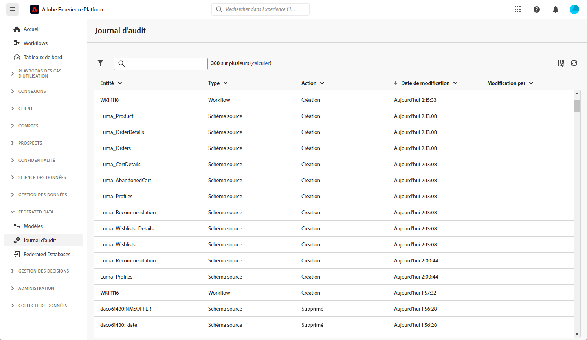

# Journal d’audit {#audit-trail}

>[!AVAILABILITY]
>
>Pour accéder au journal d’audit, vous aurez besoin de l’autorisation suivante :
>
>-**Affichage du journal d’audit**
>
>Pour plus d’informations sur les autorisations requises, lisez le [guide du contrôle d’accès](/help/governance-privacy-security/access-control.md).

>[!CONTEXTUALHELP]
>id="dc_audit_trail"
>title="Journal d’audit"
>abstract="La fonctionnalité de journal d’audit fournit un enregistrement détaillé et chronologique de toutes les actions et tous les événements qui ont été réalisés en temps réel sur votre environnement de composition d’audiences fédérées Adobe Experience Platform."

La fonctionnalité **[!UICONTROL Journal d’audit]** permet d’enregistrer en temps réel un journal détaillé des actions et événements se produisant en temps réel dans l’instance Composition d’audiences fédérées d’Adobe. Elle offre une méthode pratique d’accès à un enregistrement chronologique des données, en répondant à des requêtes telles que : le statut des workflows, les dernières personnes qui les modifient ou les activités effectuées par les utilisateurs et utilisatrices au sein de l’instance.

+++ En savoir plus sur les entités disponibles du journal d’audit

* **Journal d’audit du schéma source** : permet de surveiller les activités et les modifications récentes apportées à vos schémas dans l’instance Composition d’audiences fédérées d’Adobe.

  Pour plus d’informations sur les schémas, consultez [cette page](../customer/schemas.md).

* Le **Journal d’audit des workflows** permet de suivre les activités et les modifications récentes apportées aux workflows, y compris leurs statuts actuels, telles que :

   * Démarrer
   * Pause
   * Arrêter
   * Redémarrer
   * Nettoyer qui correspond à l’action Purge de l’historique
   * Simuler qui correspond à l’action Démarrer en mode simulation
   * Réveiller qui correspond à l’action Traitement anticipé des tâches en attente
   * Arrêt inconditionnel

  Pour plus d’informations sur les workflows, consultez [cette page](../compositions/gs-compositions.md).

* Le **Compte externe** permet de vérifier les modifications apportées aux comptes externes dans l’instance Composition d’audiences Adobe.

  Pour plus d’informations sur les comptes externes, consultez cette [page](../connections/federated-db.md).

+++

## Accéder au journal d’audit {#accessing-audit-trail}

Pour accéder au **[!UICONTROL journal d’audit]** de votre instance, procédez comme suit :

1. Dans le menu **[!UICONTROL Données fédérées]**, sélectionnez **[!UICONTROL Journal d’audit]**.

1. La fenêtre **[!UICONTROL Journal d’audit]** s’ouvre avec la liste de vos entités. La composition d’audiences fédérées réalise l’audit des actions de création, de modification et de suppression pour les workflows, les options, les diffusions et les schémas.

   

1. La fenêtre **[!UICONTROL Entité d’audit]** vous donne des informations plus détaillées sur l’entité choisie, telles que :

   * **[!UICONTROL Type]** : workflow, options, diffusions ou schémas.
   * **[!UICONTROL Entité]** : nom interne de vos activités.
   * **[!UICONTROL Modifié par]** : nom d’utilisateur ou d’utilisatrice de la dernière personne à avoir modifié cette entité.
   * **[!UICONTROL Action]** : dernière action réalisée sur cette entité (création, édition ou suppression).
   * **[!UICONTROL Date de modification]** : date de la dernière action effectuée sur cette entité.
