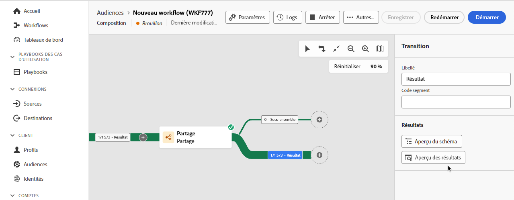

# Vue d’ensemble des activités

Dans la composition d’audiences fédérées, vous pouvez ajouter des activités et des transitions qui permettent de définir votre audience.

## Activités {#activities}

Les activités vous permettent de définir les composants dans l’audience.

Il existe **deux** types d’activités différents à utiliser dans la composition d’audiences fédérées : les activités de ciblage et les activités de contrôle de flux.

### Activités de ciblage {#targeting}

Les activités de ciblage vous permettent de définir les éléments qui constituent votre audience pour la composition.

#### Créer une audience

>[!CONTEXTUALHELP]
>id="dc_orchestration_build_audience_audienceselector"
>title="Audience"
>abstract="Sélectionnez votre audience."

L’activité **Créer une audience** vous permet de définir votre population cible pour la composition. Vous pouvez sélectionner une audience existante ou utiliser le concepteur de requête pour définir votre propre requête.

+++ Détails de la configuration

Après avoir ajouté l’activité **Créer une audience** à la zone de travail de composition, attribuez un nom à votre audience. Indiquez si vous souhaitez créer une audience ou en sélectionner une existante.

>[!BEGINTABS]

>[!TAB Créer une audience]

Après avoir sélectionné **Créer une audience**, choisissez le **schéma** de votre audience. Le schéma vous permet de définir la population ciblée par l’opération, comme les personnes destinataires ou bénéficiaires d’un contrat, les opérateurs et opératrices ou les personnes abonnées. Par défaut, le schéma est sélectionné parmi les personnes destinataires.

Après avoir choisi un schéma, sélectionnez **Continuer**. Vous pouvez maintenant indiquer la définition de votre audience dans le concepteur de requête. Pour plus d’informations sur l’utilisation du concepteur de requête, consultez la [vue d’ensemble du concepteur de requête](../query/home.md).

>[!TAB Utiliser une audience existante]

Après avoir sélectionné **Lecture d’audience**, choisissez **Continuer**.

Vous pouvez maintenant sélectionner l’audience à utiliser pour votre composition.

>[!ENDTABS]

Après avoir sélectionné vos options, vous pouvez choisir de **Générer une transition sortante**. Cela vous permet d’ajouter une transition sortante qui sera activée à la fin de l’exécution de l’activité si la population de l’audience est vide.

+++

#### Modifier la source de données

L’activité **Modifier la source de données** permet de modifier la source de données utilisée par votre composition.

+++ Détails de la configuration

Après avoir ajouté l’activité **Modifier la source de données** à la zone de travail de composition, vous pouvez définir la source de données qui sera utilisée pour la composition.

{zoomable="yes"}{width="70%"}

| Source | Description |
| ------ | ----------- |
| Compte externe FDA | Base de données cloud externe connectée à la composition d’audiences fédérées. |

Après avoir sélectionné **[!UICONTROL Compte externe FDA]**, vous pouvez choisir le compte externe auquel vous souhaitez vous connecter.

{zoomable="yes"}{width="70%"}

+++

#### Changement de dimension

>[!CONTEXTUALHELP]
>id="dc_orchestration_dimension_complement"
>title="Générer un complément"
>abstract="Vous pouvez générer une transition sortante supplémentaire avec la population restante, qui a été exclue en tant que doublon. Pour ce faire, activez l’option **[!UICONTROL Générer un complément]**."

>[!CONTEXTUALHELP]
>id="dc_orchestration_change_dimension"
>title="Activité Changement de dimension"
>abstract="Cette activité vous permet de modifier le schéma, ou dimension de ciblage, à mesure que vous créez une audience. Elle déplace l’axe en fonction du modèle de données et du schéma d’entrée. Par exemple, vous pouvez passer du schéma « contrats » au schéma « clientèle »."

L’activité **Changement de dimension** permet de modifier le schéma (également appelé dimension de ciblage) de votre composition.

+++ Détails de la configuration

Après avoir ajouté l’activité **Changement de dimension** à la zone de travail de composition, vous pouvez définir un nouveau schéma pour remplacer le schéma précédent. Lors du changement de schéma, tous les enregistrements sont conservés.

Une fois la composition exécutée, vos résultats sont mis à jour.

+++

#### Combiner

>[!CONTEXTUALHELP]
>id="dc_orchestration_combine"
>title="Activité Combiner"
>abstract="L’activité **Combiner** permet d’effectuer une segmentation sur votre population entrante. Il est ainsi possible de regrouper plusieurs populations, d’en exclure une partie ou de ne conserver que les données communes entre plusieurs cibles."

>[!CONTEXTUALHELP]
>id="dc_orchestration_intersection_merging_options"
>title="Options de fusion des intersections"
>abstract="L’**intersection** permet de ne conserver que les éléments communs aux différentes populations entrantes dans l’activité. Dans la section **Ensembles à joindre**, cochez les activités précédentes à joindre."

>[!CONTEXTUALHELP]
>id="dc_orchestration_exclusion_merging_options"
>title="Options de fusion des exclusions"
>abstract="L’**exclusion** permet d’exclure des éléments d’une population en fonction de certains critères. Dans la section **Ensembles à joindre**, cochez les activités précédentes à joindre."

>[!CONTEXTUALHELP]
>id="dc_orchestration_combine_options"
>title="Sélectionner le type de segmentation"
>abstract="Choisissez comment combiner des audiences : union, intersection ou exclusion."

>[!CONTEXTUALHELP]
>id="dc_orchestration_intersection_reconciliation_options"
>title="Options de réconciliation des intersections"
>abstract="Sélectionnez le type de réconciliation pour définir la manière dont les doublons sont traités :"

>[!CONTEXTUALHELP]
>id="dc_orchestration_combine_reconciliation"
>title="Options de réconciliation"
>abstract="Sélectionnez le **type de réconciliation** pour définir comment gérer les doublons."

>[!CONTEXTUALHELP]
>id="dc_orchestration_exclusion_options"
>title="Règles d’exclusion"
>abstract="Le cas échéant, vous pouvez manipuler les tableaux entrants. En effet, pour exclure une cible d’un autre schéma, ou dimension de ciblage, cette cible doit être replacée dans le même schéma que la cible principale. Pour ce faire, sélectionnez **Ajouter une règle** dans la section **Règles d’exclusion** et indiquez les conditions de changement du schéma. La réconciliation des données s’effectue au moyen d’un attribut ou d’une jointure."

>[!CONTEXTUALHELP]
>id="dc_orchestration_combine_sets"
>title="Sélectionner des ensembles à combiner"
>abstract="Dans la section **Ensembles à joindre**, sélectionnez **Ensemble principal** parmi les transitions entrantes. C’est l’ensemble à partir duquel des éléments sont exclus. Les autres ensembles correspondent aux éléments devant être exclus de l’ensemble principal."

>[!CONTEXTUALHELP]
>id="dc_orchestration_combine_exclusion"
>title="Règles d’exclusion"
>abstract="Le cas échéant, vous pouvez manipuler les tableaux entrants. En effet, pour exclure une cible d’un autre schéma, ou dimension de ciblage, cette cible doit être replacée dans le même schéma que la cible principale. Pour ce faire, sélectionnez **Ajouter une règle** dans la section **Règles d’exclusion** et indiquez les conditions de changement du schéma. La réconciliation des données s’effectue au moyen d’un attribut ou d’une jointure."

>[!CONTEXTUALHELP]
>id="dc_orchestration_combine_complement"
>title="Combiner la génération de complément"
>abstract="Activez l’option **Générer un complément** pour traiter la population restante dans une transition supplémentaire."

>[!NOTE]
>
>L’activité **Combiner** **doit** doit être placée après une autre activité et **ne peut pas** être mise au début de la composition.

L’activité **Combiner** vous permet de joindre plusieurs audiences de différentes manières : union, intersection ou exclusion.

- **Union** : une union combine les différentes audiences en une seule audience. Cela équivaut à une opération OR.
- **Intersection** : une intersection combine les différentes audiences en une seule audience avec uniquement le contenu **partagé** conservé. Cela équivaut à une opération AND.
- **Exclusion** : une exclusion combine les différentes audiences en une seule audience sans les règles d’exclusion spécifiées. Cela équivaut à une opération XOR.

+++ Détails de la configuration

Après avoir ajouté plusieurs activités pour former au moins **deux** branches différentes, ajoutez l’activité **Combiner** à la fin de l’une des branches. Vous pouvez désormais choisir l’une des options de combinaison suivantes : Union, Intersection ou Exclusion.

>[!BEGINTABS]

>[!TAB Union]

Si vous sélectionnez **Union**, vous devez choisir le **Type de réconciliation** pour l’activité de combinaison. Le type de réconciliation permet de définir comment les entrées en double sont gérées.

- **Clés uniquement** : sélectionner **Clés uniquement** conserve **un** élément lorsque plusieurs éléments ont la même clé. Vous ne pouvez utiliser cette option que si les populations entrantes sont homogènes.
- **Une sélection de colonnes** : sélectionner **Une sélection de colonnes** permet de définir une liste de colonnes sur lesquelles s’applique la réconciliation des données. Vous pouvez sélectionner le jeu principal de données qui contient les données sources, suivi des colonnes à utiliser pour la jointure.

>[!TAB Intersection]

Si vous sélectionnez **Intersection**, vous devez choisir le **Type de réconciliation** pour l’activité de combinaison. Le type de réconciliation permet de définir comment les entrées en double sont gérées.

- **Clés uniquement** : sélectionner **Clés uniquement** conserve **un** élément lorsque plusieurs éléments ont la même clé. Vous ne pouvez utiliser cette option que si les populations entrantes sont homogènes.
- **Une sélection de colonnes** : sélectionner **Une sélection de colonnes** permet de définir une liste de colonnes sur lesquelles s’applique la réconciliation des données.

Après avoir configuré votre type de réconciliation, vous pouvez également sélectionner l’option **Générer le complément**. La génération d’un complément traite la population restante et contient les données **non** incluses dans l’intersection. Une transition sortante supplémentaire sera ajoutée à l’activité.

>[!TAB Exclusion]

Si vous sélectionnez **Exclusion**, vous devez sélectionner le **jeu principal** à partir de vos transitions entrantes. Cela représente les jeux dont les éléments seront exclus.

Après avoir choisi votre jeu principal, vous pouvez configurer vos **Règles d’exclusion**. Vous pouvez sélectionner **Correspondance par attribut** ou **Jointure**.

Une fois vos règles d’exclusion configurées, vous pouvez également sélectionner l’option **Générer le complément**. La génération d’un complément traite la population restante et contient les données **non** incluses dans le cadre de l’exclusion. Une transition sortante supplémentaire sera ajoutée à l’activité.

+++

#### Déduplication

>[!CONTEXTUALHELP]
>id="dc_orchestration_deduplication_fields"
>title="Champs pour identifier les doublons"
>abstract="Dans la section **[!UICONTROL Champs pour identifier les doublons]**, sélectionnez le bouton **[!UICONTROL Ajouter un attribut]** pour indiquer les champs pour lesquels des valeurs identiques permettent d’identifier les doublons, par exemple : adresse e-mail, prénom, nom, etc. L’ordre des champs vous permet de spécifier ceux à traiter en premier."

>[!CONTEXTUALHELP]
>id="dc_orchestration_deduplication"
>title="Activité Déduplication"
>abstract="L’activité **Déduplication** permet de supprimer les doublons dans le ou les résultats des activités entrantes. Elle est principalement utilisée à la suite des activités de ciblage et avant les activités permettant l’utilisation des données ciblées."

>[!CONTEXTUALHELP]
>id="dc_orchestration_deduplication_complement"
>title="Générer un complément"
>abstract="Vous pouvez générer une transition sortante supplémentaire avec la population restante, qui a été exclue en tant que doublon. Pour ce faire, activez l’option **[!UICONTROL Générer un complément]**."

>[!CONTEXTUALHELP]
>id="dc_orchestration_deduplication_settings"
>title="Paramètres de déduplication"
>abstract="Pour supprimer des doublons dans les données entrantes, définissez la méthode de déduplication dans les champs ci-dessous. Par défaut, un seul enregistrement est conservé. Vous devez également sélectionner le mode de déduplication en fonction d’une expression ou d’un attribut. Par défaut, l’enregistrement à conserver en dehors des doublons est sélectionné de manière aléatoire."

L’activité **Déduplication** supprime tous les résultats en double dans l’audience.

+++ Détails de la configuration

>[!NOTE]
>
>Si vous avez plusieurs transitions entrantes, vous devrez d’abord sélectionner le **jeu principal** dans la liste déroulante.

Après avoir ajouté une activité **Déduplication**, vous pouvez choisir les champs pour identifier les doublons. Sélectionnez **Ajouter un attribut** pour identifier les champs où des doublons peuvent se produire.

Une fois que vous avez identifié vos champs, vous pouvez configurer vos paramètres de déduplication.

| Paramètre | Description |
| ------- | ----------- |
| Doublons à conserver | Nombre d’enregistrements en double à conserver. Si la valeur est définie sur 0, **tous** les enregistrements en double sont conservés. |
| Méthode de déduplication | Méthode pour supprimer les enregistrements en double. <ul><li>**Sélection aléatoire** : l’enregistrement supprimé est choisi de manière aléatoire.</li><li>**À l’aide d’une expression** : l’enregistrement supprimé est basé sur l’expression envoyée. Vous pouvez effectuer un tri par ordre croissant ou décroissant, en fonction des valeurs que vous souhaitez supprimer.</li><li>**Valeurs non vides** : l’enregistrement supprimé est basé sur l’expression envoyée. Les enregistrements pour lesquels l’expression n’a pas de valeur seront supprimés.</li><li>**Suivant une liste de valeurs** : l’enregistrement supprimé est basé sur le champ ou l’expression envoyé. Vous pouvez trier les valeurs restantes de manière aléatoire par ordre croissant ou décroissant.</li></ul> |

Vous pouvez également sélectionner l’option **Générer le complément**. La génération d’un complément traite la population restante et contient les données **non** incluses dans le cadre de la déduplication. Une transition sortante supplémentaire sera ajoutée à l’activité.

+++

#### Enrichissement

>[!CONTEXTUALHELP]
>id="dc_orchestration_enrichment"
>title="Activité Enrichissement"
>abstract="L’activité **Enrichissement** permet d’enrichir les données ciblées avec des informations supplémentaires provenant de la base de données. Elle est généralement utilisée dans une composition après les activités de segmentation."

>[!CONTEXTUALHELP]
>id="dc_orchestration_enrichment_data"
>title="Activité Enrichissement"
>abstract="Une fois les données d’enrichissement ajoutées à la composition, elles peuvent être utilisées dans les activités ajoutées après l’activité **Enrichissement** pour segmenter les profils en groupes distincts en fonction de leurs comportements, préférences et choix."

>[!CONTEXTUALHELP]
>id="dc_orchestration_enrichment_simplejoin"
>title="Définition de lien"
>abstract="Créez un lien entre les données de la table de travail et la base de données fédérée."

>[!CONTEXTUALHELP]
>id="dc_orchestration_enrichment_reconciliation"
>title="Réconciliation des enrichissements"
>abstract="Définissez les paramètres de réconciliation."

>[!CONTEXTUALHELP]
>id="dc_targetdata_personalization_enrichmentdata"
>title="Données d’enrichissement"
>abstract="Sélectionnez les données à utiliser pour enrichir votre composition. Vous pouvez sélectionner deux types de données d’enrichissement : un seul attribut d’enrichissement du schéma, ou dimension de ciblage, ou un lien de collection, qui est un lien avec une cardinalité 1-N entre les tableaux."

L’activité **Enrichissement** permet d’améliorer votre composition en ajoutant des données supplémentaires à partir de votre base de données fédérée.

Si vous avez configuré une connexion à la destination de la composition d’audiences fédérées, vous pouvez utiliser l’activité Enrichissement pour enrichir les données provenant d’Adobe Experience Platform avec les attributs de votre base de données externe. [Découvrir comment enrichir les audiences Adobe Experience Platform avec des données externes](../connections/destinations.md)

+++ Détails de la configuration

>[!NOTE]
>
>Si vous avez plusieurs transitions entrantes, vous devrez d’abord sélectionner le **jeu principal** dans la liste déroulante.

Après avoir ajouté l’activité **Enrichissement** à votre composition, vous pouvez sélectionner **Ajouter des données d’enrichissement** pour choisir l’attribut à utiliser pour enrichir votre composition. Vous pouvez sélectionner **Modifier l’expression** pour créer une expression avancée afin de sélectionner l’attribut.

+++

#### Réconciliation

>[!CONTEXTUALHELP]
>id="dc_orchestration_reconciliation"
>title="Activité Réconciliation"
>abstract="L’activité **Réconciliation** vous permet de définir le lien entre les données dans la base de données et les données dans une table de travail."

>[!CONTEXTUALHELP]
>id="dc_orchestration_reconciliation_field"
>title="Champ de sélection de la réconciliation"
>abstract="Champ de sélection de la réconciliation"

>[!CONTEXTUALHELP]
>id="dc_orchestration_reconciliation_condition"
>title="Condition de création de réconciliation"
>abstract="Condition de création de réconciliation"

>[!CONTEXTUALHELP]
>id="dc_orchestration_reconciliation_complement"
>title="Complément de génération de réconciliation"
>abstract="Complément de génération de réconciliation"

>[!CONTEXTUALHELP]
>id="dc_orchestration_reconciliation_targeting"
>title="Schéma"
>abstract="Sélectionnez le nouveau schéma à appliquer aux données. Un schéma, ou dimension de ciblage, vous permet de définir la population ciblée : personnes destinataires, personnes abonnées à l’application, opérateurs et opératrices, personnes abonnées, etc. Par défaut, le schéma actuel de la composition est sélectionné."

>[!CONTEXTUALHELP]
>id="dc_orchestration_reconciliation_rules"
>title="Règles de réconciliation"
>abstract="Sélectionnez les règles de réconciliation à utiliser pour la déduplication. Pour utiliser des attributs, sélectionnez l’option **Attributs simples** et choisissez les champs source et de destination. Pour créer votre propre condition de réconciliation à l’aide du concepteur de requête, sélectionnez l’option **Conditions de réconciliation avancées**."

>[!CONTEXTUALHELP]
>id="dc_orchestration_reconciliation_targeting_selection"
>title="Sélectionner la dimension de ciblage"
>abstract="Sélectionnez le schéma, ou dimension de ciblage, de vos données entrantes avec lesquelles effectuer la réconciliation."

>[!CONTEXTUALHELP]
>id="dc_orchestration_keep_unreconciled_data"
>title="Conserver les données non réconciliées"
>abstract="Par défaut, les données non réconciliées sont conservées dans la transition sortante et disponibles dans la table de travail pour une utilisation ultérieure. Pour supprimer les données non réconciliées, désactivez l’option **Conserver les données non réconciliées**."

>[!CONTEXTUALHELP]
>id="dc_orchestration_reconciliation_attribute"
>title="Attribut de réconciliation"
>abstract="Sélectionnez l’attribut à utiliser pour rapprocher les données, puis confirmez."

>[!NOTE]
>
>Par défaut, les données non réconciliées sont conservées dans la transition sortante et disponibles dans la table de travail pour une utilisation ultérieure. Si vous ne souhaitez **pas** que les données réconciliées soient utilisées, désactivez l’option **Conserver les données non réconciliées**.

L’activité **Réconciliation** vous permet de définir le lien entre les données dans la base de données et les données dans une table de travail.

+++ Détails de la configuration

Après avoir ajouté l’activité **Réconciliation** à votre composition, vous pouvez choisir le schéma à utiliser pour la réconciliation.

Une fois le schéma choisi, vous devez configurer vos règles de réconciliation. Vous pouvez choisir entre **Attributs simples** et **Conditions avancées de réconciliation**.

>[!BEGINTABS]

>[!TAB Attributs simples]

Après avoir choisi **Attributs simples**, sélectionnez **Ajouter une règle**. Vous pouvez maintenant configurer votre réconciliation en ajoutant les champs **Source** et **Destination**. Le champ **Destination** correspond aux champs du schéma sélectionné.

Les données sont réconciliées lorsque la source et la destination sont égales. Vous pouvez ajouter d’autres critères de réconciliation en sélectionnant **Ajouter une règle**. Si plusieurs conditions de jointure sont spécifiées, elles doivent **toutes** être vérifiées afin que les données puissent être liées entre elles.

>[!TAB Conditions avancées de réconciliation]

Après avoir choisi **Conditions avancées de réconciliation**, sélectionnez **Créer des conditions**. Vous pouvez maintenant créer votre propre condition de réconciliation à l’aide du concepteur de requête. Pour plus d’informations sur l’utilisation du concepteur de requête, consultez la [vue d’ensemble du concepteur de requête](../query/home.md).

>[!ENDTABS]

Vous pouvez également filtrer les données réconciliées. Sélectionnez **Créer un filtre** pour créer une condition personnalisée à l’aide du concepteur de requête. Pour plus d’informations sur l’utilisation du concepteur de requête, consultez la [vue d’ensemble du concepteur de requête](../query/home.md).

+++

#### Enregistrer l’audience

>[!CONTEXTUALHELP]
>id="dc_orchestration_save_audience"
>title="Enregistrer une audience"
>abstract="Utilisez cette activité pour créer une audience à partir de la population calculée en amont dans la composition. Les audiences créées sont ajoutées à la liste des audiences et sont disponibles dans le menu **Audiences**."

>[!CONTEXTUALHELP]
>id="dc_orchestration_saveaudience_outbound"
>title="Générer une transition sortante"
>abstract="Utilisez cette option pour ajouter une transition après l’activité **Enregistrer l’audience**."

>[!CONTEXTUALHELP]
>id="dc_orchestration_save_audience_primary_identity"
>title="Champ d’identité principale"
>abstract="Sélectionnez l’identité principale à utiliser pour les profils."
>additional-url="https://experienceleague.adobe.com/fr/docs/experience-platform/xdm/ui/fields/identity#define-a-identity-field" text="En savoir plus dans la documentation d’Experience Platform"

>[!CONTEXTUALHELP]
>id="dc_orchestration_saveaudience_namespace"
>title="Espace de noms d’identité"
>abstract="Sélectionnez l’espace de noms à utiliser pour les profils."
>additional-url="https://experienceleague.adobe.com/fr/docs/experience-platform/identity/features/namespaces" text="En savoir plus dans la documentation d’Experience Platform"

>[!IMPORTANT]
>
>Si votre sandbox utilise une politique de fusion **Priorité du jeu de données**, contactez l’assistance clientèle d’Adobe pour ajouter le jeu de données `Halos UPS` à votre politique de fusion.
>
>Pour plus d’informations sur les politiques de fusion, consultez la [vue d’ensemble des politiques de fusion](https://experienceleague.adobe.com/fr/docs/experience-platform/profile/merge-policies/overview).

L’activité **Enregistrer l’audience** vous permet de créer une audience basée sur la composition. Une fois l’audience créée, vous pouvez l’utiliser dans le portail des audiences d’Adobe Experience Platform. Pour plus d’informations sur l’utilisation des audiences avec la composition d’audiences fédérées, consultez la [vue d’ensemble des audiences](../start/audiences.md). Pour plus d’informations sur les audiences dans Experience Platform, consultez la [vue d’ensemble du portail des audiences](https://experienceleague.adobe.com/fr/docs/experience-platform/segmentation/ui/audience-portal){target="_blank"}.

+++ Détails de la configuration

>[!IMPORTANT]
>
>Le nom de l’audience **doit** être unique dans le sandbox actuel et ne peut pas avoir le même nom qu’une audience existante.

Après avoir ajouté l’activité **Enregistrer l’audience** à votre composition, vous pouvez spécifier le nom de l’audience que vous venez de créer.

Vous pouvez maintenant spécifier vos mappages pour sélectionner les champs à transférer à l’audience nouvellement créée. Sélectionnez **Ajouter un mappage d’audience** et choisissez les champs d’audience source et cible, en répétant l’opération autant de fois que nécessaire.

Après avoir ajouté vos mappages, vous pouvez sélectionner l’identité principale et l’espace de noms pour identifier les profils ciblés dans la base de données. Le champ Identité principale permet d’identifier les profils tandis que l’espace de noms d’identité sert de clé pour identifier l’identité.

+++

#### Partage

>[!CONTEXTUALHELP]
>id="dc_orchestration_split"
>title="Activité Partage"
>abstract="L’activité **Partage** permet de segmenter les populations entrantes en plusieurs sous-ensembles selon différents critères de sélection, tels que les règles de filtrage ou la taille de la population."

>[!CONTEXTUALHELP]
>id="dc_orchestration_split_segments"
>title="Segments de l’activité de partage"
>abstract="Ajoutez autant de sous-ensembles que vous le souhaitez pour segmenter la population entrante.  Lorsque l’activité **Partage** est exécutée, la population est segmentée entre les différents sous-ensembles dans l’ordre dans lequel ils sont ajoutés à l’activité. Avant de démarrer votre composition, assurez-vous d’avoir trié les sous-ensembles dans l’ordre qui vous convient à l’aide des boutons fléchés."

>[!CONTEXTUALHELP]
>id="dc_orchestration_split_filter"
>title="Filtre de l’activité Partage"
>abstract="Pour appliquer une condition de filtrage au sous-ensemble, sélectionnez **[!UICONTROL Créer un filtre]** et configurez la règle de filtrage souhaitée à l’aide du concepteur de requête. Par exemple, incluez les profils de la population entrante dont l’adresse e-mail existe dans la base de données."

>[!CONTEXTUALHELP]
>id="dc_orchestration_split_limit"
>title="Limite de l’activité Partage"
>abstract="Pour limiter le nombre de profils sélectionnés par le sous-ensemble, activez la fonction **[!UICONTROL Activer la limite]** et indiquez le nombre ou les pourcentages de la population à inclure."

>[!CONTEXTUALHELP]
>id="dc_orchestration_split_sorting"
>title="Tri de l’activité Partage"
>abstract="Lorsque vous définissez une limite de population pour un sous-ensemble, vous pouvez classer les profils sélectionnés en fonction d’un attribut de profil spécifique, dans un ordre croissant ou décroissant. Pour ce faire, activez l’option **Activer le tri**. Par exemple, vous pouvez restreindre un sous-ensemble afin de n’inclure que les 50 premiers profils qui ont le montant d’achat le plus élevé."

>[!CONTEXTUALHELP]
>id="dc_orchestration_split_complement"
>title="Générer un complément pour l’activité Partage"
>abstract="Une fois que vous avez paramétré tous les sous-ensembles, vous pouvez sélectionner la population restante qui ne correspond à aucun des sous-ensembles et les inclure dans une transition sortante supplémentaire. Pour ce faire, activez l’option **Générer un complément**."

>[!CONTEXTUALHELP]
>id="dc_orchestration_split_generatesubsets"
>title="Générer tous les sous-ensembles dans le même tableau"
>abstract="Activez cette option pour regrouper tous les sous-ensembles dans une seule transition sortante."

>[!CONTEXTUALHELP]
>id="dc_orchestration_split_emptytransition"
>title="Ignorer la transition vide"
>abstract="Activez l’option **[!UICONTROL Ignorer la transition vide]** pour désactiver la transition sortante pour ce sous-ensemble si la population entrante est vide."

>[!CONTEXTUALHELP]
>id="dc_orchestration_split_enable_overlapping"
>title="Permettre le chevauchement des populations de sortie"
>abstract="L’option **[!UICONTROL Permettre le chevauchement des populations de sortie]** permet de gérer les populations qui appartiennent à plusieurs sous-ensembles. Lorsque la case n’est pas cochée, l’activité de partage fait en sorte qu’une personne destinataire ne puisse pas apparaître dans plusieurs transitions de sortie, même si elle répond aux critères de plusieurs sous-ensembles. Elles apparaissent ainsi dans la cible du premier onglet avec les critères correspondants. Lorsque la case est activée, les destinataires se trouvent dans plusieurs sous-ensembles s’ils ou elles répondent à leurs critères de filtre. "

L’activité **Partage** sépare la population entrante en plusieurs parties, selon les critères déterminés.

+++ Détails de la configuration

>[!IMPORTANT]
>
>Lorsque l’activité **Partage** est exécutée, la population est séparée entre les différents sous-ensembles dans l’**ordre dans lequel ils sont ajoutés à l’activité**. Par exemple, si le premier sous-ensemble comprend 70 % de la population initiale, le sous-ensemble suivant applique ses critères de sélection aux 30 % restants.
>
>Avant d’exécuter votre composition, assurez-vous d’avoir ordonné les sous-ensembles dans l’ordre dans lequel vous souhaitez que les partages soient exécutés.

Après avoir ajouté l’activité **Partage** à votre composition, vous pouvez maintenant déterminer comment définir un sous-ensemble de votre audience. Sélectionnez **Ajouter un segment** pour créer vos différents chemins d’embranchement.

Vous pouvez maintenant fournir des détails pour chacun de ces sous-chemins. Vous pouvez donner un nom au sous-chemin, ainsi qu’aux conditions de filtrage. Pour appliquer une condition de filtrage, sélectionnez **Créer un filtre** et configurez la règle de filtrage à l’aide du concepteur de requête. Pour plus d’informations sur l’utilisation du concepteur de requête, consultez la [vue d’ensemble du concepteur de requête](../query/home.md).

Une fois la condition de filtrage créée, vous pouvez appliquer les règles supplémentaires suivantes :

- **Activer la limite** : limite le nombre de profils qui peuvent être partagés dans le sous-ensemble. Vous pouvez définir la limite en nombre ou pourcentage de la population.
   - Si vous activez une limite, vous pouvez également classer les profils sélectionnés en fonction d’un attribut de profil spécifique. Activez **Activer le tri** et vous pouvez trier les attributs par ordre croissant ou décroissant.
- **Ignorer la transition vide** : désactive la transition si la population entrante est vide.

Maintenant que les sous-ensembles ont été configurés, vous pouvez définir quelques options supplémentaires.

| Options | Description |
| ------- | ----------- |
| **Générer le complément** | Crée une transition sortante qui contient la population restante. |
| **Permettre le chevauchement des populations de sortie** | Si cette option est activée, la personne destinataire **ne peut pas** être présente dans plusieurs transitions sortantes et sera présente **uniquement** dans la première transition sortante. Si elle est désactivée, la personne destinataire **peut** apparaître dans plusieurs transitions sortantes. |
| **Générer tous les sous-ensembles dans le même tableau** | Regroupe tous les sous-ensembles dans une seule transition sortante. |

+++

### Activités de contrôle de flux {#flow-control}

Les activités de contrôle de flux vous permettent de définir l’organisation et la coordination de votre composition.

#### Rendez-vous

>[!CONTEXTUALHELP]
>id="dc_orchestration_and-join"
>title="Activité Rendez-vous"
>abstract="L’activité **Rendez-vous** vous permet de synchroniser plusieurs branches d’exécution d’une composition. Elle est déclenchée une fois toutes les activités précédentes terminées. Vous pouvez ainsi vous assurer que certaines activités sont terminées avant de continuer à exécuter la composition."

L’activité **Rendez-vous** vous permet de combiner plusieurs branches d’une composition. Cette activité n’est déclenchée qu’une fois que **toutes** les transitions entrantes sont activées.

+++ Détails de la configuration

Après avoir ajouté plusieurs activités pour former au moins deux branches différentes, vous pouvez ajouter l’activité **Rendez-vous** à la fin de l’une des branches.

Dans la section **Options de fusion**, vous pouvez sélectionner toutes les activités que vous souhaitez synchroniser. De plus, vous pouvez choisir la transition entrante à conserver dans le menu déroulant du **jeu principal**.

+++

#### Fin

L’activité **Fin** permet d’illustrer la fin d’une composition et n’a aucun impact fonctionnel.

#### Branchement

>[!CONTEXTUALHELP]
>id="dc_orchestration_fork"
>title="Activité Branchement"
>abstract="L’activité **Branchement** permet de créer des transitions sortantes afin de lancer plusieurs activités en parallèle."

>[!CONTEXTUALHELP]
>id="dc_orchestration_fork_transitions"
>title="Transitions de l’activité Branchement"
>abstract="Par défaut, deux transitions sont créées avec une activité **Branchement**. Sélectionnez le bouton **Ajouter une transition** pour définir une transition sortante supplémentaire, puis renseignez son libellé."

L’activité **Branchement** permet de créer plusieurs transitions sortantes qui démarrent simultanément plusieurs activités.

+++ Détails de la configuration

Une fois que vous avez ajouté l’activité **Branchement** à votre composition, deux transitions sortantes sont automatiquement générées. Vous pouvez nommer ces transitions sortantes. De plus, vous pouvez sélectionner **Ajouter une transition** pour ajouter une autre transition sortante.

+++

#### Planificateur

>[!CONTEXTUALHELP]
>id="dc_orchestration_scheduler"
>title="Activité Planificateur"
>abstract="L’activité **Planificateur** vous permet de planifier le démarrage de la composition d’audiences. Cette activité est à considérer comme un démarrage planifié. Elle ne peut être utilisée que comme première activité d’une composition."

>[!CONTEXTUALHELP]
>id="dc_orchestration_schedule_validity"
>title="Validité du planificateur"
>abstract="Vous pouvez définir une période de validité pour le planificateur. Elle peut être permanente (par défaut) ou valide jusqu’à une date spécifique."

>[!CONTEXTUALHELP]
>id="dc_orchestration_schedule_options"
>title="Options du planificateur"
>abstract="Définissez la fréquence du planificateur. Il peut être exécuté à un moment précis, ou encore une ou plusieurs fois par jour, semaine ou mois."

L’activité **Planificateur** vous permet de planifier le moment du démarrage de l’exécution de la composition. Vous **devez** l’utiliser comme première activité de la composition.

+++ Détails de la configuration

Après avoir ajouté l’activité **Planificateur** à votre composition, vous pouvez définir la **Fréquence d’exécution** de la composition. Les options incluent **Une fois**, **Quotidien**, **Plusieurs fois par jour**, **Hebdomadaire** et **Mensuel**.

>[!BEGINTABS]

>[!TAB Une fois]

>[!NOTE]
>
>L’heure est définie sur UTC.

Si vous sélectionnez **Une fois**, la composition n’est exécutée qu’une seule fois. Vous pouvez sélectionner la date et l’heure d’exécution de la composition.

>[!TAB Quotidien]

Si vous sélectionnez **Quotidien**, la composition est exécutée une fois par jour. Cependant, vous pouvez indiquer le jour du mois où la composition est exécutée sous la section **Jour du mois**. Les valeurs possibles sont les suivantes : **Tous les jours**, **Jours de la semaine**, **Pendant une période sélectionnée** et **Jours sélectionnés de la semaine**.

| Jour du mois | Description |
| ---------------- | ----------- |
| Tous les jours | La composition est exécutée tous les jours. |
| Jours de la semaine | La composition est exécutée tous les jours de la semaine. |
| Pendant une période sélectionnée | La composition est exécutée tous les jours pendant la période sélectionnée. Vous pouvez définir la durée de la période de récurrence ainsi que la date de début de la période. |
| Jours sélectionnés de la semaine | La composition est exécutée tous les jours sélectionnés de la semaine. |

Après avoir choisi le jour du mois où le planning sera exécuté, vous pouvez sélectionner **Prévisualiser les heures de lancement** pour vérifier le planning des dix prochaines exécutions de votre composition.

>[!TAB Plusieurs fois par jour]

Si vous sélectionnez **Plusieurs fois par jour**, la composition est exécutée plusieurs fois par jour. Vous pouvez choisir si la composition est exécutée à des heures spécifiques par jour ou périodiquement à des heures définies.

Si vous sélectionnez **Heures sélectionnées**, vous pouvez choisir les heures spécifiques d’exécution de la composition. Si vous sélectionnez **Périodique**, vous pouvez choisir la fréquence d’exécution de la composition en heures ou minutes et les plages horaires de son exécution. Toutes les heures correspondent au fuseau horaire UTC.

Après avoir sélectionné les heures, vous pouvez choisir la fréquence d’exécution sous la section **Jour du mois**.

| Jour du mois | Description |
| ---------------- | ----------- |
| Tous les jours de la semaine | La composition est exécutée tous les jours. |
| Certains jours de la semaine | La composition est exécutée tous les jours sélectionnés de la semaine. |

Après avoir choisi le jour du mois où le planning sera exécuté, vous pouvez sélectionner **Prévisualiser les heures de lancement** pour vérifier le planning des dix prochaines exécutions de votre composition.

>[!TAB Hebdomadaire]

Si vous sélectionnez **Hebdomadaire**, la composition est exécutée à la fréquence hebdomadaire définie. Si vous définissez la fréquence hebdomadaire sur une valeur supérieure à 1, vous pouvez également choisir la date à partir de laquelle l’exécution commence.

Après avoir choisi la fréquence d’évaluation, vous pouvez choisir la fréquence d’exécution sous la section **Jour du mois**.

| Jour du mois | Description |
| ---------------- | ----------- |
| Tous les jours de la semaine | La composition est exécutée tous les jours. |
| Certains jours de la semaine | La composition est exécutée tous les jours sélectionnés de la semaine. |

Après avoir choisi le jour du mois où le planning sera exécuté, vous pouvez sélectionner **Prévisualiser les heures de lancement** pour vérifier le planning des dix prochaines exécutions de votre composition.

>[!TAB Mensuel]

Si vous sélectionnez **Mensuel**, la composition est exécutée à la fréquence mensuelle définie. Vous pouvez la définir sur tous les mois ou sur certains mois.

Après avoir choisi la fréquence mensuelle, vous pouvez choisir le **Jour du mois** auquel l’exécution est exécutée.

| Jour du mois | Description |
| ---------------- | ----------- |
| Tous les jours | La composition est exécutée tous les jours. |
| Jours de la semaine | La composition est exécutée tous les jours de la semaine. |
| Pendant une période sélectionnée | La composition est exécutée tous les jours pendant la période sélectionnée. Vous pouvez définir la durée de la période de récurrence ainsi que la date de début de la période. |
| Jours sélectionnés de la semaine | La composition est exécutée tous les jours sélectionnés de la semaine. |

Une fois que vous avez défini le **Jour du mois**, vous pouvez choisir l’heure de début. Toutes les heures correspondent au fuseau horaire UTC.

>[!ENDTABS]

Après avoir sélectionné la fréquence d’exécution, vous pouvez choisir la **Période de validité** du planning.

| Période de validité | Description |
| --------------- | ----------- |
| **Permanent (n’expire jamais)** | La composition n’expirera jamais. |
| **Période de validité** | La composition s’exécute entre les dates données. |

+++

#### Attente

>[!CONTEXTUALHELP]
>id="dc_orchestration_wait"
>title="Activité Attente"
>abstract="L’activité **Attente** est utilisée pour retarder la transition d’une activité à une autre."

L’activité **Attente** suspend l’exécution de la composition pendant la durée spécifiée.

+++ Détails de la configuration

Après avoir ajouté l’activité **Attente** à votre composition, vous pouvez la faire attendre soit sous la forme d’une **Durée** soit d’une **Heure fixe**.

Si vous sélectionnez la durée, vous pouvez définir la période d’attente. Cette période peut être exprimée en secondes, minutes, heures ou jours.

Si vous sélectionnez une heure fixe, vous pouvez définir la composition pour qu’elle attende la date et l’heure données. L’heure est définie sur votre **fuseau horaire local**.

+++

## Transitions {#transitions}

Dans les compositions, les transitions montrent comment les données sont transportées d’une activité à une autre. Les transitions stockent les données dans une table de travail temporaire. Si vous sélectionnez la transition, vous pouvez consulter les informations suivantes :

- **Aperçu du schéma** : sélectionnez cette option pour afficher le schéma de la table de travail.
- **Prévisualiser les résultats** : sélectionnez cette option pour visualiser les données transportées dans la transition sélectionnée. Cette option n’est disponible que si l’option **Conserver le résultat des populations intermédiaires entre deux exécutions** est activée.

## Étapes suivantes {#next-steps}

Après avoir lu ce guide, vous comprendrez mieux les activités et les transitions que vous pouvez utiliser dans une composition. Pour plus d’informations sur les compositions en général, consultez la [vue d’ensemble des compositions](./create-composition.md).
