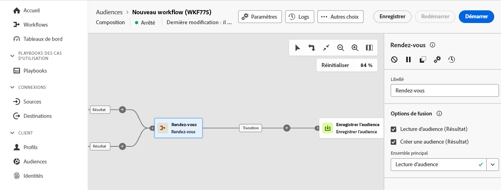

# Rendez-vous {#join}

>[!CONTEXTUALHELP]
>id="dc_orchestration_and-join"
>title="Activité Rendez-vous"
>abstract="La variable **Et rejoindre** vous permet de synchroniser plusieurs branches d’exécution d’une composition. Elle est déclenchée une fois toutes les activités précédentes terminées. Vous pouvez ainsi vous assurer que certaines activités sont terminées avant de continuer à exécuter la composition."

La variable **AND-join** vous permet de synchroniser plusieurs branches d’exécution d’une composition.

L’activité Rendez-vous ne déclenche sa transition sortante qu’une fois toutes les transitions entrantes activées, c’est-à-dire quand toutes les activités précédentes sont terminées. Vous pouvez ainsi vous assurer que certaines activités sont terminées avant de continuer à exécuter la composition.

## Configurer l’activité Rendez-vous {#and-join-configuration}

>[!CONTEXTUALHELP]
>id="dc_orchestration_and-join_merging"
>title="Configurer l’activité Rendez-vous"
>abstract="Sélectionnez les activités auxquelles vous souhaitez adhérer. Dans l’**Ensemble principal**, choisissez la population de transition entrante à conserver."

Pour configurer l’activité **Rendez-vous**, procédez comme suit :

1. Ajoutez plusieurs activités afin de former au moins deux branches d&#39;exécution différentes.
1. Ajoutez une activité **Rendez-vous** à l’une des branches.

   

1. Dans le **Options de fusion** , vérifiez toutes les activités précédentes que vous souhaitez synchroniser.
1. Dans l’**Ensemble principal**, choisissez la population de transition entrante à conserver. La transition sortante ne peut contenir que l&#39;une des populations des transitions entrantes. Si l&#39;activité n&#39;est pas paramétrée, la transition sortante contiendra aléatoirement l&#39;une des populations entrantes.
