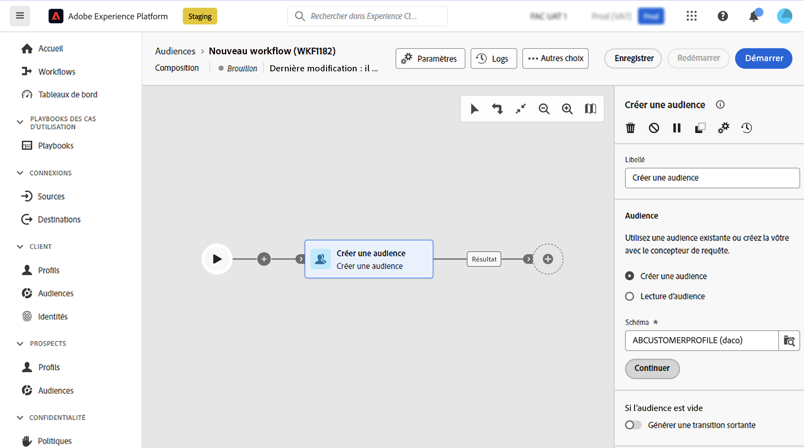
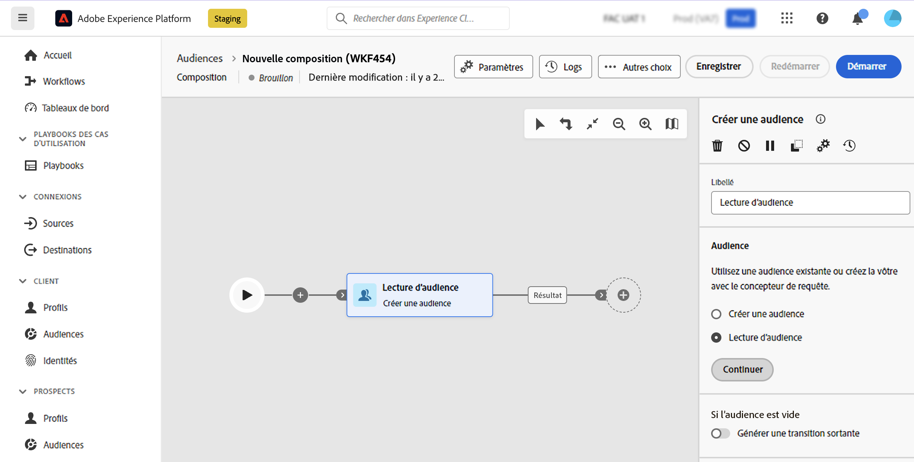

# Créer une audience {#build-audience}

>[!CONTEXTUALHELP]
>id="dc_orchestration_build_audience"
>title="Activité Créer une audience"
>abstract="L’activité **Créer une audience** permet de définir l’audience qui va entrer dans la composition."

L&#39;activité **Créer l&#39;audience** vous permet de définir l&#39;audience qui va entrer dans la composition. Pour définir la population de l’audience, vous pouvez :

* Sélectionnez une audience Adobe Experience Platform existante.
* Créez une nouvelle audience avec le modèle de requête en définissant et combinant des critères de filtrage.

## Configurer l’activité Créer une audience {#build-audience-configuration}

>[!CONTEXTUALHELP]
>id="dc_orchestration_build_audience_audienceselector"
>title="Audience"
>abstract="Sélectionnez votre audience."

Pour configurer l’activité **Créer une audience**, procédez comme suit :

1. Ajoutez une activité **Créer une audience**.
1. Définissez un libellé.
1. Indiquez si vous souhaitez créer une audience ou en sélectionner une existante.
1. Configurez votre audience en suivant les étapes présentées dans les onglets ci-dessous.

>[!BEGINTABS]

>[!TAB Créer une audience]

Pour créer votre propre audience, procédez comme suit :

1. Sélectionnez **Créer une audience**.
1. Sélectionnez le **Schéma**, également appelé dimension de ciblage. Le schéma permet de définir la population ciblée par l&#39;opération : destinataires, bénéficiaires de contrats, opérateur, abonnés, etc. Par défaut, le schéma est sélectionné parmi les destinataires.

   

1. Cliquez sur **Continuer**.
1. Utilisez le modèle de requête pour définir votre requête, puis confirmez. [Découvrez comment utiliser le concepteur de requêtes](../../query/query-modeler-overview.md).

>[!TAB Lecture d’audience]

Pour sélectionner une audience existante, procédez comme suit :

1. Sélectionnez **Lecture d’audience**.
1. Cliquez sur **Continuer**.

   

1. Sélectionnez votre audience.

>[!ENDTABS]

>[!NOTE]
>
>L&#39;option **Générer une transition sortante** permet d&#39;ajouter une transition sortante qui sera activée à la fin de l&#39;exécution de l&#39;activité si la population de l&#39;audience est vide.

<!--
## Examples{#build-audience-examples}

Here is an example of a workflow with two **Build audience** activities. The first one targets the poker players audience, followed by an email delivery. The second one targets the VIP clients audience, followed by an SMS delivery.

-->
