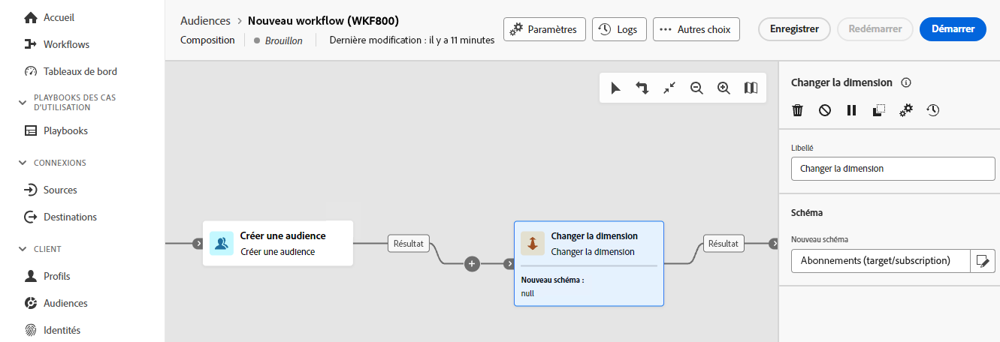

# Changement de dimension {#change-dimension}

>[!CONTEXTUALHELP]
>id="dc_orchestration_dimension_complement"
>title="Générer un complémentaire"
>abstract="Vous pouvez générer une transition sortante supplémentaire avec la population restante, qui a été exclue en tant que doublon. Pour ce faire, activez l’option **Générer le complémentaire**."

>[!CONTEXTUALHELP]
>id="dc_orchestration_change_dimension"
>title="Activité Changement de dimension"
>abstract="Cette activité vous permet de modifier le schéma, ou dimension de ciblage, à mesure que vous créez une audience. Elle déplace l’axe en fonction du modèle de données et du schéma d’entrée. Par exemple, vous pouvez passer du schéma « contrats » au schéma « clientèle »."

L’activité **Changement de dimension** vous permet de modifier le schéma, également appelé dimension de ciblage, lorsque vous créez votre audience. Il déplace l’axe en fonction du modèle de données et du schéma d’entrée.

## Configurer l’activité Changement de dimension {#configure}

Pour configurer l’activité **Changement de dimension**, procédez comme suit :

1. Ajoutez une activité **Changement de dimension** à votre composition.

   

1. Définissez le **nouveau schéma**. Lors de la modification du schéma, tous les enregistrements sont conservés.

1. Exécutez la composition pour visualiser le résultat. Comparez les données des tables avant et après l’activité **Changement de dimension** et comparez la structure des tables de composition.

<!--
## Example {#example}

In this example, we want to send an SMS delivery to all the profiles who have made a purchase. To do this, we first use a **[!UICONTROL Build audience]** activity linked to a custom "Purchase" targeting dimension to target all purchases that occurred.

We then use a **[!UICONTROL Change dimension]** activity to switch the workflow targeting dimension to "Recipients". This allows us to be able to target the recipients who match the query.
-->

<!-- on parle de dimension, mais dans UI "schema", va rester comme ça ?-->