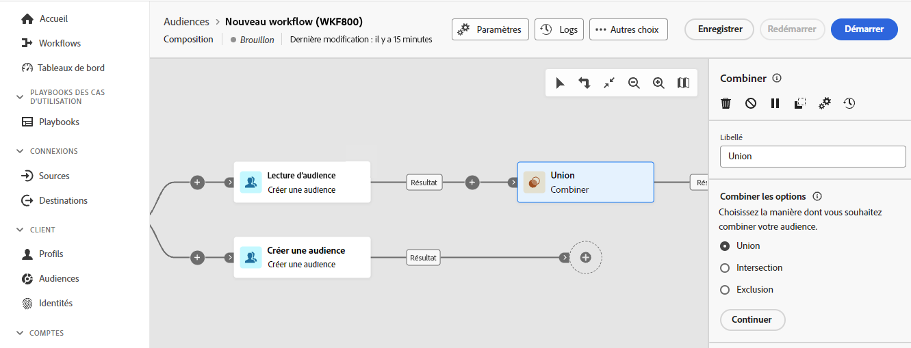
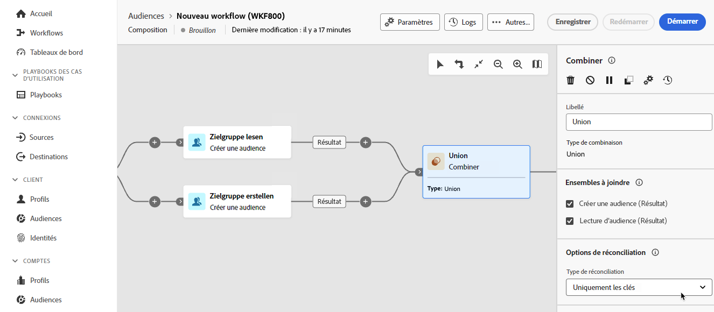
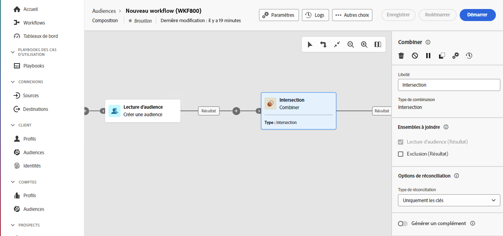
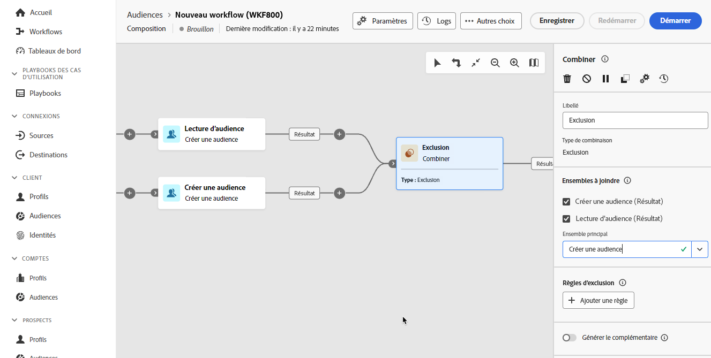

# Combiner {#combine}

>[!CONTEXTUALHELP]
>id="dc_orchestration_combine"
>title="Activité Combiner"
>abstract="L’activité **Combiner** permet d’effectuer une segmentation sur votre population entrante. Il est ainsi possible de regrouper plusieurs populations, d’en exclure une partie ou de ne conserver que les données communes entre plusieurs cibles."

L’activité **Combiner** permet d’effectuer une segmentation sur votre population entrante. Vous pouvez ainsi regrouper plusieurs populations, en exclure une partie ou ne conserver que les données communes entre plusieurs cibles.

L’activité **Combiner** peut être placée après toute autre activité, mais pas au début de la composition. Toute activité peut être placée après l’activité **Combiner**.

## Configurer l’activité Combiner {#combine-configuration}

>[!CONTEXTUALHELP]
>id="dc_orchestration_intersection_merging_options"
>title="Options de fusion des intersections"
>abstract="L’**intersection** permet de ne conserver que les éléments communs aux différentes populations entrantes dans l’activité. Dans la section **Ensembles à joindre**, cochez les activités précédentes à joindre."

>[!CONTEXTUALHELP]
>id="dc_orchestration_exclusion_merging_options"
>title="Options de fusion des exclusions"
>abstract="L’**exclusion** permet d’exclure des éléments d’une population selon certains critères. Dans la section **Ensembles à joindre**, cochez les activités précédentes à joindre."

>[!CONTEXTUALHELP]
>id="dc_orchestration_combine_options"
>title="Sélectionner le type de segmentation"
>abstract="Choisissez comment combiner des audiences : union, intersection ou exclusion."

Pour commencer à configurer l’activité **Combiner**, procédez comme suit :

1. Ajoutez plusieurs activités afin de former au moins deux branches d’exécution différentes.

1. Ajoutez une activité **Combiner** à l’une des branches précédentes.

1. Sélectionnez le type de segmentation : [Union](#union), [Intersection](#intersection) ou [Exclusion](#exclusion), puis cliquez sur **Continuer**.

   

1. Dans la section **Ensembles à joindre**, cochez les activités précédentes à joindre.

## Union {#combine-union}

>[!CONTEXTUALHELP]
>id="dc_orchestration_intersection_reconciliation_options"
>title="Options de réconciliation des interactions"
>abstract="Sélectionnez le type de réconciliation pour définir la manière dont les duplicatas sont traités :"

>[!CONTEXTUALHELP]
>id="dc_orchestration_combine_reconciliation"
>title="Options de réconciliation"
>abstract="Sélectionnez le **type de réconciliation** pour définir comment gérer les doublons."

Dans l’activité **Combiner**, vous pouvez configurer une **union**.

Pour cela, vous devez sélectionner le **type de réconciliation** pour définir la manière dont les doublons sont traités :

* **Uniquement les clés** : il s’agit du mode par défaut. Lorsque des éléments provenant des différentes transitions entrantes ont la même clé, l’activité ne conserve qu’un élément. Cette option ne peut être utilisée que si les populations entrantes sont homogènes.
* **Une sélection de colonnes** : sélectionnez cette option pour définir la liste des colonnes sur lesquelles est appliquée la réconciliation des données. Vous devez d’abord sélectionner l’ensemble principal (celui qui contient les données sources), puis les colonnes à utiliser pour la jointure.

## Intersection {#combine-intersection}

Dans l’activité **Combiner**, vous pouvez configurer une **intersection**.

Pour cela, suivez les étapes supplémentaires ci-dessous :

1. Sélectionnez le **Type de réconciliation** pour définir la manière dont les duplicatas sont traités. Pour plus d’informations, consultez la section [Union](#union).
1. Cochez l’option **Générer le complément** si vous souhaitez traiter la population restante. Le complémentaire contiendra l’union des résultats de toutes les activités entrantes, moins l’intersection. Une transition sortante supplémentaire sera alors ajoutée à l’activité.

## Exclusion {#combine-exclusion}

>[!CONTEXTUALHELP]
>id="dc_orchestration_exclusion_options"
>title="Règles d’exclusion"
>abstract="Le cas échéant, vous pouvez manipuler les tableaux entrants. En effet, pour exclure une cible d’un autre schéma, ou dimension de ciblage, cette cible doit être replacée dans le même schéma que la cible principale. Pour ce faire, cliquez sur **Ajouter une règle** dans la section **Règles d’exclusion** et indiquez les conditions de changement du schéma. La réconciliation des données s’effectue au moyen d’un attribut ou d’une jointure."

>[!CONTEXTUALHELP]
>id="dc_orchestration_combine_sets"
>title="Sélectionner des ensembles à combiner"
>abstract="Dans la section **Ensembles à joindre**, sélectionnez **Ensemble principal** parmi les transitions entrantes. C’est l’ensemble à partir duquel des éléments sont exclus. Les autres ensembles correspondent aux éléments devant être exclus de l’ensemble principal."

>[!CONTEXTUALHELP]
>id="dc_orchestration_combine_exclusion"
>title="Règles d’exclusion"
>abstract="Le cas échéant, vous pouvez manipuler les tableaux entrants. En effet, pour exclure une cible d’un autre schéma, ou dimension de ciblage, cette cible doit être replacée dans le même schéma que la cible principale. Pour ce faire, cliquez sur **Ajouter une règle** dans la section **Règles d’exclusion** et indiquez les conditions de changement du schéma. La réconciliation des données s’effectue au moyen d’un attribut ou d’une jointure."

>[!CONTEXTUALHELP]
>id="dc_orchestration_combine_complement"
>title="Combiner la génération de complément"
>abstract="Activez l’option **Générer un complément** pour traiter la population restante dans une transition supplémentaire."

Dans l’activité **Combiner**, vous pouvez configurer une **exclusion**.

Pour cela, suivez les étapes supplémentaires ci-dessous :

1. Dans la section **Ensembles à joindre**, sélectionnez **Ensemble principal** parmi les transitions entrantes. C’est l’ensemble à partir duquel des éléments sont exclus. Les autres ensembles correspondent aux éléments devant être exclus de l’ensemble principal.

1. Le cas échéant, vous pouvez manipuler les tableaux entrants. En effet, pour exclure une cible d’un autre schéma, cette cible doit être replacée dans le même schéma que la cible principale. Pour ce faire, cliquez sur **Ajouter une règle** dans la section **Règles d’exclusion** et indiquez les conditions de changement du schéma. La réconciliation des données s’effectue au moyen d’un attribut ou d’une jointure. <!-- pas compris-->
1. Vous pouvez vérifier l’option **Générer le complémentaire** si vous souhaitez traiter la population restante. Pour plus d’informations, consultez la section [Intersection](#intersection).

<!--
## Examples{#combine-examples}

In the following example, we are using a **Combine** activity and we add a **union** to retrieves all the profiles of the two queries: persons between 18 and 27 years old and persons between 34 and 40 years old.

The following example shows the **intersection** between two query activities. It is being used here to retrieve profiles who are between 18 to 27 years old and whose email address has been provided.

The following **exclusion** example shows two queries configured to filter profiles who are between 18 and 27 years old and have an Adobe email domain. The profiles with an Adobe email domain are then excluded from the first set. 

-->
