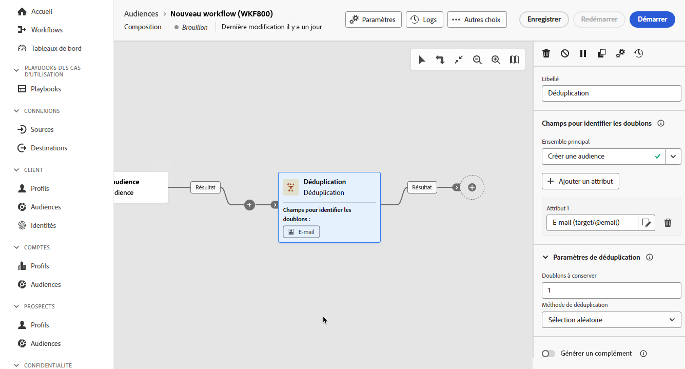

# Déduplication {#deduplication}

>[!CONTEXTUALHELP]
>id="dc_orchestration_deduplication_fields"
>title="Champs pour identifier les doublons"
>abstract="Dans la section **[!UICONTROL Champs pour identifier des doublons]**, cliquez sur le bouton **[!UICONTROL Ajouter un attribut]** pour indiquer les champs pour lesquels des valeurs identiques permettent d’identifier les doublons, par exemple : adresse e-mail, prénom, nom, etc. L’ordre des champs vous permet de spécifier ceux à traiter en premier."

>[!CONTEXTUALHELP]
>id="dc_orchestration_deduplication"
>title="Activité Déduplication"
>abstract="L’activité **Déduplication** permet de supprimer les doublons dans le ou les résultats des activités entrantes. Elle est principalement utilisée à la suite des activités de ciblage et avant les activités permettant l’utilisation des données ciblées."

>[!CONTEXTUALHELP]
>id="dc_orchestration_deduplication_complement"
>title="Générer un complémentaire"
>abstract="Vous pouvez générer une transition sortante supplémentaire avec la population restante, qui a été exclue en tant que doublon. Pour ce faire, activez l’option **[!UICONTROL Générer un complément]**."

>[!CONTEXTUALHELP]
>id="dc_orchestration_deduplication_settings"
>title="Paramètres de déduplication"
>abstract="Pour supprimer des doublons dans les données entrantes, définissez la méthode de déduplication dans les champs ci-dessous. Par défaut, un seul enregistrement est conservé. Vous devez également sélectionner le mode de déduplication en fonction d’une expression ou d’un attribut. Par défaut, l’enregistrement à conserver en dehors des doublons est sélectionné de manière aléatoire."

L’activité **Déduplication** permet de supprimer les doublons dans le ou les résultats des activités entrantes, par exemple les profils dupliqués dans la liste des personnes destinataires. L’activité **Déduplication** est généralement utilisée à la suite des activités de ciblage et avant les activités permettant d’utiliser les données ciblées.

## Configurer l’activité Déduplication{#deduplication-configuration}

Pour configurer l’activité **Déduplication**, procédez comme suit :

1. Ajoutez une activité **Déduplication** à votre composition.

1. Si l’activité possède plusieurs transitions entrantes, sélectionnez la transition à utiliser pour effectuer la déduplication dans la liste déroulante **[!UICONTROL Ensemble principal]**.

1. Dans la section **[!UICONTROL Champs pour identifier des doublons]**, cliquez sur le bouton **[!UICONTROL Ajouter un attribut]** pour indiquer les champs pour lesquels des valeurs identiques permettent d’identifier les doublons, par exemple : adresse e-mail, prénom, nom, etc. L’ordre des champs vous permet de spécifier ceux à traiter en premier.

   

1. Dans la section **[!UICONTROL Paramètres de déduplication]**, sélectionnez le nombre de **[!UICONTROL Doublons à conserver]** uniques. La valeur par défaut de champ est **1**. La valeur **0** permet de conserver tous les doublons.

   Par exemple, si les enregistrements A et B sont considérés comme des doublons de l’enregistrement Y et qu’un enregistrement C est considéré comme un doublon de l’enregistrement Z :

   * Si la valeur du champ est **1** : seuls les enregistrements Y et Z sont conservés.
   * Si la valeur du champ est **0** : tous les enregistrements sont conservés.
   * Si la valeur du champ est **2** : les enregistrements C et Z sont conservés et deux enregistrements parmi A, B et Y sont conservés, par hasard ou selon la méthode de déduplication sélectionnée par la suite.

1. Sélectionnez la **[!UICONTROL méthode de déduplication]** à utiliser :

   * **[!UICONTROL Sélection aléatoire]** : sélectionne au hasard l’enregistrement à conserver parmi les doublons.
   * **[!UICONTROL À partir d’une expression]** : permet de conserver les enregistrements dont la valeur de l’expression renseignée est la plus petite ou la plus grande.
   * **[!UICONTROL Valeurs non vides]** : conserve les enregistrements pour lesquels l’expression n’est pas vide.
   * **[!UICONTROL Par ordonnancement de valeurs]** : définit un ordre de priorité des valeurs pour un ou plusieurs champs. Pour définir les valeurs, cliquez sur **[!UICONTROL Attributs]** pour sélectionner un champ ou créez une expression, puis ajoutez la ou les valeurs dans le tableau correspondant. Pour définir un nouveau champ, cliquez sur le bouton **[!UICONTROL Ajouter]** situé au-dessus de la liste des valeurs.

1. Cochez l’option **[!UICONTROL Générer le complément]** si vous souhaitez exploiter la population restante. Le complément est constitué de tous les doublons. Une transition supplémentaire sera alors ajoutée à l’activité.

<!--
## Example{#deduplication-example}

In the following example, use a deduplication activity to exclude duplicates from the target before sending a delivery. The identified duplicated profiles are added to a dedicated audience that can be reused if necessary. Choose the **Email** address to identify the duplicates. Keep 1 entry and select the **Random** deduplication method.

-->
