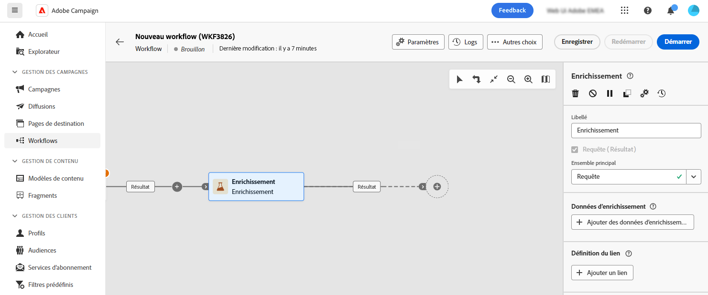

# Enrichissement {#enrichment}

>[!CONTEXTUALHELP]
>id="dc_orchestration_enrichment"
>title="Activité Enrichissement"
>abstract="L’activité **Enrichissement** permet d’enrichir les données ciblées avec des informations supplémentaires provenant de la base de données. Elle est généralement utilisée dans une composition après les activités de segmentation."

>[!CONTEXTUALHELP]
>id="dc_orchestration_enrichment_data"
>title="Activité Enrichissement"
>abstract="Une fois les données d’enrichissement ajoutées à la composition, elles peuvent être utilisées dans les activités ajoutées après l’activité **Enrichissement** pour segmenter les profils en groupes distincts en fonction de leurs comportements, préférences et choix."

>[!CONTEXTUALHELP]
>id="dc_orchestration_enrichment_simplejoin"
>title="Définition de lien"
>abstract="Créez un lien entre les données de la table de travail et la base de données fédérée."

>[!CONTEXTUALHELP]
>id="dc_orchestration_enrichment_reconciliation"
>title="Réconciliation des enrichissements"
>abstract="Définissez les paramètres de réconciliation."

>[!CONTEXTUALHELP]
>id="dc_targetdata_personalization_enrichmentdata"
>title="Données d’enrichissement"
>abstract="Sélectionnez les données à utiliser pour enrichir votre composition. Vous pouvez sélectionner deux types de données d’enrichissement : un seul attribut d’enrichissement du schéma, ou dimension de ciblage, ou un lien de collection, qui est un lien avec une cardinalité 1-N entre les tableaux."

L’activité **Enrichissement** permet d’enrichir les données ciblées avec des informations supplémentaires provenant de la base de données fédérée. Elle est généralement utilisée dans une composition après les activités de segmentation.

Si vous avez configuré une connexion à la destination de composition d’audiences fédérées, vous pouvez utiliser l’activité Enrichissement pour enrichir les données provenant de Adobe Experience Platform avec les attributs de votre base de données externe. [Découvrir comment enrichir les audiences Adobe Experience Platform avec des données externes](../../connections/destinations.md)

Les données d’enrichissement tirent leur origine des sources suivantes :

* **La même table de travail** que celle ciblée dans votre composition :

  *Ciblez un groupe de clientes et de clients et ajoutez le champ « Date de naissance » au tableau de travail actuel.*

* **Une autre table de travail** :

  *Ciblez un groupe de clients et de clientes et ajoutez les champs « Montant » et « Type de produit » provenant du tableau « Achat »*.

Une fois les données d’enrichissement ajoutées à la composition, elles peuvent être utilisées dans les activités ajoutées après l’activité **Enrichissement** pour segmenter les clientes et clients en groupes distincts en fonction de leurs comportements, préférences et choix.

<!--For instance, you can add to the working table information related to customers' purchases and use this data to personalize emails with their latest purchase or the amount spent on these purchases.-->

## Configurer l’activité Enrichissement {#enrichment-configuration}

Pour configurer l’activité **Enrichissement**, procédez comme suit :

1. Ajoutez des activités telles que **Créer une audience** et **Combiner**.
1. Ajoutez une activité **Enrichissement**.

   

1. Si plusieurs transitions ont été configurées dans votre composition, vous pouvez utiliser le champ **[!UICONTROL Ensemble principal]** pour définir la transition à utiliser comme ensemble principal pour enrichir les données.

1. Cliquez sur **Ajouter des données d’enrichissement** et sélectionnez l’attribut à utiliser pour enrichir les données.

   

   >[!NOTE]
   >
   >Le **bouton Modifier l’expression** dans l’écran de sélection d’attributs vous permet de créer des expressions avancées pour sélectionner l’attribut.

<!--PAS VU SUR INSTANCE: You can select two types of enrichment data: a single enrichment attribute from the target dimension, or a collection link. Each of these types is detailed in the examples below:

    * [Single enrichment attribute](#single-attribute)
    * [Collection lnk](#collection-link)-->

<!--
## Examples {#example}

### Single enrichment attribute {#single-attribute}

Here, we are just adding a single enrichment attribute, for example, the date of birth. Follow these steps:

1. Click inside the **Attribute** field.
1. Select a simple field from the schema, also known as targeting dimension, the date of birth in our example. 
1. Click **Confirm**.
-->
<!--### Collection link {#collection-link}

In this more complex use case, we will select a collection link which is a link with a 1-N cardinality between tables. Let's retrieve the three latest purchases that are less than 100$. For this you need to define:

* an enrichment attribute: the **Total amount** field
* the number of lines to retrieve: 3
* a filter: filter out items that are greater than 100$
* a sorting: descendant sorting on the **Order date** field. 

#### Add the attribute {#add-attribute}

This is where you select the collection link to use as enrichment data.

1. Click inside the **Attribute** field.
1. Click **Display advanced attributes**.
1. Select the **Total amount** field from the **Purchases** table. 

#### Define the collection settings{#collection-settings}

Then, define how the data is collected and the number of records to retrieve.

1. Select **Collect data** in the **Select how the data is collected** drop-down.
1. Type "3" in the **Lines to retrieve (Columns to create)** field. 

If you want, for example, to get the average amount of purchases for a customer, select **Aggregated data** instead, and select **Average** in the **Aggregate function** drop-down.

#### Define the filters{#collection-filters}

Here, we define the maximum value for the enrichment attribute. We filter out items that are greater than 100$. [Learn how to work with the query modeler](../../query/query-modeler-overview.md)

1. Click **Edit filters**.
1. Add the two following filters: **Total amount** exists AND **Total amount** is less than 100. The first one filters NULL values as they would appear as the greatest value.
1. Click **Confirm**.

#### Define the sorting{#collection-sorting}

We now need to apply sorting in order to retrieve the three **latest** purchases.

1. Activate the **Enable sorting** option.
1. Click inside the **Attribute** field.
1. Select the **Order date** field.
1. Click **Confirm**. 
1. Select **Descending** from the **Sort** drop-down.-->
