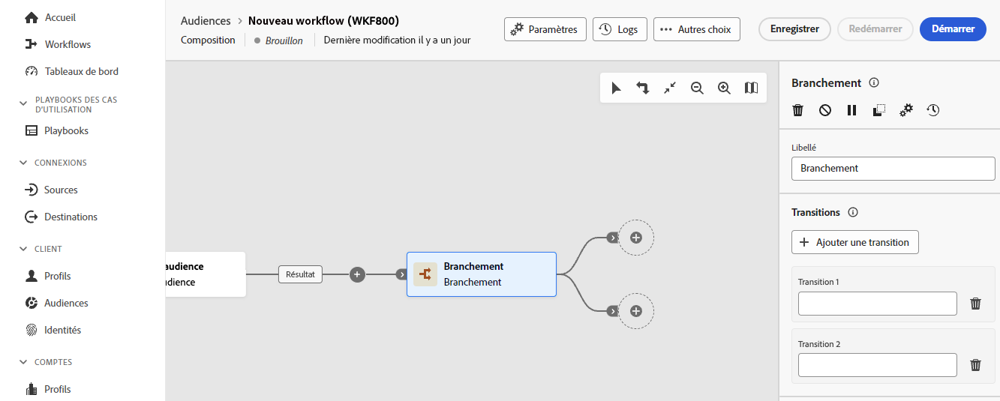

# Branchement {#fork}

>[!CONTEXTUALHELP]
>id="dc_orchestration_fork"
>title="Activité Branchement"
>abstract="L’activité **Branchement** permet de créer des transitions sortantes afin de lancer plusieurs activités en parallèle."

>[!CONTEXTUALHELP]
>id="dc_orchestration_fork_transitions"
>title="Transitions de l’activité Branchement"
>abstract="Par défaut, deux transitions sont créées avec une activité **Branchement**. Cliquez sur le bouton **Ajouter une transition** pour définir une transition sortante supplémentaire, puis renseignez son libellé."

L’activité **Branchement** permet de créer des transitions sortantes afin de lancer plusieurs activités en parallèle.

## Configurer l’activité Branchement {#fork-configuration}

Pour configurer l’activité **Branchement**, procédez comme suit :

1. Ajoutez une activité **Branchement** à votre composition.
1. Cliquez sur **Ajouter une transition** pour ajouter une nouvelle transition sortante. Par défaut, deux transitions sont définies.
1. Ajoutez un libellé à chacune de vos transitions.

   
