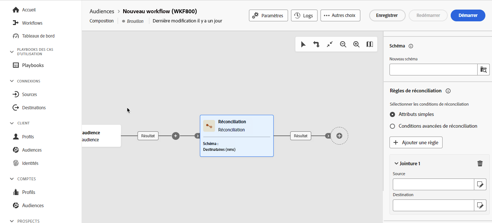
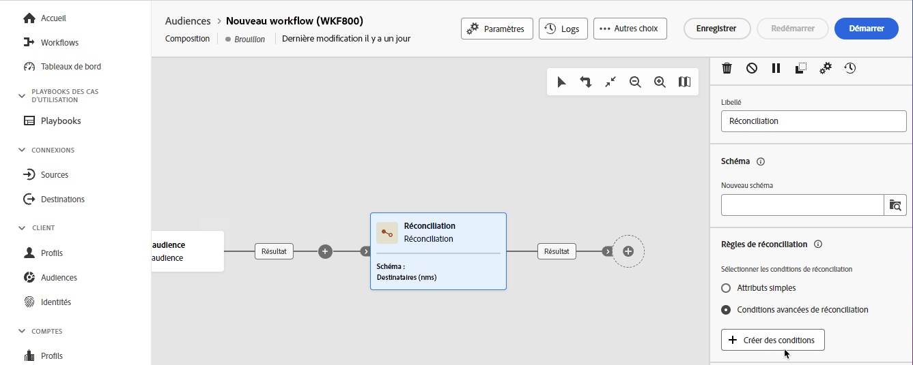

# Réconciliation {#reconciliation}

>[!CONTEXTUALHELP]
>id="dc_orchestration_reconciliation"
>title="Activité Réconciliation"
>abstract="La variable **Réconciliation** permet de définir le lien entre les données de la base et les données d&#39;une table de travail."

>[!CONTEXTUALHELP]
>id="dc_orchestration_reconciliation_field"
>title="Champ de sélection de la réconciliation"
>abstract="Champ de sélection de la réconciliation"

>[!CONTEXTUALHELP]
>id="dc_orchestration_reconciliation_condition"
>title="Condition de création de réconciliation"
>abstract="Condition de création de réconciliation"

>[!CONTEXTUALHELP]
>id="dc_orchestration_reconciliation_complement"
>title="Complément de génération de réconciliation"
>abstract="Complément de génération de réconciliation"

La variable **Réconciliation** activité permet de définir le lien entre les données de la base et celles d&#39;une table de travail, par exemple les données chargées depuis un système externe.

<!--For example, the **Reconciliation** activity can be placed after a **Load file** activity to import non-standard data into the database. In this case, the **Reconciliation** activity lets you define the link between the data in the Adobe Campaign database and the data in the work table.-->

La variable **Réconciliation** vous permet de lier des données non identifiées à des ressources existantes. L&#39;opération de réconciliation implique que les données que vous joignez se trouvent déjà dans la base de données. Par exemple, si vous souhaitez réconcilier des informations d’achat indiquant quel produit a été acheté, à quelle heure, par quel client, etc., le produit ainsi que le client doivent déjà exister dans la base de données.

## Configurer l’activité Réconciliation {#reconciliation-configuration}

>[!CONTEXTUALHELP]
>id="dc_orchestration_reconciliation_targeting"
>title="Schéma"
>abstract="Sélectionnez le nouveau schéma à appliquer aux données. Un schéma, également appelé dimension de ciblage, permet de définir la population ciblée : destinataires, abonnés aux applications, opérateurs, abonnés, etc. Par défaut, le schéma actuel de la composition est sélectionné."

>[!CONTEXTUALHELP]
>id="dc_orchestration_reconciliation_rules"
>title="Règles de réconciliation"
>abstract="Sélectionnez les règles de réconciliation à utiliser pour la déduplication. Pour utiliser des attributs, sélectionnez l’option **Attributs simples** et choisissez les champs source et de destination. Pour créer votre propre condition de réconciliation à l’aide du concepteur de requête, sélectionnez l’option **Conditions de réconciliation avancées**."

>[!CONTEXTUALHELP]
>id="dc_orchestration_reconciliation_targeting_selection"
>title="Sélectionner la dimension de ciblage"
>abstract="Sélectionnez le schéma, également appelé dimension de ciblage, auquel vos données entrantes doivent être réconciliées."

>[!CONTEXTUALHELP]
>id="dc_orchestration_keep_unreconciled_data"
>title="Conserver les données non réconciliées"
>abstract="Par défaut, les données non réconciliées sont conservées dans la transition sortante et disponibles dans la table de travail pour une utilisation ultérieure. Pour supprimer les données non réconciliées, désactivez l’option **Conserver les données non réconciliées**."

>[!CONTEXTUALHELP]
>id="dc_orchestration_reconciliation_attribute"
>title="Attribut de réconciliation"
>abstract="Sélectionnez l&#39;attribut à utiliser pour réconcilier les données et validez."

Pour configurer l’activité **Réconciliation**, procédez comme suit :

1. Ajouter un **Réconciliation** dans votre composition.

1. Sélectionnez la variable **Nouveau schéma**. Un schéma, également appelé dimension de ciblage, permet de définir la population ciblée : destinataires, abonnés aux applications, opérateurs, abonnés, etc.

1. Sélectionnez le ou les champs à utiliser pour la réconciliation. Vous pouvez utiliser un ou plusieurs critères de réconciliation.

   1. Pour utiliser des attributs afin de réconcilier des données, sélectionnez la variable **Attributs simples** puis cliquez sur l’option **Ajouter une règle** bouton .
   1. Sélectionnez la variable **Source** et **Destination** pour la réconciliation. La variable **Source** champ . La variable **Destination** correspond aux champs du schéma sélectionné.

      Les données sont réconciliées lorsque la source et la destination sont égales. Par exemple, sélectionnez les champs **E-mail** pour dédupliquer des profils en fonction de leur adresse e-mail.

      Pour ajouter un autre critère de réconciliation, cliquez sur le bouton **Ajouter une règle**. Si plusieurs conditions de jointure sont indiquées, elles doivent TOUTES être vérifiées pour que le lien entre les données puisse se faire.

      

   1. Pour utiliser d’autres attributs afin de réconcilier des données, sélectionnez la variable **Conditions de réconciliation avancées** puis cliquez sur l’option **Création de conditions** bouton . Vous pouvez ensuite créer votre propre condition de réconciliation à l’aide du modeleur de requête.

      

1. Vous pouvez filtrer les données à réconcilier à l’aide du bouton **Créer un filtre**. Vous pouvez ainsi créer une condition personnalisée à l’aide du créateur de modèles de requête.

Par défaut, les données non réconciliées sont conservées dans la transition sortante et disponibles dans la table de travail pour une utilisation ultérieure. Pour supprimer les données non réconciliées, désactivez l’option **Conserver les données non réconciliées**.

<!--
## Example {#reconciliation-example}

The following example demonstrates a workflow that creates an audience of profiles directly from an imported file containing new clients. It is made up of the following activities:

The workflow is designed as follows:


 
It is built with the following activities:

* A [Load file](load-file.md) activity uploads a file containing profiles data that were extracted from an external tool.

    For example:

    ```
    lastname;firstname;email;birthdate;
    JACKMAN;Megan;megan.jackman@testmail.com;07/08/1975;
    PHILLIPS;Edward;phillips@testmail.com;09/03/1986;
    WEAVER;Justin;justin_w@testmail.com;11/15/1990;
    MARTIN;Babe;babeth_martin@testmail.net;11/25/1964;
    REESE;Richard;rreese@testmail.com;02/08/1987;
    ```

* A **Reconciliation** activity which identifies the incoming data as profiles, by using the **email** and **Date of birth** fields as reconciliation criteria.

    

* A [Save audience](save-audience.md) activity to create a new audience based on these updates. You can also replace the **Save audience** activity by an **End** activity if no specific audience needs to be created or updated. Recipient profiles are updated in any case when you run the workflow.


## Compatibility {#reconciliation-compat}

The **Reconciliation** activity does not exist in the Client console. All **Enrichments** activities created in the Client console with the reconciliation options enabled are displayed as **Reconciliation** activities in Campaign Web user interface.
-->
