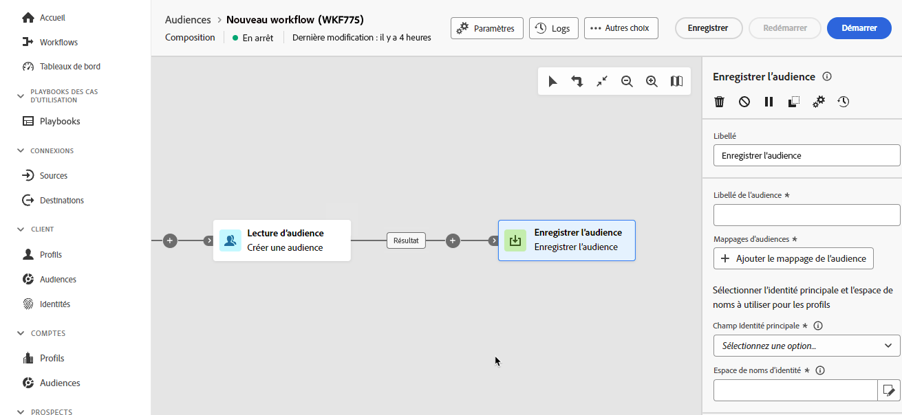

# Enregistrer l’audience {#save-audience}

>[!CONTEXTUALHELP]
>id="dc_orchestration_save_audience"
>title="Enregistrer une audience"
>abstract="Utilisez cette activité pour créer une audience à partir de la population calculée en amont dans la composition. Les audiences créées sont ajoutées à la liste des audiences et sont disponibles dans le menu **Audiences**."

>[!CONTEXTUALHELP]
>id="dc_orchestration_saveaudience_outbound"
>title="Générer une transition sortante"
>abstract="Utilisez cette option pour ajouter une transition après l’activité **Enregistrer l’audience**."

>[!CONTEXTUALHELP]
>id="dc_orchestration_save_audience_primary_identity"
>title="Champ d’identité principale"
>abstract="Sélectionnez l’identité principale à utiliser pour les profils."
>additional-url="https://experienceleague.adobe.com/fr/docs/experience-platform/xdm/ui/fields/identity#define-a-identity-field" text="En savoir plus dans la documentation d’Experience Platform"

>[!CONTEXTUALHELP]
>id="dc_orchestration_saveaudience_namespace"
>title="Espace de noms d’identité"
>abstract="Sélectionnez l’espace de noms à utiliser pour les profils."
>additional-url="https://experienceleague.adobe.com/fr/docs/experience-platform/identity/features/namespaces" text="En savoir plus dans la documentation d’Experience Platform"

>[!IMPORTANT]
>
>Si votre sandbox utilise une stratégie de fusion **priorité du jeu de données**, contactez l’assistance clientèle d’Adobe pour ajouter le jeu de données `Halos UPS` à votre stratégie de fusion.
>
>Pour plus d’informations sur les politiques de fusion, consultez la [présentation des politiques de fusion](https://experienceleague.adobe.com/fr/docs/experience-platform/profile/merge-policies/overview).

L’activité **[!UICONTROL Enregistrer l’audience]** permet de créer une audience à partir de la population calculée en amont dans une composition. Les audiences créées sont ajoutées à la liste des audiences Adobe Experience Platform et sont disponibles via le menu **Audiences**. [Découvrir comment utiliser les audiences](../../start/audiences.md)

Cette activité est essentiellement utilisée afin de conserver des groupes de population calculés dans la même composition, en les convertissant en audiences réutilisables. Connectez-la à d’autres activités de ciblage telles que **Créer une audience** ou **Combiner**.

L’activité **[!UICONTROL Enregistrer l’audience]** génère un schéma d’audience et un jeu de données associé, qui peuvent contenir des données personnelles (PII) ou des informations de santé protégées (PHI). Une fois l’audience créée, contactez votre administrateur ou administratrice pour vous assurer que les libellés de gouvernance des données appropriés sont appliqués conformément aux politiques de données de votre organisation. Pour plus d’informations sur l’application des libellés d’utilisation des données, consultez le [guide d’utilisation des libellés d’utilisation des données](https://experienceleague.adobe.com/fr/docs/experience-platform/data-governance/labels/user-guide).

## Configurer l’activité Enregistrer l’audience {#save-audience-configuration}

Pour configurer l’activité **Enregistrer l’audience**, procédez comme suit :

1. Ajoutez une activité **Enregistrer l’audience** à votre composition.

   

1. Indiquez le libellé de l’audience à créer.

   >[!IMPORTANT]
   >
   >Le libellé de l’audience doit être unique dans le sandbox actuel. Il ne peut pas s’agir du même libellé qu’une audience existante.

1. Utilisez la section Mappages d’audiences pour sélectionner les champs que vous souhaitez apporter à l’audience nouvellement créée. Pour ce faire, cliquez sur **Ajouter le mappage d’audiences**, puis sélectionnez les champs d’audience source et cible.

   Répétez l’opération pour ajouter autant de mappages d’audiences que nécessaire.

1. Sélectionnez l’identité principale et l’espace de noms à utiliser pour identifier les profils ciblés dans la base de données :

   * **Champ Identité principale** : sélectionnez le champ à utiliser pour identifier les profils. Par exemple, son adresse e-mail ou son numéro de téléphone.
   * **Espace de noms d’identité** : sélectionnez l’espace de noms à utiliser pour identifier les profils, c’est-à-dire le type de données à utiliser comme clé d’identification. Par exemple, si l’adresse e-mail a été sélectionnée comme champ Identité principale, l’espace de noms d’identité **E-mail** doit être sélectionné. Si l’identifiant unique est le numéro de téléphone, l’espace de noms d’identité **Téléphone** doit être sélectionné.

## Accéder à votre audience dans Adobe Experience Platform {#access-audience}

Après l’exécution de la composition, l’audience obtenue est enregistrée dans Adobe Experience Platform en tant qu’audience externe. Elle est disponible dans Adobe Real-Time CDP et/ou Adobe Journey Optimizer dans le portail des audiences. Pour plus d’informations sur le portail des audiences, consultez la [vue d’ensemble du portail des audiences](https://experienceleague.adobe.com/fr/docs/experience-platform/segmentation/ui/audience-portal){target="_blank"}.

L’audience créée comprend tous les champs sélectionnés dans la section Mappages d’audiences. Vous pouvez ensuite cibler ces audiences dans Journey Optimizer ou les activer vers n’importe quelle destination prise en charge par Adobe Experience Platform.

[En savoir plus dans la documentation d’Adobe Experience Platform](https://experienceleague.adobe.com/fr/docs/experience-platform/segmentation/ui/audience-portal){target="_blank"}

<!--

## Example{#save-audience-example}

The following example illustrates a simple audience update from targeting. A scheduler is added to run the workflow once a month. A query recovers all the profiles subscribed to the different application services available. The **Save audience** activity updates the audience by deleting profiles that have unsubscribed from the service since the last workflow execution and by adding the newly subscribed profiles.
-->
