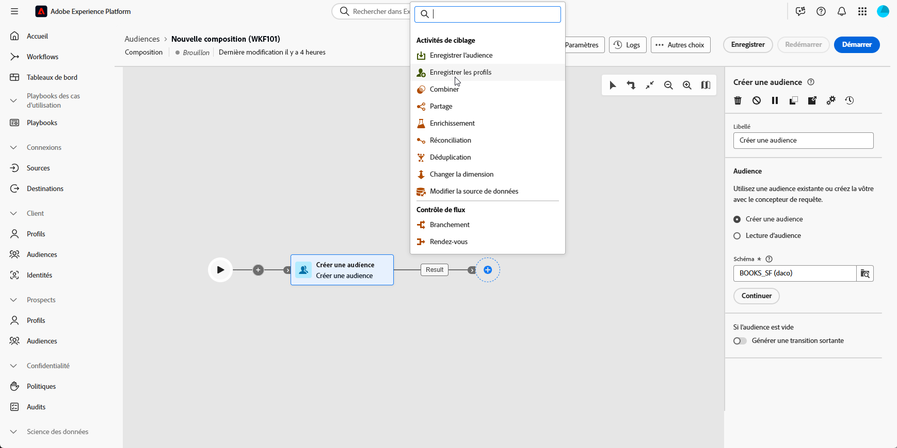
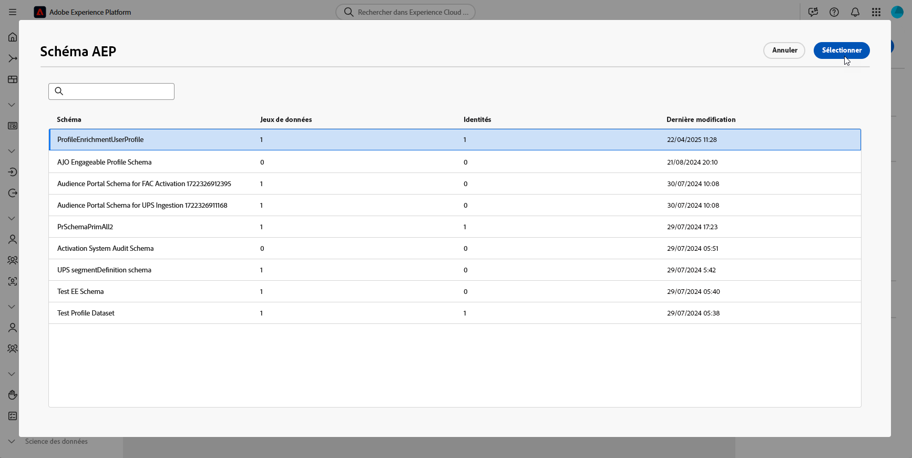
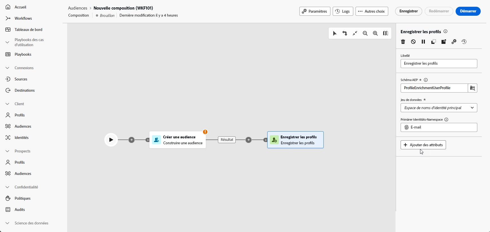

# Enregistrer les profils {#save-profile}

>[!CONTEXTUALHELP]
>id="dc_orchestration_saveprofile"
>title="Enregistrer les profils"
>abstract="L’activité Enregistrer les profils vous permet d’enrichir les profils Experience Platform en fédérant les données d’entrepôts externes, ce qui vous permet d’améliorer les profils clientèle avec des attributs supplémentaires. "

>[!CONTEXTUALHELP]
>id="dc_orchestration_saveprofile_aepschemalist"
>title="Sélectionner un schéma AEP"
>abstract="Choisissez le schéma Experience Platform pour les profils."

>[!CONTEXTUALHELP]
>id="dc_orchestration_saveprofile_primaryidentitynamespace"
>title="Sélectionner le champ d’identité principale"
>abstract="Sélectionnez l’identité principale à utiliser pour identifier les profils ciblés dans la base de données."

>[!CONTEXTUALHELP]
>id="dc_orchestration_saveprofile_selectaepschema"
>title="Sélectionner un schéma AEP"
>abstract="Choisissez le schéma Experience Platform pour les profils."

L’activité **Enregistrer les profils** permet d’enrichir les profils Adobe Experience Platform avec des données fédérées à partir d’entrepôts externes.

Cette activité est généralement utilisée pour améliorer les profils clientèle en apportant des attributs et des informations supplémentaires sans déplacer ou dupliquer physiquement les données dans la plateforme.

## Configurer l’activité Enregistrer les profils {#save-profile-configuration}

Pour configurer l’activité **Enregistrer les profils**, procédez comme suit :

1. Ajoutez une activité **Enregistrer les profils** à votre composition.

   

1. Indiquez le libellé des profils à créer.

   >[!IMPORTANT]
   >
   >Le libellé de l’audience doit être unique dans le sandbox actuel. Il ne peut pas s’agir du même libellé qu’une audience existante.

1. Sélectionnez le schéma Adobe Experience Platform à utiliser.

   

1. Sélectionnez le champ d’identité principale qui sera utilisé pour identifier les profils dans la base de données.

1. Pour réconcilier des attributs de données supplémentaires, cliquez sur **Ajouter des attributs**.

   Spécifiez ensuite le champ **Source** (données externes) et le champ **Destination** (champ de schéma) pour chaque attribut à mapper.

   

1. Une fois la configuration effectuée, cliquez sur **Démarrer**.
