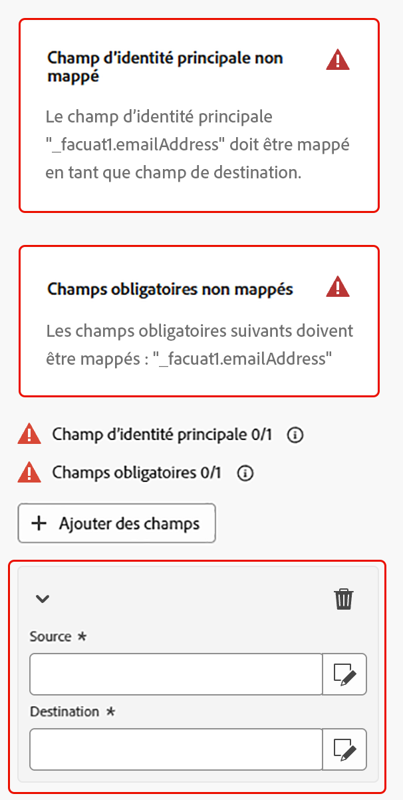

# Enregistrer les profils {#save-profile}

>[!CONTEXTUALHELP]
>id="dc_orchestration_saveprofile"
>title="Enregistrer les profils"
>abstract="L’activité Enregistrer les profils vous permet d’enrichir les profils Experience Platform en fédérant les données d’entrepôts externes, ce qui vous permet d’améliorer les profils clientèle avec des attributs supplémentaires. "

>[!CONTEXTUALHELP]
>id="dc_orchestration_saveprofile_aepschemalist"
>title="Sélectionner le schéma Experience Platform"
>abstract="Choisissez le schéma Experience Platform pour les profils."

>[!CONTEXTUALHELP]
>id="dc_orchestration_saveprofile_primaryidentitynamespace"
>title="Sélectionner le champ d’identité principale"
>abstract="Sélectionnez l’identité principale à utiliser pour identifier les profils ciblés dans la base de données."

>[!CONTEXTUALHELP]
>id="dc_orchestration_saveprofile_selectaepschema"
>title="Sélectionner le schéma Experience Platform"
>abstract="Choisissez le schéma Experience Platform pour les profils."

>[!CONTEXTUALHELP]
>id="dc_orchestration_saveprofile_updatemode"
>title="Mode de mise à jour de l’enregistrement de profil"
>abstract="Les modes de mise à jour disponibles pour l’activité d’enregistrement de profil incluent la mise à jour complète et la mise à jour incrémentielle."

>[!CONTEXTUALHELP]
>id="dc_orchestration_saveprofile_updatemode_full"
>title="Mise à jour complète"
>abstract="Le mode de mise à jour complète met à jour l’ensemble complet des profils pour l’enrichissement."

>[!CONTEXTUALHELP]
>id="dc_orchestration_saveprofile_updatemode_incremental"
>title="Mise à jour incrémentielle"
>abstract="Le mode de mise à jour incrémentielle met à jour les profils qui ont été modifiés depuis la dernière exécution de l’enrichissement."

>[!CONTEXTUALHELP]
>id="dc_orchestration_saveprofile_primaryidentityfield"
>title="Champ d’identité principale"
>abstract="Le champ d’identité principale indique la source de vérité lors de la fusion des profils pour l’enrichissement."

>[!CONTEXTUALHELP]
>id="dc_orchestration_saveprofile_requiredfieldscheck"
>title="Critères des champs obligatoires"
>abstract="Un champ obligatoire est un attribut qui doit être renseigné pour chaque profil ou enregistrement lors de l’export de données. Si un champ obligatoire est manquant, l’export ne sera pas terminé ou valide."

>[!CONTEXTUALHELP]
>id="dc_orchestration_saveprofile_primaryidentitycheck"
>title="Critères du champ d’identité principale"
>abstract="Identifiant unique de chaque profil ou enregistrement. Cela permet de s’assurer que chaque enregistrement peut être distinctement reconnu et mis en correspondance, ce qui évite la duplication des données."

L&#39;activité **[!UICONTROL Enregistrer les profils]** permet d&#39;enrichir les profils Adobe Experience Platform avec des données fédérées à partir d&#39;entrepôts externes.

Cette activité est généralement utilisée pour améliorer les profils client en apportant des attributs et des informations supplémentaires sans déplacer ou dupliquer physiquement les données dans la plateforme.

## Configuration de l&#39;activité [!UICONTROL Enregistrer les profils] {#save-profile-configuration}

>[!IMPORTANT]
>
>L’activité **Enregistrer des profils** nécessite un schéma et un jeu de données activés pour Profile. Pour savoir comment activer votre jeu de données pour qu’il soit activé pour Profil, veuillez lire le [guide d’utilisation des jeux de données](https://experienceleague.adobe.com/fr/docs/experience-platform/catalog/datasets/user-guide#enable-profile){target="_blank"}.
>
>En outre, si l’upsert n’est **activé pour le jeu de données sélectionné** les données des profils seront **remplacées**. Pour savoir comment activer l’upsert pour vos jeux de données, consultez le [guide d’activation de l’upsert](https://experienceleague.adobe.com/en/docs/experience-platform/catalog/datasets/enable-upsert).

Pour configurer l’activité **[!UICONTROL Enregistrer les profils]**, procédez comme suit :

1. Ajoutez une activité **[!UICONTROL Enregistrer les profils]** à votre composition.

   {width="1500" zoomable="yes"}

1. Indiquez le libellé des profils à créer.

   >[!IMPORTANT]
   >
   >Le libellé de l’audience doit être unique dans le sandbox actuel. Il ne peut pas s’agir du même libellé qu’une audience existante.

1. Sélectionnez le schéma Adobe Experience Platform à utiliser.

   {width="1500" zoomable="yes"}

1. Sélectionnez le jeu de données dans lequel vous souhaitez enregistrer l’enrichissement.

   {width="300" zoomable="yes"}

1. Après avoir sélectionné le jeu de données, vous pouvez voir le champ d’identité principale qui sera utilisé pour identifier les profils dans la base de données.

1. Sélectionnez **[!UICONTROL Ajouter des champs]** pour ajouter les champs d’identité principaux et obligatoires.

   {width="300" zoomable="yes"}

   Vous pouvez spécifier le champ **Source** (données externes) et le champ **Destination** (champ de schéma) pour chaque attribut à mapper.

   {width="300" zoomable="yes"}

1. Vous pouvez également définir le mode de mise à jour de l’enrichissement.

   {width="300" zoomable="yes"}

   | Mode de mise à jour | Description |
   | ----------- | ----------- |
   | Mises à jour complètes | L’ensemble complet des profils est mis à jour pour l’enrichissement. |
   | Mises à jour incrémentielles | Seuls les profils qui ont été modifiés depuis la dernière exécution d’enrichissement sont mis à jour pour l’enrichissement. |

   Si vous sélectionnez [!UICONTROL &#x200B; Mises à jour incrémentielles &#x200B;], vous devez également choisir la date de dernière modification pour déterminer les données envoyées.

1. Une fois la configuration effectuée, sélectionnez **Démarrer**.
