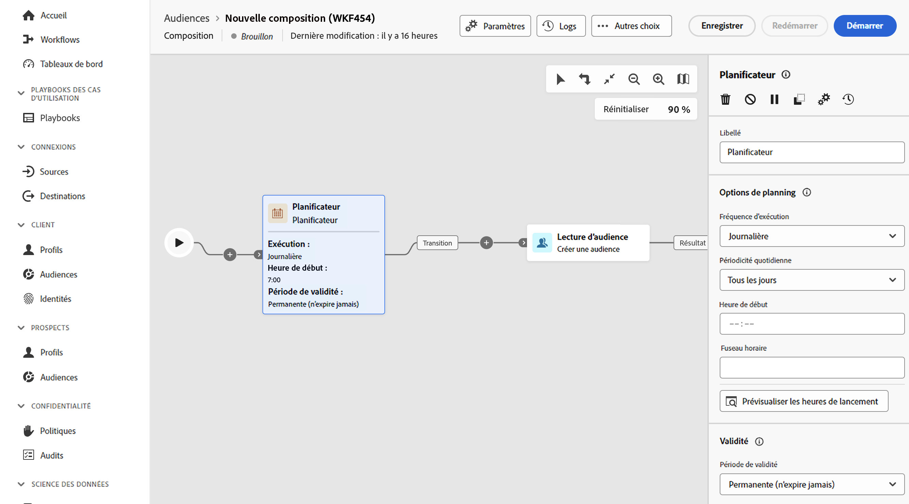

# Planificateur {#scheduler}

>[!CONTEXTUALHELP]
>id="dc_orchestration_scheduler"
>title="Activité Planificateur"
>abstract="L’activité **Planificateur** vous permet de planifier le démarrage de la composition de l’audience. Cette activité est à considérer comme un démarrage planifié. Il ne peut être utilisé que comme première activité d’une composition."

L’activité **Planificateur** est une activité de **contrôle de flux**. Il vous permet de planifier le moment où la composition commence. Cette activité est à considérer comme un démarrage planifié. Il ne peut être utilisé que comme première activité de la composition.

Si vous avez configuré une connexion à la destination de composition d’audiences fédérées, vous pouvez utiliser cette activité pour envoyer des audiences Adobe Experience Platform à des fréquences régulières. [Découvrez comment enrichir les audiences Adobe Experience Platform avec des données externes](../../connections/destinations.md)

## Configurer l’activité Planificateur {#scheduler-configuration}

>[!CONTEXTUALHELP]
>id="dc_orchestration_schedule_validity"
>title="Validité du planificateur"
>abstract="Vous pouvez définir une période de validité pour le planificateur. Elle peut être permanente (par défaut) ou valide jusqu’à une date spécifique."

>[!CONTEXTUALHELP]
>id="dc_orchestration_schedule_options"
>title="Options du planificateur"
>abstract="Définissez la fréquence du planificateur. Il peut être exécuté à un moment précis, ou encore une ou plusieurs fois par jour, semaine ou mois."

Pour configurer l’activité **Planificateur**, procédez comme suit :

1. Ajoutez une activité **Planificateur** à votre composition.

1. Configurez la **Fréquence d’exécution** :

   * **Une fois** : la composition est exécutée une seule fois.
   * **Quotidien** : la composition est exécutée à une heure spécifique, une fois par jour.
   * **Plusieurs fois par jour :** la composition est exécutée régulièrement plusieurs fois par jour. Vous pouvez configurer des exécutions à des heures et dates spécifiques ou périodiquement.

     >[!NOTE]
     >
     >Ne planifiez pas l’exécution d’une composition plus de toutes les 15 minutes, car cela peut nuire aux performances générales du système et créer des blocs dans la base de données.

   * **Hebdomadaire** : la composition est exécutée à un instant défini, une ou plusieurs fois par semaine.
   * **Mensuel** : la composition est exécutée à un instant défini, une ou plusieurs fois par mois. Vous pouvez sélectionner les mois, au moment de l&#39;exécution de la composition. Vous pouvez également configurer des exécutions un jour de semaine spécifié du mois, comme le deuxième mardi du mois.

1. Définissez les détails de l&#39;exécution en fonction de la fréquence sélectionnée. Les champs de détail peuvent varier en fonction de la fréquence d&#39;utilisation (heure, fréquence de répétition, jours spécifiques, etc.).

1. Cliquez sur **Aperçu des heures de lancement** pour vérifier la planification des dix prochaines exécutions de votre composition.

1. Définissez la période de validité du planificateur :

   * **Permanent (n&#39;expire jamais)** : la composition est exécutée, selon la fréquence spécifiée, sans limite dans le temps ni dans le nombre d&#39;itérations.

   * **Période de validité** : la composition est exécutée selon la fréquence spécifiée, jusqu’à une date spécifique. Vous devez spécifier les dates de début et de fin.

>[!NOTE]
>
>Si vous souhaitez démarrer la composition immédiatement, vous pouvez cliquer sur l&#39;icône **Exécuter la tâche en attente** dans la barre d&#39;actions supérieure du planificateur. Ce bouton n’est disponible que lorsque vous avez commencé la composition.

<!--## Example{#scheduler-example}

In the following example, the activity is configured so that the composition runs several times a day at 9 and 12 AM, every day of the week from October 1st, 2023 to January 1st, 2024.-->
