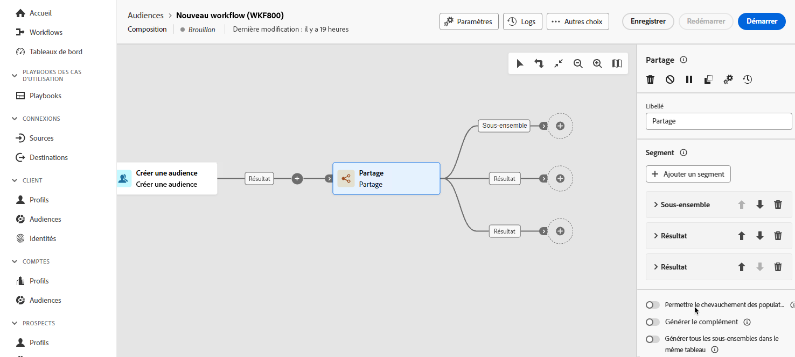
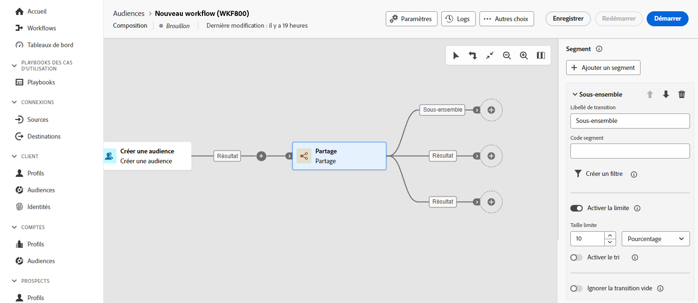

# Fractionner {#split}

>[!CONTEXTUALHELP]
>id="dc_orchestration_split"
>title="Activité Partage"
>abstract="L’activité **Partage** permet de segmenter les populations entrantes en plusieurs sous-ensembles selon différents critères de sélection, tels que les règles de filtrage ou la taille de la population."

L’activité **Partage** permet de segmenter les populations entrantes en plusieurs sous-ensembles selon différents critères de sélection, tels que les règles de filtrage ou la taille de la population.

## Configurer l’activité Partage {#split-configuration}

>[!CONTEXTUALHELP]
>id="dc_orchestration_split_segments"
>title="Segments de l’activité de partage"
>abstract="Ajoutez autant de sous-ensembles que vous le souhaitez pour segmenter la population entrante.  Lorsque l’activité **Partage** est exécutée, la population est segmentée entre les différents sous-ensembles dans l’ordre dans lequel ils sont ajoutés à l’activité. Avant de commencer votre composition, assurez-vous d’avoir ordonné les sous-ensembles dans l’ordre qui vous convient à l’aide des boutons fléchés."

>[!CONTEXTUALHELP]
>id="dc_orchestration_split_filter"
>title="Filtre de l’activité Partage"
>abstract="Pour appliquer une condition de filtrage au sous-ensemble, cliquez sur **[!UICONTROL Créer un filtre]** et configurez la règle de filtrage souhaitée à l’aide du concepteur de requête. Par exemple, incluez les profils de la population entrante dont l’adresse e-mail existe dans la base de données."

>[!CONTEXTUALHELP]
>id="dc_orchestration_split_limit"
>title="Limite de l’activité Partage"
>abstract="Pour limiter le nombre de profils sélectionnés par le sous-ensemble, activez la fonction **[!UICONTROL Activer la limite]** et indiquez le nombre ou les pourcentages de la population à inclure."

>[!CONTEXTUALHELP]
>id="dc_orchestration_split_sorting"
>title="Tri de l’activité Partage"
>abstract="Lorsque vous définissez une limite de population pour un sous-ensemble, vous pouvez classer les profils sélectionnés en fonction d’un attribut de profil spécifique, dans un ordre croissant ou décroissant. Pour ce faire, activez l’option **Activer le tri**. Par exemple, vous pouvez restreindre un sous-ensemble afin de n’inclure que les 50 premiers profils ayant le montant d’achat le plus élevé."

>[!CONTEXTUALHELP]
>id="dc_orchestration_split_complement"
>title="Partager le complément de génération"
>abstract="Une fois que vous avez paramétré tous les sous-ensembles, vous pouvez sélectionner la population restante qui ne correspond à aucun des sous-ensembles et les inclure dans une transition sortante supplémentaire. Pour ce faire, activez l’option **Générer le complémentaire**."

>[!CONTEXTUALHELP]
>id="dc_orchestration_split_generatesubsets"
>title="Générer tous les sous-ensembles dans le même tableau"
>abstract="Activez cette option pour regrouper tous les sous-ensembles dans une seule transition sortante."

>[!CONTEXTUALHELP]
>id="dc_orchestration_split_emptytransition"
>title="Ignorer la transition vide"
>abstract="Activez l’option **[!UICONTROL Ignorer la transition vide]** pour désactiver la transition sortante pour ce sous-ensemble si la population entrante est vide."

>[!CONTEXTUALHELP]
>id="dc_orchestration_split_enable_overlapping"
>title="Permettre le chevauchement des populations de sortie"
>abstract="La variable **[!UICONTROL Permettre le recouvrement des populations de sortie]** permet de gérer les populations appartenant à plusieurs sous-ensembles. Lorsque la case n&#39;est pas cochée, l&#39;activité de partage assure qu&#39;un destinataire ne peut pas être présent dans plusieurs transitions en sortie, même s&#39;il répond aux critères de plusieurs sous-ensembles. Ils seront dans la cible du premier onglet avec les critères correspondants. Lorsque la case est cochée, les destinataires peuvent être présents dans plusieurs sous-ensembles s&#39;ils vérifient leurs critères de filtrage. Adobe Campaign vous recommande d&#39;utiliser des critères exclusifs."

Pour configurer l’activité **Partage**, procédez comme suit :

1. Ajouter un **Partage** à votre composition.

1. Le volet de configuration des activités s’ouvre avec un sous-ensemble par défaut. Cliquez sur le bouton **Ajouter un segment** pour ajouter autant de sous-ensembles que vous le souhaitez pour segmenter la population entrante.

   >[!IMPORTANT]
   >
   >Lorsque l’activité **Partage** est exécutée, la population est segmentée entre les différents sous-ensembles dans l’ordre dans lequel ils sont ajoutés à l’activité. Par exemple, si le premier sous-ensemble récupère 70 % de la population initiale, le sous-ensemble ajouté suivant n’appliquera ses critères de sélection qu’aux 30 % restants, etc.
   >
   >Avant de commencer votre composition, assurez-vous d’avoir ordonné les sous-ensembles dans l’ordre qui correspond à vos besoins. Pour ce faire, utilisez les boutons fléchés pour changer la position d’un sous-ensemble.

1. Une fois les sous-ensembles ajoutés, l’activité propose autant de transitions en sortie que de sous-ensembles : Nous vous recommandons vivement de modifier le libellé de chaque sous-ensemble afin de les identifier facilement dans la zone de travail de composition.

   

1. Configurez la manière dont chaque sous-ensemble doit filtrer la population entrante. Pour ce faire, procédez comme suit :

   1. Développez le sous-ensemble pour afficher ses propriétés.

      

   1. Pour appliquer une condition de filtrage au sous-ensemble, cliquez sur **[!UICONTROL Créer un filtre]** et configurez la règle de filtrage souhaitée à l’aide du concepteur de requête. Par exemple, incluez les profils de la population entrante dont l’adresse e-mail existe dans la base de données. [Découvrir comment utiliser le concepteur de requête](../../query/query-modeler-overview.md)

   1. Pour limiter le nombre de profils sélectionnés par le sous-ensemble, activez la fonction **[!UICONTROL Activer la limite]** et indiquez le nombre ou les pourcentages de la population à inclure.

   1. Pour désactiver une transition si la population entrante est vide, activez l’option **[!UICONTROL Ignorer la transition vide]**. Si aucun profil ne correspond au sous-ensemble, la composition ne passe pas à l’activité suivante.

   >[!NOTE]
   >
   >Lorsque vous définissez une limite de population pour un sous-ensemble, vous pouvez classer les profils sélectionnés en fonction d’un attribut de profil spécifique, dans un ordre croissant ou décroissant. Pour ce faire, activez l’option **[!UICONTROL Activer le tri]**. Par exemple, vous pouvez restreindre un sous-ensemble afin de n’inclure que les 50 premiers profils ayant le montant d’achat le plus élevé.

1. Une fois que vous avez paramétré tous les sous-ensembles, vous pouvez sélectionner la population restante qui ne correspond à aucun des sous-ensembles et les inclure dans une transition sortante supplémentaire. Pour ce faire, activez l’option **[!UICONTROL Générer le complémentaire]**.

   >[!NOTE]
   >
   >L’option **[!UICONTROL Générer tous les sous-ensembles dans le même tableau]** vous permet de regrouper tous les sous-ensembles dans une seule transition sortante.

1. L&#39;option **[!UICONTROL Permettre le recouvrement des populations de sortie]** permet de gérer les populations appartenant à plusieurs sous-ensembles :

   * Lorsque la case est décochée, l&#39;activité de partage assure qu&#39;un destinataire ne sera pas présent dans plusieurs transitions en sortie, même s&#39;il vérifie les critères de plusieurs sous-ensembles. Il sera dans la cible du premier onglet dont les critères sont vérifiés.
   * Lorsque la case est cochée, les destinataires peuvent être présents dans plusieurs sous-ensembles s&#39;ils vérifient leurs critères de filtrage. Adobe Campaign vous recommande d&#39;utiliser des critères exclusifs.

L’activité est désormais configurée. Lors de l&#39;exécution, la population sera segmentée dans les différents sous-ensembles, dans l&#39;ordre dans lequel elle a été ajoutée à l&#39;activité.

<!--
## Example{#split-example}

In the following example, the **[!UICONTROL Split]** activity is used to segment an audience into distinct subsets based on the communication channel that we want to use :

* **Subset 1 "push"**: This subset comprises all profiles who have installed our mobile application.
* **Subset 2 "sms"**: Mobile phone users: For the remaining population that did not fall into Subset 1, subset 2 applies a filtering rule to select profiles with mobile phones in the database.
* **Complement transition**: This transition captures all the remaining profiles that did not match Subset 1 or Subset 2. Specifically, it includes profiles who neither installed the mobile application nor have a mobile phone, such as users who haven't installed the mobile app or lack a registered mobile number.

-->
