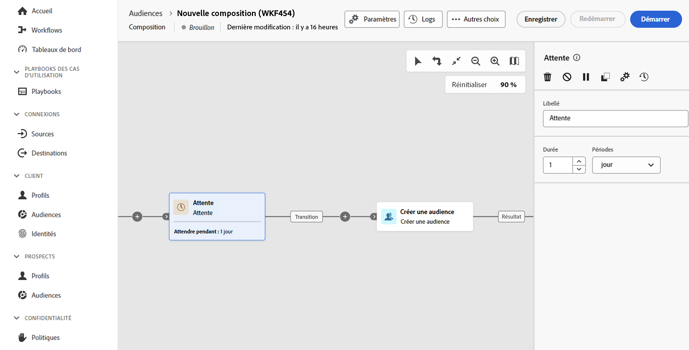

# Attente {#wait}

>[!CONTEXTUALHELP]
>id="dc_orchestration_wait"
>title="Activité Attente"
>abstract="L’activité **Attente** est utilisée pour retarder la transition d’une activité à une autre."

L’activité **Attente** est utilisée pour permettre qu’un certain temps s’écoule entre l’exécution de deux activités.

## Configuration{#wait-configuration}

Pour configurer l’activité d’**attente**, procédez comme suit :

1. Ajoutez une activité **Attente** dans votre composition.

1. Spécifiez la **durée** de l’attente entre les transitions entrante et sortante.

1. Sélectionnez l’unité de temps dans le champ **Périodes** : secondes, minutes, heures, jours.

   
