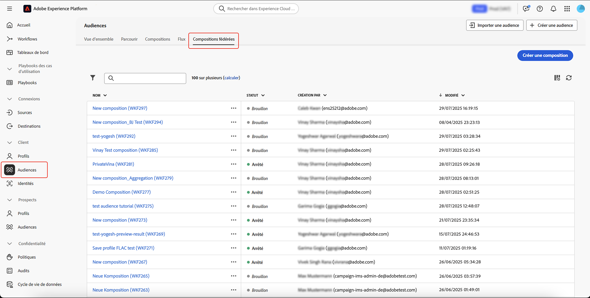
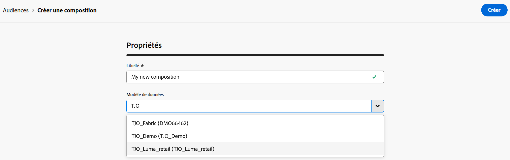

# Créer et configurer la composition {#create}

La première étape pour créer une composition consiste à définir son libellé et à configurer des paramètres supplémentaires si nécessaire.

## Créer la composition {#create-the-composition}

Pour créer une composition, sélectionnez **[!UICONTROL Audiences]** dans la section **[!UICONTROL Client]**, suivie de l’onglet **[!UICONTROL Compositions fédérées]**.

La page de navigation des compositions fédérées s’affiche. Sélectionnez **[!UICONTROL Créer une composition]** pour poursuivre le processus de création de composition.

Dans la section **[!UICONTROL Propriétés]**, spécifiez un libellé pour votre composition et sélectionnez un modèle de données. Seuls les schémas associés à ce modèle de données seront disponibles dans les activités de votre composition.

Sélectionnez **[!UICONTROL Créer]**. La zone de travail de composition s’affiche. Vous pouvez maintenant configurer votre composition en ajoutant autant d’activités que nécessaire pour répondre à vos besoins avant de l’exécuter :

* [Découvrir comment orchestrer les activités](orchestrate-activities.md)
* [Découvrir comment démarrer et surveiller une composition](start-monitor-composition.md)

## Configurer les paramètres de la composition {#settings}

>[!CONTEXTUALHELP]
>id="dc_composition_settings_properties"
>title="Propriétés de la composition"
>abstract="Cette section fournit des propriétés de composition génériques qui sont également accessibles lors de la création de la composition."

>[!CONTEXTUALHELP]
>id="dc_composition_settings_segmentation"
>title="Segmentation de composition"
>abstract="Par défaut, seules les tables de travail de la dernière exécution de la composition sont conservées. Vous pouvez activer cette option pour conserver les tables de travail à des fins de test. Elle doit être utilisée **uniquement** sur les environnements de développement ou d’évaluation. Cette option ne doit jamais être cochée dans un environnement de production."

>[!CONTEXTUALHELP]
>id="dc_composition_settings_error"
>title="Paramètres de gestion des erreurs"
>abstract="Dans cette section, vous pouvez définir la façon de gérer les erreurs lors de l’exécution. Vous pouvez choisir de suspendre le processus, d’ignorer un certain nombre d’erreurs ou d’arrêter l’exécution de la composition."

Lors de l’accès à une composition, vous pouvez accéder à des paramètres avancés qui vous permettent, par exemple, de définir le comportement de la composition en cas d’erreur.

Pour accéder à ces options supplémentaires, sélectionnez **[!UICONTROL Paramètres]** dans la section supérieure de l’écran de création de composition.

Les paramètres disponibles sont les suivant :

* **[!UICONTROL Libellé]** : modifiez le libellé de la composition.

* **[!UICONTROL Conserver le résultat des populations intermédiaires entre deux exécutions]** : par défaut, seules les tables de travail de la dernière exécution de la composition sont conservées. Les tables de travail des exécutions précédentes sont purgées par une composition technique qui s’exécute quotidiennement.

  Si cette option est activée, les tables de travail sont conservées même après l’exécution de la composition. Vous pouvez l’utiliser à des fins de test. N’utilisez donc cette option **que** dans les environnements de développement ou d’évaluation. Cette option ne doit jamais être cochée dans une composition de production.

* **[!UICONTROL Gestion des erreurs]** : ce champ vous permet de définir les actions à effectuer si une activité de composition rencontre une erreur. Trois choix s’offrent à vous :

   * **[!UICONTROL Suspendre le processus]** : la composition est automatiquement mise en pause et adopte le statut **[!UICONTROL Échec]**. Une fois le problème résolu, reprenez l’exécution de a composition à l’aide des boutons **[!UICONTROL Reprendre]**.
   * **[!UICONTROL Ignorer]** : le statut de la tâche qui a déclenché l’erreur passe à **[!UICONTROL Échec]**, mais la composition conserve le statut **[!UICONTROL Démarré]**.
   * **[!UICONTROL Abandonner le processus]** : la composition est automatiquement arrêtée et adopte le statut **[!UICONTROL Échec]**. Une fois le problème résolu, redémarrez la composition à l’aide du bouton **[!UICONTROL Démarrer]**.

* **[!UICONTROL Erreurs consécutives]** : indiquez le nombre d’erreurs qui peuvent être ignorées avant l’arrêt du processus. Une fois ce nombre atteint, le statut de la composition passe à **[!UICONTROL Échec]**. Si la valeur de ce champ est 0, la composition ne sera jamais arrêtée, quel que soit le nombre d’erreurs.
