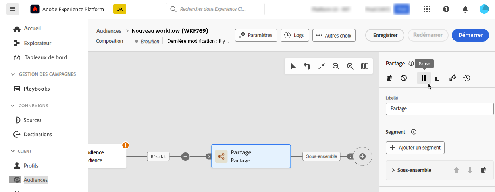
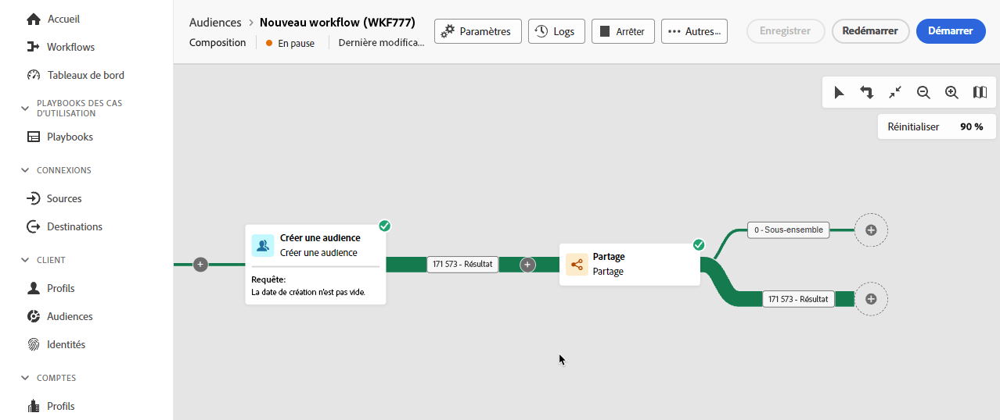
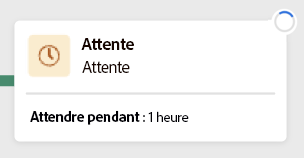
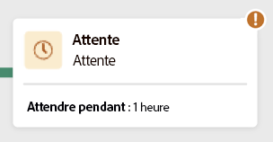
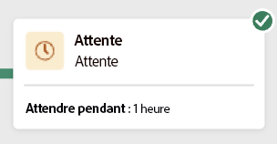
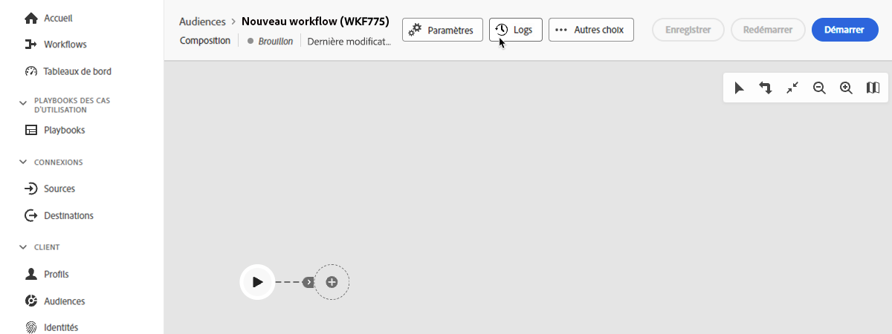

# Créer une composition

La composition d’audiences fédérées vous permet de créer des compositions, dans lesquelles vous pouvez tirer parti de diverses activités dans une zone de travail visuelle pour créer des audiences. Une fois votre composition créée, les audiences obtenues sont enregistrées dans Adobe Experience Platform et sont prêtes à être utilisées dans des destinations Experience Platform et Adobe Journey Optimizer pour cibler la clientèle.

## Définir votre composition {#create}

>[!CONTEXTUALHELP]
>id="dc_composition_creation_properties"
>title="Propriétés de la composition"
>abstract="Dans cet écran, choisissez le modèle à utiliser pour créer la composition et indiquez un libellé. Développez la section OPTIONS SUPPLÉMENTAIRES pour configurer d’autres paramètres tels que le nom interne de la composition, son dossier, son fuseau horaire et le groupe de personnes responsables. Il est vivement recommandé de sélectionner un groupe de personnes responsables afin d’alerter les opérateurs et opératrices en cas d’erreur."

Pour créer une composition, vous devez d’abord définir son libellé et éventuellement configurer des paramètres supplémentaires.

Pour créer une composition, sélectionnez **[!UICONTROL Audiences]** dans la section **[!UICONTROL Client ou cliente]**, puis l’onglet **[!UICONTROL Compositions fédérées]**.

La page de navigation des compositions fédérées s’affiche. Sélectionnez **[!UICONTROL Créer une composition]** pour poursuivre le processus de création de composition.

Dans la section **[!UICONTROL Propriétés]**, spécifiez un libellé pour votre composition, puis sélectionnez un modèle de données. Seuls les schémas associés à ce modèle de données seront disponibles dans les activités de votre composition.

Sélectionnez **[!UICONTROL Créer]**. La zone de travail de composition s’affiche. Vous pouvez désormais configurer votre composition en ajoutant des activités et des transitions à la zone de travail.

## Zone de travail de composition {#canvas}

Dans la partie supérieure de la zone de travail, vous pouvez accéder à une barre d’outils qui propose des options pour gérer et parcourir vos activités.

Les options disponibles sont les suivantes :

* **[!UICONTROL Sélection multiple]** : sélectionnez plusieurs activités pour les supprimer toutes en même temps ou pour les copier et les coller.
* **[!UICONTROL Faire pivoter]** : retournez la zone de travail verticalement.
* **[!UICONTROL Ajuster à l’écran]** : adaptez le niveau de zoom de la zone de travail à votre écran.
* **[!UICONTROL Zoom avant]** / **[!UICONTROL Zoom arrière]** : effectuez un zoom arrière ou avant dans la zone de travail.
* **[!UICONTROL Afficher la carte]** : ouvre un instantané de la zone de travail indiquant où vous vous trouvez.

## Ajouter des activités {#add-activities}

Dans la zone de travail de composition, vous pouvez ajouter des activités et des transitions qui permettent de définir votre audience. Les activités vous permettent de *définir* les composants au sein de l’audience, tandis que les transitions vous permettent d’*organiser* le flux de votre composition.

Pour plus d’informations sur les activités et les transitions disponibles, consultez la [vue d’ensemble des activités](./activities.md).

## Gérer des activités {#manage-activities}

Vous pouvez effectuer des opérations sur les activités ajoutées dans le volet des propriétés.

Les options incluent :

* **[!UICONTROL Supprimer]** : supprimez l’activité de la zone de travail.
* **[!UICONTROL Désactiver]/[!UICONTROL Activer]** : désactivez ou activez l’activité. Lorsque la composition est exécutée, les activités désactivées et les activités suivantes sur le même chemin ne sont pas exécutées et la composition est arrêtée.
* **[!UICONTROL Mettre en pause]/[!UICONTROL Reprendre]** : mettez en pause ou reprenez l’activité. Lorsque la composition est exécutée, elle s’arrête quand l’activité est en pause. La tâche correspondante, ainsi que toutes les suivantes dans le même chemin, ne sont pas exécutées.
* **[!UICONTROL Copier]** : copie l’activité pour la coller à un autre emplacement de la composition. Pour ce faire, sélectionnez le bouton **+** sur une transition, puis **[!UICONTROL Coller l’activité X]**. <!-- cannot copy multiple activities ? cannot paste in another composition?-->
* Configurez les **[!UICONTROL options d’exécution]** pour l’activité sélectionnée. Les options d’exécution disponibles sont les suivantes :
  +++Options d’exécution disponibles

  La section **[!UICONTROL Propriétés]** vous permet de configurer des paramètres génériques concernant l’exécution de l’activité :

   * **[!UICONTROL Exécution]** : définissez l’action à effectuer au démarrage de l’activité.
   * **[!UICONTROL Durée d’exécution maximale]** : spécifiez une durée de type « 30 s » ou « 1 h ». Si l’activité n’est pas terminée une fois cette durée écoulée, une alerte est déclenchée, ce qui n’a par ailleurs aucun impact sur le fonctionnement de la composition.
   * **[!UICONTROL Fuseau horaire]** : sélectionnez le fuseau horaire de l’activité. La composition d’audiences fédérées vous permet de gérer les décalages horaires entre plusieurs pays sur la même instance. La configuration appliquée est paramétrée lors de la création de l’instance.
   * **[!UICONTROL Affinité]** : forcez l’exécution de l’activité de composition sur une machine particulière. Vous devez pour cela définir une ou plusieurs affinités au niveau de la composition ou de l’activité concernée.
   * **[!UICONTROL Comportement]** : définissez la procédure à suivre en cas d’utilisation de tâches asynchrones.

  Le champ **[!UICONTROL Gestion des erreurs]** vous permet de définir l’action à effectuer lorsque l’activité a rencontré une erreur.

  La section **[!UICONTROL script d’initialisation]** vous permet d’initialiser des variables ou de modifier des propriétés d’activité. Sélectionnez le bouton **[!UICONTROL Modifier le code]** et saisissez l’extrait de code à exécuter. Le script est appelé lors de l’exécution de l’activité.

  +++
* **Journaux et tâches** : affichez les journaux et les tâches de l’activité sélectionnée.

## Démarrer et surveiller votre composition {#start-and-monitor}

Une fois que vous avez terminé d’ajouter vos activités à la composition, vous pouvez commencer l’exécution de la composition. Pour démarrer une composition, sélectionnez le bouton **[!UICONTROL Démarrer]** dans le coin supérieur droit de l’écran.

| Action | Description |
| ------ | ----------- |
| **Début** | Démarre l’exécution de la composition et passe son statut à **En cours**. |
| **Pause** | Suspend l’exécution de la composition et la définit sur le statut **En pause**. Aucune nouvelle activité ne sera activée jusqu’à la reprise de la composition, mais les opérations en cours **ne sont pas** suspendues. |
| **Reprendre** | Reprend l’exécution de la composition en pause et la définit sur le statut **En cours**. |
| **Stopper** | Arrête l’exécution de la composition et la définit sur l’état **Terminé**. **Il n’est pas possible** de reprendre à l’endroit où la composition s’est arrêtée. |
| **Redémarrer** | Arrête et redémarre l’exécution de la composition. |

Une fois la composition en cours d’exécution, chaque activité de la zone de travail est exécutée dans un ordre séquentiel, jusqu’à ce que la composition soit terminée. Vous pouvez suivre la progression des profils ciblés en temps réel à l’aide du flux visuel. Vous pouvez ainsi identifier rapidement le statut de chaque activité et le nombre de profils qu’elle contient.

Les indicateurs visuels situés dans le coin supérieur droit de chaque activité affichent le statut de l’exécution :

| Indicateur visuel | Description |
| ---------------- | ------------|
| {zoomable="yes"}{width="70%"} | L’activité est en cours d’exécution. |
| {zoomable="yes"}{width="70%"} | L’activité nécessite votre attention. Vous devez, par exemple, confirmer l’envoi d’une diffusion ou prendre une mesure nécessaire. |
| {zoomable="yes"}{width="70%"} | L’activité a rencontré une erreur. Pour résoudre ce problème, ouvrez les journaux de compositions pour obtenir plus d’informations. |
| {zoomable="yes"}{width="70%"} | L’activité a été exécutée correctement. |

### Surveiller les logs et les tâches {#monitor-logs}

De plus, vous pouvez afficher les journaux de composition afin de vous assurer de leur bonne exécution. Sélectionnez **[!UICONTROL Journaux]** dans la barre d’outils d’actions pour afficher ces informations.

L’écran **[!UICONTROL Journaux et tâches de composition]** s’affiche. Il fournit un historique de l’exécution de la composition, qui enregistre toutes les actions des utilisateurs et utilisatrices et les erreurs rencontrées.

L’historique est organisé en plusieurs onglets, présentés ci-dessous :

* L’onglet **[!UICONTROL Journal]** affiche l’historique de l’exécution de toutes les activités de la composition. Il répertorie par ordre chronologique les opérations réalisées et les erreurs d’exécution.
* L’onglet **[!UICONTROL Tâches]** permet de voir le séquencement de l’exécution des activités. Le bouton situé à la fin de chaque tâche vous permet de répertorier les variables d’événements transmises par l’activité.
* L’onglet **[!UICONTROL Variables]** répertorie toutes les variables transmises dans la composition. Il est disponible uniquement lors de l’accès aux journaux et aux tâches à partir de la zone de travail de la composition. Il est désormais disponible lors de l’accès aux journaux à partir du volet des propriétés d’une activité.

Dans tous les onglets, vous pouvez choisir les colonnes à afficher et leur ordre, appliquer des filtres et trouver rapidement des informations à l’aide du champ de recherche.

### S’abonner aux alertes {#alerts}

Vous pouvez également vous abonner à des alertes pour recevoir des notifications si les exécutions de vos compositions fédérées ont réussi ou échoué.

Pour vous abonner à des alertes, sélectionnez l’, puis l’.

{zoomable="yes"}{width="70%"}

La page des paramètres des notifications s’affiche. Sur cette page, sélectionnez **[!UICONTROL Experience Platform]** et choisissez les canaux d’alertes de votre choix. Pour afficher les notifications dans l’interface d’utilisation, sélectionnez **[!UICONTROL In-app]**.

{zoomable="yes"}{width="50%"}

Après avoir sélectionné **[!UICONTROL In-app]**, vous recevrez les notifications de succès et d’échec des exécutions des compositions.

{zoomable="yes"}{width="70%"}

## Configurer les paramètres de la composition {#settings}

>[!CONTEXTUALHELP]
>id="dc_composition_settings_properties"
>title="Propriétés de la composition"
>abstract="Cette section fournit des propriétés de composition génériques qui sont également accessibles lors de la création de la composition."

>[!CONTEXTUALHELP]
>id="dc_composition_settings_segmentation"
>title="Segmentation de composition"
>abstract="Par défaut, seules les tables de travail de la dernière exécution de la composition sont conservées. Vous pouvez activer cette option pour conserver les tables de travail à des fins de test. Elle doit être utilisée **uniquement** sur les environnements de développement ou d’évaluation. Cette option ne doit jamais être cochée dans un environnement de production."

>[!CONTEXTUALHELP]
>id="dc_composition_settings_error"
>title="Paramètres de gestion des erreurs"
>abstract="Dans cette section, vous pouvez définir la façon de gérer les erreurs lors de l’exécution. Vous pouvez choisir de suspendre le processus, d’ignorer un certain nombre d’erreurs ou d’arrêter l’exécution de la composition."

Lors de l’accès à une composition, vous pouvez accéder à des paramètres avancés qui vous permettent, par exemple, de définir le comportement de la composition en cas d’erreur.

Pour accéder à ces options supplémentaires, sélectionnez **[!UICONTROL Paramètres]** dans la section supérieure de l’écran de création de la composition.

| Paramètres | Description |
| -------- | ----------- |
| **[!UICONTROL Libellé]** | Mettez à jour le nom donné à la composition. |
| **[!UICONTROL Conserver le résultat des populations intermédiaires entre deux exécutions]** | Si cette option est activée, les tables de travail sont conservées même après l’exécution de la composition. Par défaut, seules les tables de travail de la dernière exécution de la composition sont conservées. Les tables de travail des exécutions précédentes sont supprimées quotidiennement. Vous ne devez activer ce paramètre que dans un environnement de développement ou d’évaluation. Vous ne devez **jamais** activer ce paramètre dans un environnement de production. |
| **[!UICONTROL Gestion des erreurs]** | Définit les actions entreprises si la composition comporte une erreur. Trois choix s’offrent à vous : <ul><li>**[!UICONTROL Suspendre le processus]** : la composition est automatiquement mise en pause et adopte le statut **[!UICONTROL Échec]**. Une fois le problème résolu, reprenez l’exécution de a composition à l’aide des boutons **[!UICONTROL Reprendre]**.</li><li>**[!UICONTROL Ignorer]** : le statut de la tâche qui a déclenché l’erreur passe à **[!UICONTROL Échec]**, mais la composition conserve le statut **[!UICONTROL Démarré]**.</li><li>**[!UICONTROL Abandonner le processus]** : la composition est automatiquement arrêtée et adopte le statut **[!UICONTROL Échec]**. Une fois le problème résolu, redémarrez la composition à l’aide du bouton **[!UICONTROL Démarrer]**.</li></ul> |
| **[!UICONTROL Erreurs consécutives]** | Indiquez le nombre d’erreurs qui peuvent être ignorées avant l’arrêt du processus. Une fois ce nombre atteint, le statut de la composition passe à **[!UICONTROL Échec]**. Si la valeur de ce champ est 0, la composition ne sera jamais arrêtée, quel que soit le nombre d’erreurs. |
