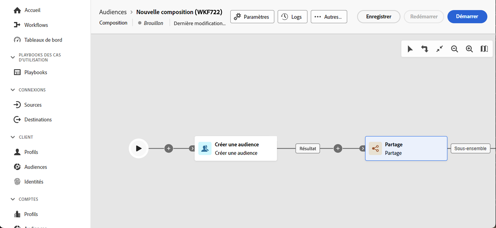

# Principes clés de la création de composition {#gs-composition-creation}

>[!CONTEXTUALHELP]
>id="dc_composition_creation_properties"
>title="Propriétés de composition"
>abstract="Dans cet écran, choisissez le modèle à utiliser pour créer la composition et indiquez un libellé. Développez la section OPTIONS SUPPLÉMENTAIRES pour configurer d’autres paramètres tels que le nom interne de la composition, son dossier, son fuseau horaire et le groupe du superviseur. Il est vivement recommandé de sélectionner un groupe de personnes responsables afin d’alerter les opérateurs et opératrices en cas d’erreur."

## Qu&#39;y a-t-il dans une composition ? {#gs-composition-inside}

La composition de données fédérées fournit un canevas visuel qui vous permet de créer des audiences en exploitant différentes activités (fractionnement, enrichissement, etc.).

Le diagramme de composition est une représentation de ce qui est censé se produire. Il décrit les différentes tâches à effectuer et la manière dont elles sont liées.

{zoomable="yes"} {zoomable="yes"}

Chaque composition contient :

* des **Activités** : une activité est une tâche à effectuer. Les différentes activités disponibles sont représentées sur le diagramme par des icônes. Chaque activité possède des propriétés spécifiques et d’autres propriétés communes à toutes les activités.
* **Transitions** : les transitions relient une activité source à une activité de destination et définissent leur ordre.
* **Tables de travail** : la table de travail contient toutes les informations véhiculées par la transition. Chaque composition utilise plusieurs tables de travail. Les données véhiculées dans ces tableaux peuvent être utilisées tout au long du cycle de vie de la composition.

## Étapes clés de création d’une composition {#gs-composition-steps}

Les principales étapes pour créer une composition sont les suivantes :

1. [Création et configuration de la composition](../compositions/create-composition.md)
1. [Orchestrer les activités](../compositions/orchestrate-activities.md)
1. [Exécuter la composition et suivre son exécution](../compositions/start-monitor-composition.md)
