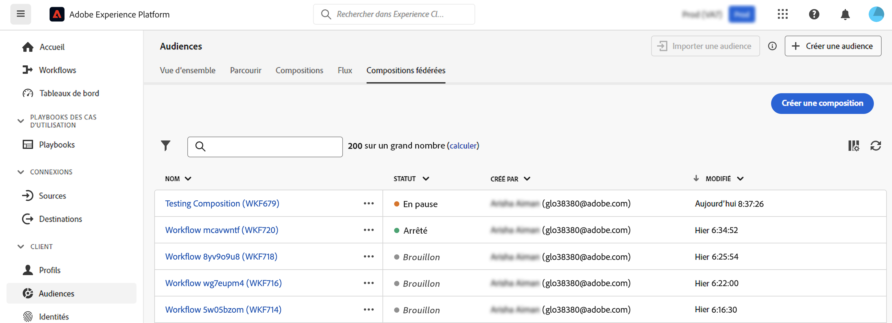

# Prise en main des compositions {#compositions}

## Qu’est-ce qu’une composition ? {#what}

La Composition des données d’Adobe vous permet de créer des compositions, dans lesquelles vous pouvez exploiter différentes activités (fractionner, exclure..) dans un canevas visuel pour créer des audiences. Une fois cette opération terminée, les audiences résultantes sont enregistrées dans Adobe Experience Platform avec les audiences existantes et peuvent être exploitées dans des destinations telles que Journey Optimizer pour cibler des clients.

## Accéder aux compositions {#access}

>[!CONTEXTUALHELP]
>id="dc_workflow_list"
>title="Compositions"
>abstract="Dans cet écran, vous pouvez accéder à la liste complète des compositions, vérifier leur état actuel, les dates de dernière exécution/prochaine et créer une nouvelle composition."

Les composition sont accessibles à partir de Adobe Experience Platform **[!UICONTROL Audiences]** , dans le **Compositions fédérées** .

Dans cet écran, vous pouvez créer de nouvelles compositions et accéder à celles existantes.

Pour affiner la liste et trouver facilement la composition que vous recherchez, vous pouvez rechercher la liste et filtrer les compositions selon leur statut ou leur date de dernier traitement.

Vous pouvez également personnaliser la liste en ajoutant ou en supprimant des colonnes. Pour cela, cliquez sur le bouton Configurer les colonnes et gérez

Pour dupliquer ou supprimer une composition existante, cliquez sur le bouton représentant des points de suspension en regard de son nom et sélectionnez l’opération souhaitée.

## Statuts des compositions {#status}

Les compositions peuvent avoir plusieurs statuts :

* **[!UICONTROL Version préliminaire]**: la composition a été créée et enregistrée.
* **[!UICONTROL En cours]**: la composition a été exécutée et est en cours d’exécution.
* **[!UICONTROL Stoppé]**: l’exécution de la composition s’est arrêtée.
* **[!UICONTROL En pause]**: l’exécution de la composition a été suspendue.
* **[!UICONTROL En erreur]**: l’exécution de la composition a rencontré une erreur. Ouvrez la composition et accédez aux logs et tâches pour identifier l&#39;erreur et la résoudre.
