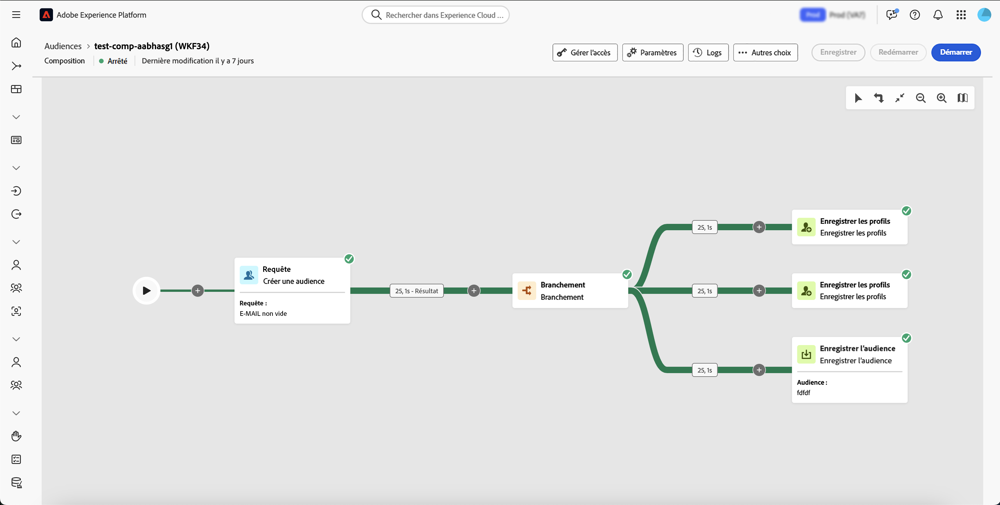
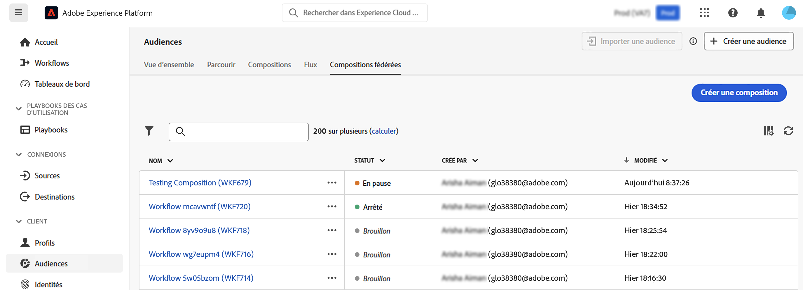
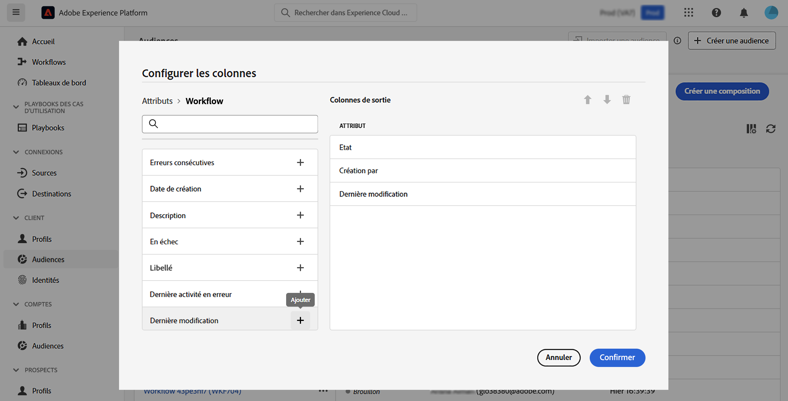
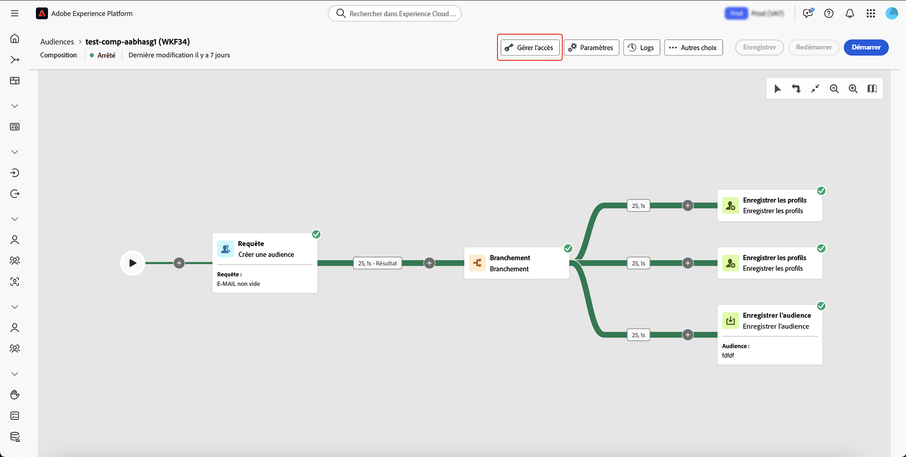
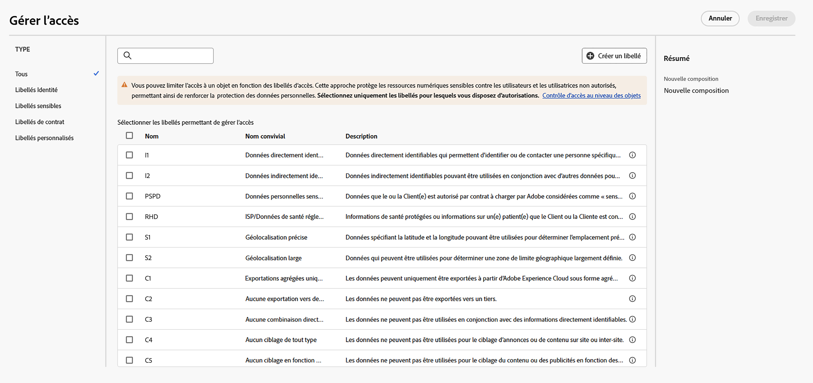

# Commencer avec les compositions {#compositions}

>[!AVAILABILITY]
>
>Pour accéder aux compositions, vous devez disposer de l’une des autorisations suivantes :
>
>-**Gestion des compositions fédérées**
>>-**Affichage des compositions fédérées**
>
>Pour plus d’informations sur les autorisations requises, lisez le [guide du contrôle d’accès](/help/governance-privacy-security/access-control.md).

La composition d’audiences fédérées vous permet de créer des compositions, dans lesquelles vous pouvez tirer parti de diverses activités dans une zone de travail visuelle pour créer des audiences. Une fois votre composition créée, les audiences obtenues sont enregistrées dans Adobe Experience Platform et sont prêtes à être utilisées dans des destinations Experience Platform et Adobe Journey Optimizer pour cibler la clientèle.

{zoomable="yes"}{width="70%"}

## Accéder aux compositions et les gérer {#access}

>[!CONTEXTUALHELP]
>id="dc_composition_list"
>title="Compositions"
>abstract="Dans cet écran, vous pouvez accéder à la liste complète des compositions, vérifier leur statut actuel, les dates de dernière exécution et de prochaine exécution, et créer une composition."

Les compositions sont accessibles à partir du menu **[!UICONTROL Audiences]** d’Adobe Experience Platform, dans l’onglet **[!UICONTROL Compositions fédérées]** de la section **[!UICONTROL Clientes et clients]**.

Dans cet écran, vous pouvez accéder aux compositions existantes ou en créer de nouvelles. Vous pouvez également dupliquer ou supprimer une composition existante en sélectionnant le bouton  en regard de son nom.

Vous pouvez également afficher des informations sur les compositions, notamment le nom, le statut, le créateur ou la créatrice et la date de dernière modification.

| État | Description |
| ------ | ----------- |
| **[!UICONTROL Brouillon]** | La composition a été créée et enregistrée. |
| **[!UICONTROL En cours]** | La composition a été effectuée et est en cours d’exécution. |
| **[!UICONTROL Arrêtée]** | L’exécution de la composition est terminée et s’est arrêtée. |
| **[!UICONTROL En pause]** | L’exécution de la composition a été mise en pause. |
| **[!UICONTROL Erronée]** | L’exécution de la composition a rencontré une erreur. Pour afficher plus d’informations sur l’erreur, ouvrez la composition et accédez aux journaux. |

Vous pouvez apprendre à démarrer ou arrêter une composition dans le [guide de démarrage et de surveillance de la composition](./start-monitor-composition.md).

{zoomable="yes"}{width="70%"}

Pour affiner la liste et trouver la composition que vous recherchez, vous pouvez rechercher la liste et filtrer les compositions selon leur statut ou leur date de dernier traitement.

Vous pouvez également personnaliser la liste en ajoutant ou en supprimant des colonnes. Pour ce faire, sélectionnez le bouton **[!UICONTROL Configurer les colonnes]** et ajoutez ou supprimez les colonnes de sortie souhaitées.

{zoomable="yes"}{width="70%"}

### Appliquer les libellés d’accès {#access-labels}

Pour appliquer des libellés d’accès à une composition spécifique, sélectionnez la composition, puis **[!UICONTROL Gérer l’accès]**.

{zoomable="yes"}{width="70%"}

La fenêtre contextuelle **[!UICONTROL Gérer l’accès]** s’affiche. Sur cette page, vous pouvez appliquer les libellés d’accès et de gouvernance des données applicables à votre composition.

{zoomable="yes"}{width="70%"}

| Type de libellé | Description |
| ---------- | ----------- |
| Libellés de contrat | Les libellés de contrat (libellés « C ») sont utilisées pour catégoriser des données qui possèdent des obligations contractuelles ou qui sont liées aux politiques de gouvernance des données de votre organisation. |
| Libellés d’identité | Les libellés d’identité (libellés « I ») servent à catégoriser les données permettant d’identifier ou de contacter une personne spécifique. |
| Libellés sensibles | Les libellés sensibles (libellés « S ») sont utilisés pour catégoriser ce que vous et/ou votre organisation considérez comme sensible. |
| Libellés de réseau partenaire | Les libellés de réseau partenaire servent à catégoriser les données des sources externes à votre organisation. |

Pour plus d’informations sur les libellés d’accès et de gouvernance des données, consultez le [glossaire des libellés d’utilisation des données](https://experienceleague.adobe.com/fr/docs/experience-platform/data-governance/labels/reference).

## Étapes suivantes

Après avoir lu ce guide, vous avez appris à accéder à vos libellés d’accès, à les gérer et à en créer pour vos compositions. Pour plus d’informations sur l’utilisation des audiences dans leur ensemble, lisez le [guide des audiences](../start/audiences.md).
