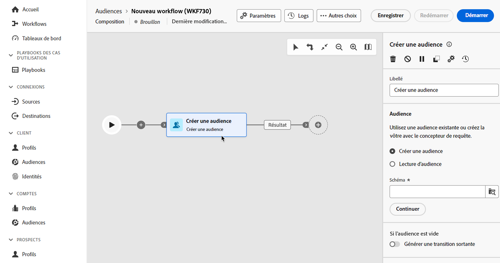
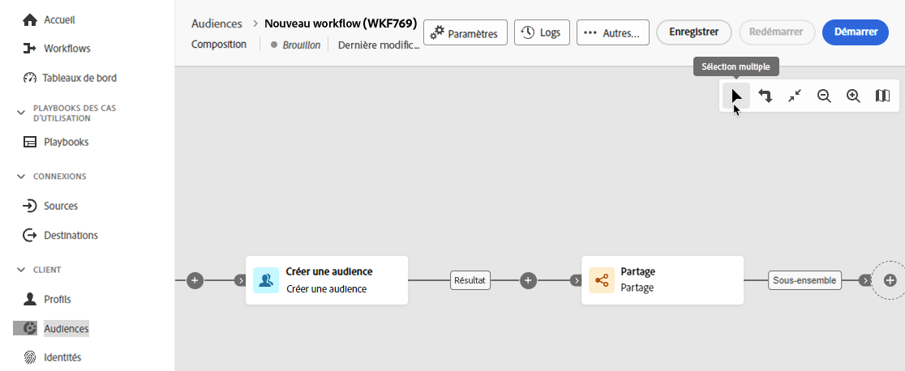
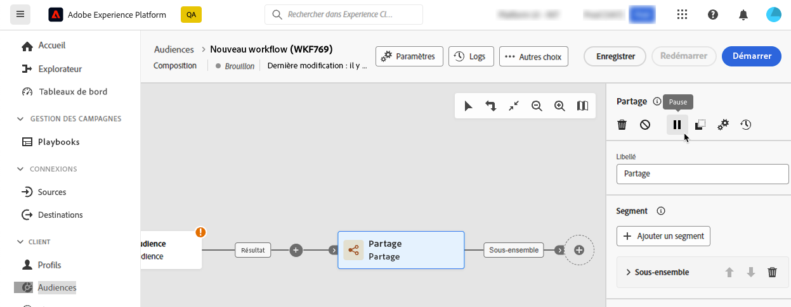

# Orchestration des activités de composition {#activities}

Une fois que vous avez créé une composition, vous pouvez commencer à orchestrer les différentes tâches qu’elle exécutera. Pour ce faire, un canevas visuel vous permet de construire votre diagramme de composition. Dans ce diagramme, vous pouvez ajouter différentes activités et les enchaîner dans un ordre séquentiel.

## Ajouter des activités {#add}

À ce stade de la configuration, le diagramme comporte une icône de démarrage, qui représente le début de votre workflow. Pour ajouter votre première activité, cliquez sur le bouton **+** associé à l’icône de démarrage.

La liste des activités pouvant être ajoutées au diagramme s’affiche. Les activités disponibles dépendent de votre position dans le diagramme de composition. Par exemple, lorsque vous ajoutez votre première activité, vous pouvez démarrer votre composition en ciblant une audience, en divisant le chemin du workflow, en configurant un planificateur pour retarder l’exécution du workflow ou en définissant un **Attente** pour retarder l&#39;exécution du workflow. D’un autre côté, après une **Créer une audience** , vous pouvez affiner votre cible avec des activités de ciblage ou organiser le processus de composition avec des activités de contrôle de flux.

Une fois qu’une activité a été ajoutée au diagramme, un volet s’affiche à droite. Il vous permet de définir des paramètres spécifiques pour l’activité. Des informations détaillées sur la configuration de chacune des activités sont disponibles dans [cette section](activities/about-activities.md).

Répétez ce processus pour ajouter autant d’activités que vous le souhaitez en fonction des tâches que votre composition doit exécuter. Vous pouvez également insérer une nouvelle activité entre deux activités. Pour ce faire, cliquez sur le bouton **+** sur la transition entre les activités, puis sélectionnez l’activité souhaitée et configurez-la dans le volet de droite.

>[!TIP]
>
>Vous pouvez personnaliser le nom des transitions entre chaque activité. Pour ce faire, sélectionnez la transition et modifiez son libellé dans le volet de droite.

## Barre d’outils de la zone de travail {#toolbar}

La barre d’outils située dans le coin supérieur droit de la zone de travail fournit des options pour manipuler facilement les activités et naviguer dans la zone de travail.

Les actions disponibles sont les suivantes :

* **Sélection multiple**: sélectionnez plusieurs activités pour les supprimer toutes en même temps ou copiez-les et collez-les. Consultez [cette section](#copy).
* **Faire pivoter** : retournez la zone de travail verticalement.
* **Ajuster à l’écran** : adaptez le niveau de zoom de la zone de travail à votre écran.
* **Zoom arrière**/**Zoom avant** : effectuez un zoom arrière ou avant dans la zone de travail.
* **Afficher la carte** : ouvre un instantané de la zone de travail indiquant où vous vous trouvez.

## Gérer des activités {#manage}

Lors de l’ajout d’activités, des boutons d’action sont disponibles dans le volet des propriétés, ce qui vous permet d’effectuer plusieurs opérations.

Vous pouvez :

* **Supprimer** l’activité à partir de la zone de travail.
* **Désactivez/activez** l’activité. Lorsque le workflow est exécuté, les activités désactivées et les activités qui suivent sur le même chemin ne sont pas exécutées et le workflow est arrêté.
* **Mettez en pause/Reprenez** l’activité. Lorsque le workflow est exécuté, il s’arrête quand l’activité est en pause. La tâche correspondante, ainsi que toutes les suivantes dans le même chemin, ne sont pas exécutées.
* **Copier** l’activité pour la coller à un autre emplacement de la composition. Pour ce faire, cliquez sur le bouton **+** sur une transition et sélectionnez &quot;Coller X activité&quot;. <!-- cannot copy multiple activities ? cannot paste in another composition?-->
* Configurer **Options d&#39;exécution** pour l’activité sélectionnée. Développez la section ci-dessous pour en savoir plus sur les options disponibles.

  +++ Options d’exécution disponibles

  La variable **Propriétés** permet de paramétrer des paramètres génériques relatifs à l&#39;exécution de l&#39;activité :

   * **Exécution**: définissez l’action à effectuer au démarrage de .
   * **Durée maximale d’exécution**: spécifiez une durée de type &quot;30s&quot; ou &quot;1h&quot;. Si l’activité n’est pas terminée une fois cette durée écoulée, une alerte est déclenchée, ce qui n’a par ailleurs aucun impact sur le fonctionnement du workflow.
   * **Fuseau horaire**: sélectionnez le fuseau horaire de l’activité. La composition d’audiences fédérées vous permet de gérer les différences de temps entre plusieurs pays sur la même instance. La configuration appliquée est paramétrée lors de la création de l’instance.
   * **Affinité**: force l’exécution de l’activité de composition sur une machine particulière. Pour cela, vous devez définir une ou plusieurs affinités pour l&#39;activité en question.
   * **Comportement**: définissez la procédure à suivre en cas d’utilisation de tâches asynchrones.

  La variable **Gestion des erreurs** permet de spécifier l&#39;action à effectuer en cas d&#39;erreur de l&#39;activité.

  La variable **Script d&#39;initialisation** vous permet d’initialiser des variables ou de modifier les propriétés de l’activité. Cliquez sur le bouton **Modifier le code** et saisissez l’extrait de code à exécuter. Le script est appelé lors de l’exécution de l’activité.

+++

* Accédez aux **Journaux et tâches** de l’activité.
