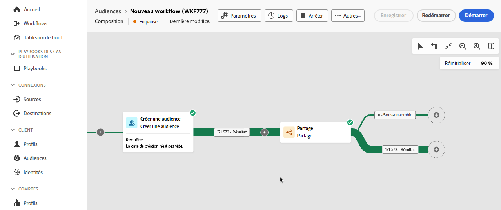
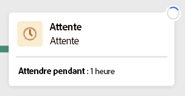
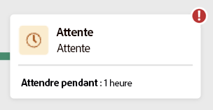
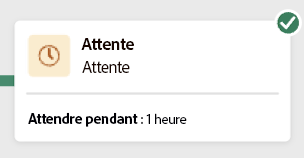
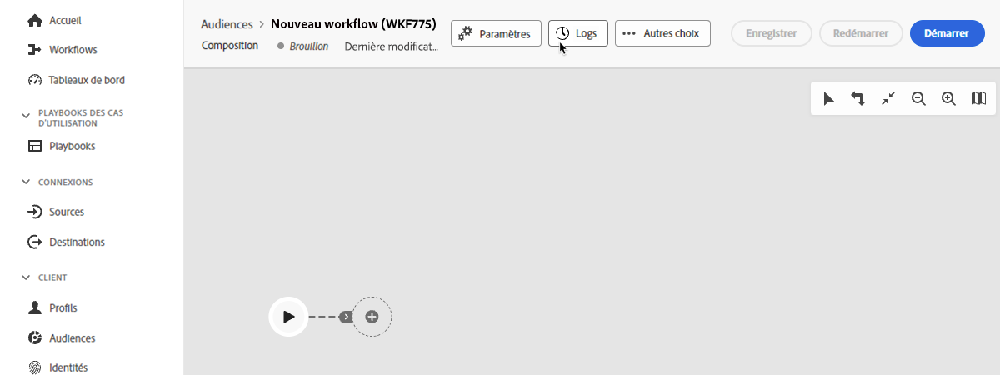
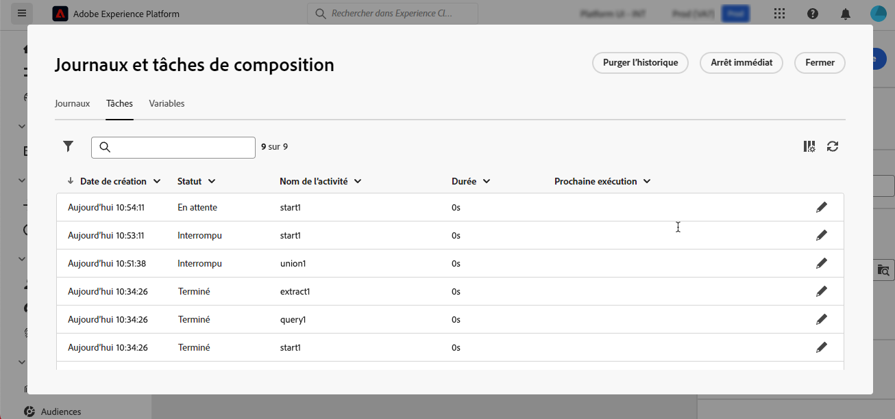
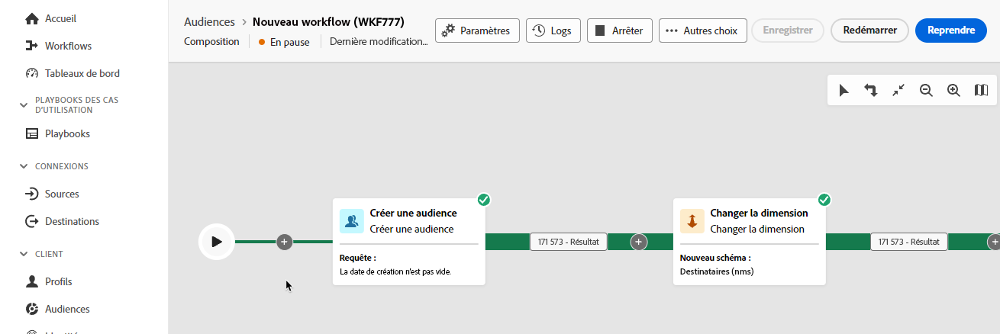

# Démarrer et surveiller votre composition {#start-monitor}

Une fois que vous avez créé votre composition et conçu les tâches à effectuer dans la zone de travail, vous pouvez lancer et contrôler son exécution.

## Démarrer la composition {#start}

Pour démarrer une composition, cliquez sur le bouton **[!UICONTROL Démarrer]** dans le coin supérieur droit de l’écran. Une fois la composition en cours d’exécution, chaque activité de la zone de travail est exécutée dans un ordre séquentiel, jusqu’à ce que la composition soit terminée.

Vous pouvez suivre la progression des profils ciblés en temps réel à l’aide du flux visuel. Vous pouvez ainsi identifier rapidement le statut de chaque activité et le nombre de profils qu’elle contient.

## Transitions de composition {#transitions}

Dans les compositions, les données véhiculées d’une activité à l’autre via les transitions sont stockées dans une table de travail temporaire. Ces données peuvent être affichées pour chaque transition. Pour cela, sélectionnez une transition pour ouvrir ses propriétés dans la partie droite de l’écran.

* Cliquez sur **[!UICONTROL Aperçu du schéma]** pour afficher le schéma de la table de travail.
* Cliquez sur **[!UICONTROL Aperçu des résultats]** pour visualiser les données véhiculées dans la transition sélectionnée. Cette option n’est disponible que si l’option **[!UICONTROL Conserver le résultat des populations intermédiaires entre deux exécutions]** est activée. [En savoir plus](create-composition.md#settings).

## Surveiller l’exécution des activités {#activities}

Les indicateurs visuels situés dans le coin supérieur droit de chaque activité vous permettent de vérifier leur exécution :

| Indicateur visuel | Description |
|-----|------------|
| {zoomable="yes"}{width="70%"} | L’activité est en cours d’exécution. |
| {zoomable="yes"}{width="70%"} | L’activité nécessite votre attention. Vous devez, par exemple, confirmer l’envoi d’une diffusion ou prendre une mesure nécessaire. |
| {zoomable="yes"}{width="70%"} | L’activité a rencontré une erreur. Pour résoudre ce problème, ouvrez les journaux de compositions pour obtenir plus d’informations. |
| {zoomable="yes"}{width="70%"} | L’activité a été exécutée correctement. |

## Surveiller les logs et les tâches {#logs-tasks}

La surveillance des journaux et des tâches de compositions est une étape essentielle pour analyser vos compositions et vérifier qu’elles s’exécutent correctement. Les journaux sont accessibles à partir du bouton **[!UICONTROL Journaux]**, situé dans la barre d’outils d’actions et dans le volet des propriétés de chaque activité.

L’écran **[!UICONTROL Journaux et tâches de composition]** fournit un historique de l’exécution des compositions : il consigne toutes les actions de l’utilisateur ou de l’utilisatrice, ainsi que les erreurs rencontrées.

<!-- à confirmer, pas trouvé dans les options = The workflow history is saved for the duration specified in the workflow execution options. During this duration, all the messages are therefore saved, even after a restart. If you do not want to save the messages from a previous execution, you have to purge the history by clicking the  button.-->

L’historique est organisé en plusieurs onglets, présentés ci-dessous :

* L’onglet **[!UICONTROL Journal]** affiche l’historique de l’exécution de toutes les activités de la composition. Il répertorie par ordre chronologique les opérations réalisées et les erreurs d’exécution.
* L’onglet **[!UICONTROL Tâches]** permet de voir le séquencement de l’exécution des activités. Le bouton situé à la fin de chaque tâche vous permet de répertorier les variables d’événements transmises par l’activité.
* L’onglet **[!UICONTROL Variables]** répertorie toutes les variables transmises dans la composition. Il est disponible uniquement lors de l’accès aux journaux et aux tâches à partir de la zone de travail de la composition. Il est désormais disponible lors de l’accès aux journaux à partir du volet des propriétés d’une activité. <!-- à confirmer-->

Dans tous les deux onglets, vous pouvez choisir les colonnes à afficher et leur ordre, appliquer des filtres et trouver rapidement des informations à l’aide du champ de recherche.

## Commandes d’exécution de la composition {#execution-commands}

La barre d’actions située dans le coin supérieur droit propose des commandes dédiées à la gestion de l’exécution de la composition.

Les actions disponibles sont les suivantes :

* **[!UICONTROL Démarrer]** : démarre l’exécution de la composition, qui adopte alors le statut **[!UICONTROL En cours]**. La composition démarre et les activités initiales sont activées.

* **[!UICONTROL Reprendre]** : reprend l’exécution de la composition qui a été suspendue. La composition adopte le statut **[!UICONTROL En cours]**.

* **[!UICONTROL Mettre en pause]** l’exécution du workflow, qui adopte alors le statut **[!UICONTROL En pause]**. Aucune nouvelle activité ne sera activée jusqu’à la prochaine reprise, mais les opérations en cours ne sont pas suspendues.

* **[!UICONTROL Arrêter]** une composition en cours d’exécution, qui adopte alors le statut **[!UICONTROL Terminé]**. Les opérations en cours sont interrompues si possible. Il n’est pas possible de reprendre à l’endroit où la composition s’est arrêtée.

* **[!UICONTROL Redémarrer]** : arrête puis redémarre une composition. Dans la plupart des cas, cela permet de redémarrer plus rapidement, car l’arrêt prend un certain temps et le bouton **[!UICONTROL Démarrer]** n’est disponible que lorsque l’arrêt est effectif.
