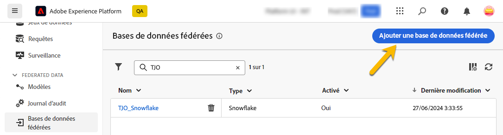
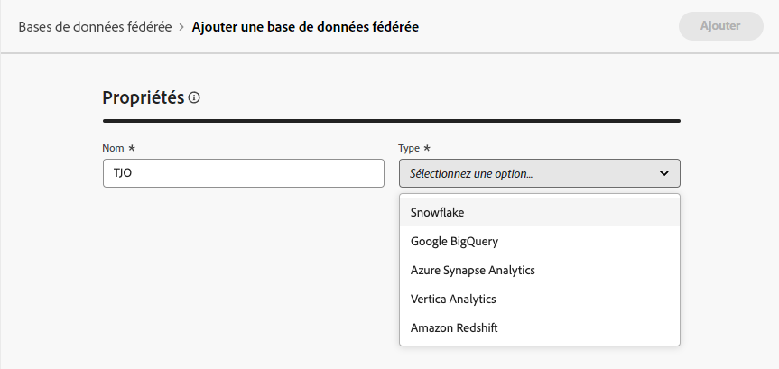
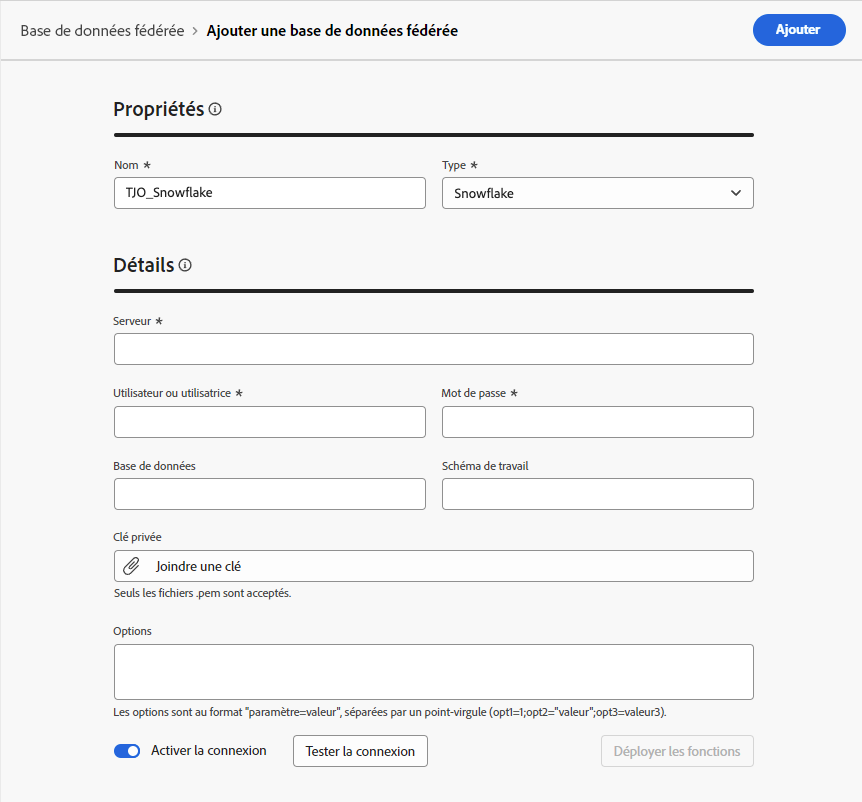
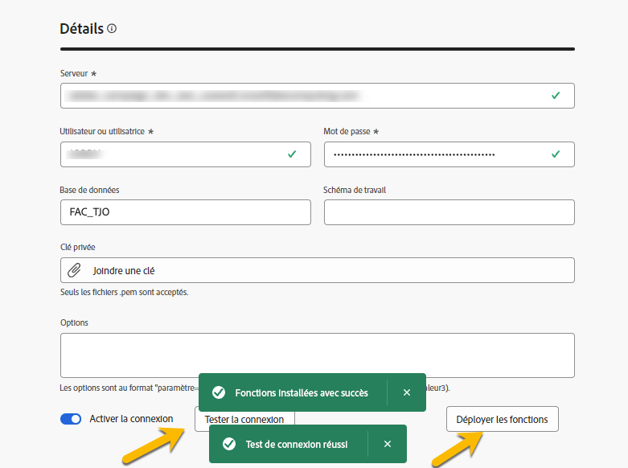

# Création de connexions {#connections-fdb}

Pour créer une nouvelle connexion à une base de données fédérée, accédez à la section **[!UICONTROL DONNÉES FÉDÉRÉES]**, puis, dans le lien **[!UICONTROL Bases de données fédérées]**, cliquez sur le bouton **[!UICONTROL Ajouter une base de données fédérée]** .

{zoomable="yes"}

Vous accédez à la fenêtre pour la connexion **[!UICONTROL Properties]**, avec le nom et le type de votre base de données.

{zoomable="yes"}

La sélection de son type vous donne accès à d’autres propriétés à remplir. [En savoir plus](federated-db.md)

{zoomable="yes"}

Une fois les détails renseignés, cliquez sur le bouton **[!UICONTROL Tester la connexion]** et sur le bouton **[!UICONTROL Déployer les fonctions]** .
Terminez la création de votre connexion en cliquant sur le bouton **[!UICONTROL Enregistrer]** .

{zoomable="yes"}
