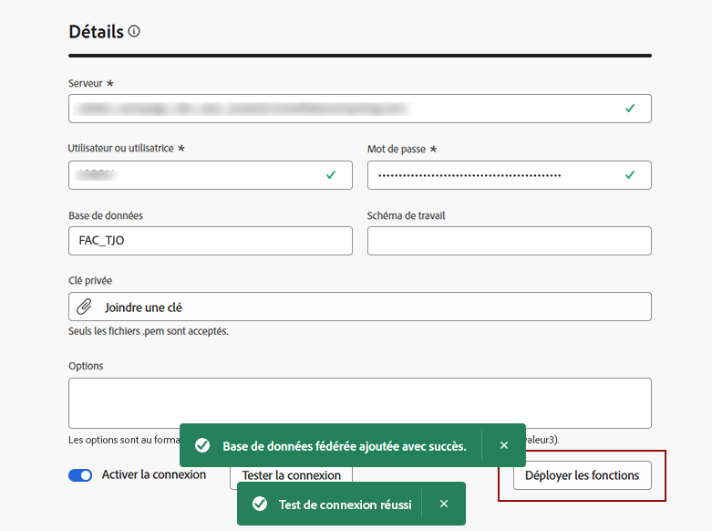

# Créer des connexions {#connections-fdb}

>[!AVAILABILITY]
>
>Pour accéder aux connexions, vous devez disposer de l’une des autorisations suivantes :
>
>-**Gérer la base de données fédérée**
>-**Afficher la base de données fédérée**
>
>Pour plus d’informations sur les autorisations requises, veuillez lire le [Guide d’accès à la composition d’audiences fédérées](/help/start/feature-access.md).

La composition d’audiences fédérées Experience Platform permet au client ou à la cliente de créer et d’enrichir des audiences à partir d’entrepôts de données tiers et d’importer les audiences dans Adobe Experience Platform. Les entrepôts de données pris en charge sont répertoriés dans [cette section](../start/access-prerequisites.md#supported-systems).

Pour travailler avec votre base de données fédérée et Adobe Experience Platform, vous devez d’abord établir une connexion. Cette connexion est configurée dans une interface d’utilisation dédiée disponible dans l’interface d’utilisation Adobe Experience Platform, comme décrit sur cette page.

Pour configurer une connexion à votre base de données, procédez comme suit :

1. Accédez à la section **[!UICONTROL DONNÉES FÉDÉRÉES]** sur le rail de gauche.

1. Dans le lien **[!UICONTROL Bases de données fédérées]**, cliquez sur le bouton **[!UICONTROL Ajouter une base de données fédérée]**.

   {zoomable="yes"}

1. Définissez la connexion **[!UICONTROL Propriétés]** avec le nom et le type de votre base de données.

   {zoomable="yes"}

   La sélection de son type vous donne accès à d’autres propriétés à remplir. Pour en savoir plus sur les bases de données prises en charge, consultez [cette page](federated-db.md).

   {zoomable="yes"}

   Les paramètres détaillés dépendent du type de votre base de données. Accédez aux liens ci-dessous pour accéder aux détails dont vous avez besoin pour configurer la connexion :

   * [Amazon Redshift](federated-db.md#amazon-redshift)
   * [Azure Synapse](federated-db.md#azure-synapse-redshift)
   * [Databricks](federated-db.md#databricks)
   * [Google BigQuery](federated-db.md#google-big-query)
   * [Snowflake](federated-db.md#snowflake)
   * [Vertica Analytics](federated-db.md#vertica-analytics)
   * [Microsoft Fabric](federated-db.md#microsoft-fabric)

1. Pour chaque base de données prise en charge, sélectionnez le bouton **[!UICONTROL Adresse IP du serveur]**. La liste de toutes les adresses IP associées à vos instances de composition d’audiences fédérées s’affiche.

   {zoomable="yes"}

   Cliquez sur une adresse IP de la liste pour la copier dans votre système et l’autoriser à se connecter à votre base de données.

   >[!NOTE]
   >
   >Pour utiliser la composition d’audiences fédérées pour une base de données, vous devez ajouter à la liste autorisée toutes les adresses IP associées à cette base de données.

1. Une fois les détails renseignés, cliquez sur les boutons **[!UICONTROL Tester la connexion]** et **[!UICONTROL Déployer les fonctions]**.

   {zoomable="yes"}

1. Terminez la création de votre connexion en cliquant sur le bouton **[!UICONTROL Enregistrer]**.

   Une vue d’ensemble de votre connexion à la base de données fédérée est disponible, comme illustré ci-dessous :

   {zoomable="yes"}
