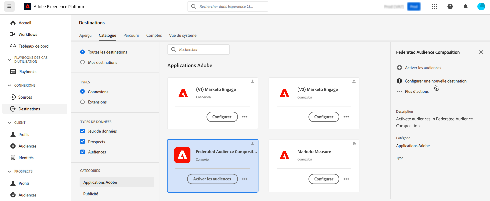
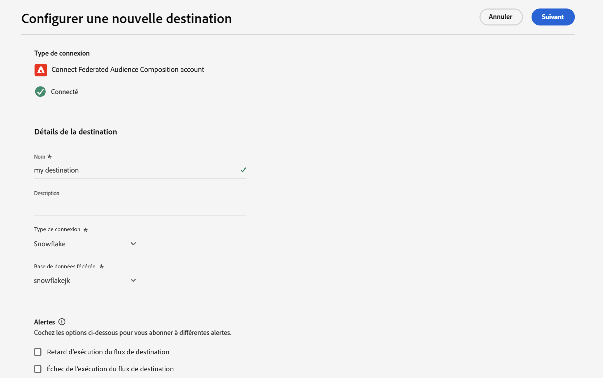
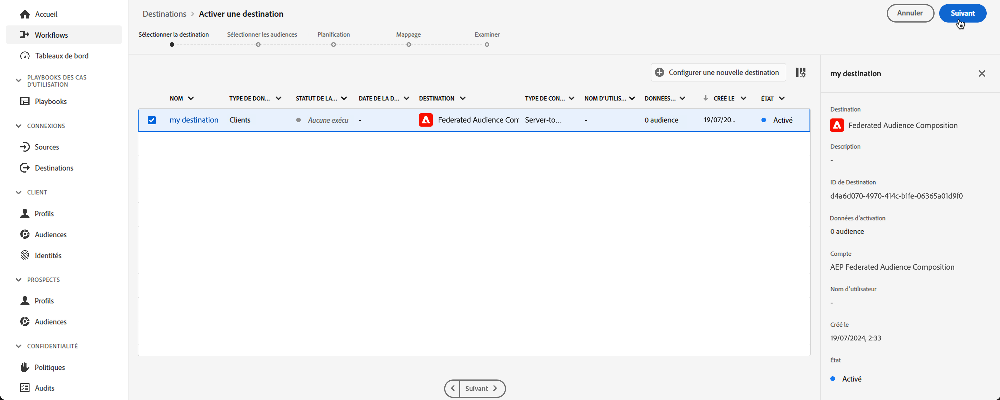
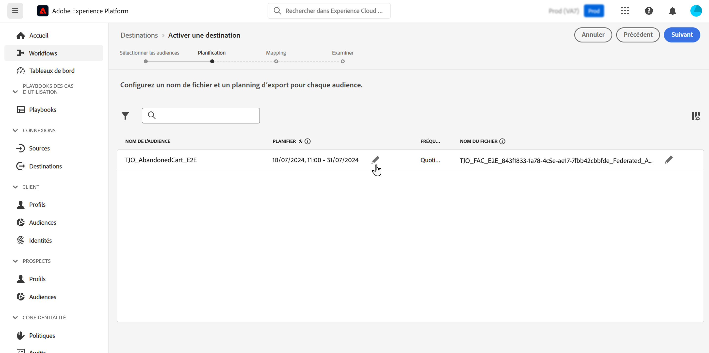
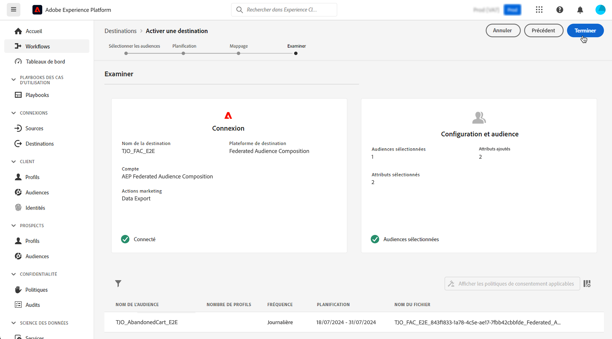

# Envoi de Adobe Experience Platform à la composition d’audiences fédérées Adobe {#connect-aep-fac}

>[!CONTEXTUALHELP]
>id="dc_new_destination"
>title="Créer une destination"
>abstract="Renseignez les paramètres de connexion à la nouvelle base de données fédérée. Utilisez le bouton **[!UICONTROL Se connecter à la destination]** pour valider votre configuration."

Adobe Experience Platform vous permet d’envoyer des audiences depuis le portail Audience pour Adobe de la composition d’audiences fédérées. Vous pouvez ainsi exploiter les audiences existantes dans des compositions et les combiner avec des données provenant de vos bases de données externes pour créer de nouvelles audiences ou mettre à jour des audiences existantes.

Pour ce faire, vous devez configurer une nouvelle connexion dans Adobe Experience Platform à la destination Adobe Federated Audience Composition . Vous pouvez utiliser un planificateur pour envoyer une audience donnée à des fréquences régulières, choisir les champs à envoyer à l’audience, tels que les identifiants pour réconcilier les données. Si vous avez appliqué des politiques de gouvernance et de confidentialité à votre audience, elles seront conservées et renvoyées au portail d’audience une fois l’audience mise à jour.

Les principales étapes pour envoyer des audiences Adobe Experience Platform à la composition d’audiences fédérées Adobe sont les suivantes :

1. Accédez au catalogue des destinations Adobe Experience Platform et sélectionnez la destination Composition d’audience fédérée .

   Dans le volet de droite, sélectionnez **[!UICONTROL Configurer une nouvelle destination]**.

   

1. Attribuez un nom à la nouvelle connexion, choisissez le **[!UICONTROL Type de connexion]** à utiliser et la **[!UICONTROL base de données fédérée]** à laquelle vous souhaitez vous connecter, puis cliquez sur **[!UICONTROL Suivant]**.

   

   La section **[!UICONTROL Alertes]** vous permet d’activer les alertes pour recevoir des notifications sur l’état du flux de données vers votre destination. Pour plus d’informations sur les alertes, consultez le guide sur l’[abonnement aux alertes des destinations dans l’interface utilisateur](../../ui/alerts.md).

1. L’étape **[!UICONTROL Stratégie de gouvernance et actions d’application]** vous permet de définir vos stratégies de gouvernance des données et de vous assurer que les données utilisées sont conformes lorsque les audiences sont envoyées et actives.

   Lorsque vous avez terminé de sélectionner les actions marketing souhaitées pour la destination, cliquez sur **[!UICONTROL Créer]**.

1. La nouvelle connexion à la destination est créée. Vous pouvez désormais activer les audiences à envoyer vers la destination. Pour ce faire, sélectionnez-le dans la liste et cliquez sur **[!UICONTROL Suivant]**

   

1. Sélectionnez les audiences que vous souhaitez envoyer, puis cliquez sur **[!UICONTROL Suivant]**.

1. Configurez le nom du fichier et un planning d&#39;export pour la ou les audiences sélectionnées.

   

   >[!NOTE]
   >
   >Vous trouverez des informations détaillées sur la configuration de la planification et des noms de fichier dans la documentation de Adobe Experience Platform :
   >* [Planification de l’export d’audience](https://experienceleague.adobe.com/en/docs/experience-platform/destinations/ui/activate/activate-batch-profile-destinations#scheduling)
   >* [Configurer les noms de fichier](https://experienceleague.adobe.com/en/docs/experience-platform/destinations/ui/activate/activate-batch-profile-destinations#configure-file-names)

1. À l’étape **[!UICONTROL Mapping]**, sélectionnez les champs d’attribut et d’identité à exporter pour vos audiences. Pour plus d’informations, consultez l’ [étape de mappage](https://experienceleague.adobe.com/en/docs/experience-platform/destinations/ui/activate/activate-batch-profile-destinations#mapping) dans la documentation Adobe Experience Platform.

   

1. Vérifiez la configuration de destination et les paramètres de l’audience, puis cliquez sur **[!UICONTROL Terminer]**.

   

Les audiences sélectionnées sont désormais activées pour la nouvelle connexion. Vous pouvez ajouter d’autres audiences à envoyer avec cette connexion en revenant à la page **[!UICONTROL Activer les audiences]**. Une fois activées, les audiences ne peuvent pas être supprimées.
