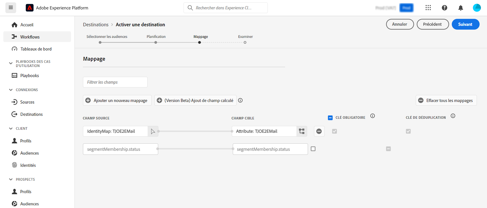

# Enrichir les audiences Adobe Experience Platform avec des données externes {#connect-aep-fac}

>[!CONTEXTUALHELP]
>id="dc_new_destination"
>title="Créer une destination"
>abstract="Renseignez les paramètres de connexion à la nouvelle base de données fédérée. Utilisez le bouton **[!UICONTROL Se connecter à la destination]** pour valider votre configuration."

Adobe Experience Platform permet une intégration transparente des audiences du portail d’audiences avec vos bases de données externes à l’aide de la **destination Adobe Composition d’audiences fédérées**. Grâce à cette intégration, vous pouvez tirer profit des audiences existantes dans des compositions et les enrichir ou les affiner à l’aide des données de vos bases de données externes pour créer des audiences.

Pour ce faire, vous devez configurer une nouvelle connexion dans Adobe Experience Platform à la destination Adobe Composition d’audiences fédérées. Vous pouvez utiliser un planificateur pour envoyer une audience donnée à des fréquences régulières, puis sélectionner des attributs spécifiques à inclure, tels que les identifiants pour la réconciliation des données. Si vous avez appliqué des politiques de gouvernance et de confidentialité à votre audience, elles seront conservées et renvoyées au portail d’audience une fois l’audience mise à jour.

Supposons que vous stockiez des informations d’achat dans votre entrepôt de données et qu’une audience Adobe Experience Platform cible la clientèle intéressée par un produit spécifique au cours des deux derniers mois. À l’aide de la destination Composition d’audiences fédérées, vous pouvez effectuer les opérations suivantes :

* Affiner l’audience en fonction des informations d’achat. Par exemple, vous pouvez filtrer l’audience pour cibler la clientèle qui a effectué un achat de plus de 150 USD uniquement.
* Enrichir l’audience avec les champs relatifs aux achats, tels que le nom du produit et la quantité achetée.

Les principales étapes pour envoyer des audiences Adobe Experience Platform à la composition d’audiences fédérées Adobe sont les suivantes :

1. Accédez au catalogue des destinations Adobe Experience Platform et sélectionnez la destination Composition d’audiences fédérées.

   Dans le volet de droite, sélectionnez **[!UICONTROL Configurer une nouvelle destination]**.

   

1. Saisissez le nom de la nouvelle connexion et sélectionnez le **[!UICONTROL Type de connexion]** parmi les connexions disponibles suivantes :

   * Amazon Redshift
   * Azure Synapse Analytics
   * Google BigQuery
   * Snowflake
   * Vertica Analytics
   * Databricks
   * Microsoft Fabric

1. Sélectionnez la **[!UICONTROL base de données fédérée]** à laquelle vous connecter, puis cliquez sur **[!UICONTROL Suivant]**.

   

1. La section **[!UICONTROL Alertes]** permet d’activer les alertes pour recevoir des notifications sur le statut de votre flux de données vers votre destination.

   Pour plus d’informations sur les alertes, consultez le guide Adobe Experience Platform sur l’[abonnement aux alertes des destinations dans l’interface d’utilisation](https://experienceleague.adobe.com/fr/docs/experience-platform/destinations/ui/alerts){target="_blank"}.

1. L’étape **[!UICONTROL Politique de gouvernance et mesures de mise en conformité]** vous permet de définir vos politiques de gouvernance des données et de vous assurer que les données utilisées sont conformes lorsque les audiences sont envoyées et actives.

   Lorsque vous avez terminé de sélectionner les actions marketing souhaitées pour la destination, cliquez sur **[!UICONTROL Créer]**.

1. La nouvelle connexion à la destination est créée. Vous pouvez désormais activer les audiences à envoyer vers la destination. Pour ce faire, sélectionnez-le dans la liste et cliquez sur **[!UICONTROL Suivant]**.

   

1. Sélectionnez les audiences souhaitées que vous souhaitez envoyer.

1. Sélectionnez l’icône  pour modifier le planning d’exportation.

   

1. Définissez les options du fichier d’exportation. Pour activer les audiences plus rapidement, sélectionnez l’option **[!UICONTROL Après l’évaluation du segment]** pour déclencher la tâche d’activation immédiatement après la fin de la tâche de segmentation par lots quotidienne de Platform.

   

   >[!NOTE]
   >
   >Des informations détaillées sur la configuration du planning et des noms de fichiers sont disponibles dans les sections suivantes de la documentation Adobe Experience Platform :
   >
   >* [Planifier l’export d’audience](https://experienceleague.adobe.com/fr/docs/experience-platform/destinations/ui/activate/activate-batch-profile-destinations#scheduling){target="_blank"}
   >* [Configurer les noms de fichiers](https://experienceleague.adobe.com/fr/docs/experience-platform/destinations/ui/activate/activate-batch-profile-destinations#configure-file-names){target="_blank"}

1. Au cours de l’étape du **[!UICONTROL Mappage]**, vous pouvez sélectionner les champs d’attribut et d’identité à exporter pour vos audiences. Pour plus d’informations, consultez l’[étape de mappage](https://experienceleague.adobe.com/fr/docs/experience-platform/destinations/ui/activate/activate-batch-profile-destinations#mapping){target="_blank"} dans la documentation Adobe Experience Platform.

   

1. Vérifiez la configuration de destination et les paramètres de l’audience, puis cliquez sur **[!UICONTROL Terminer]**.

   

Les audiences sélectionnées sont désormais activées pour la nouvelle connexion. Vous pouvez ajouter d’autres audiences à envoyer avec cette connexion en revenant à la page **[!UICONTROL Activer les audiences]**. Une fois activées, les audiences ne peuvent pas être supprimées.
