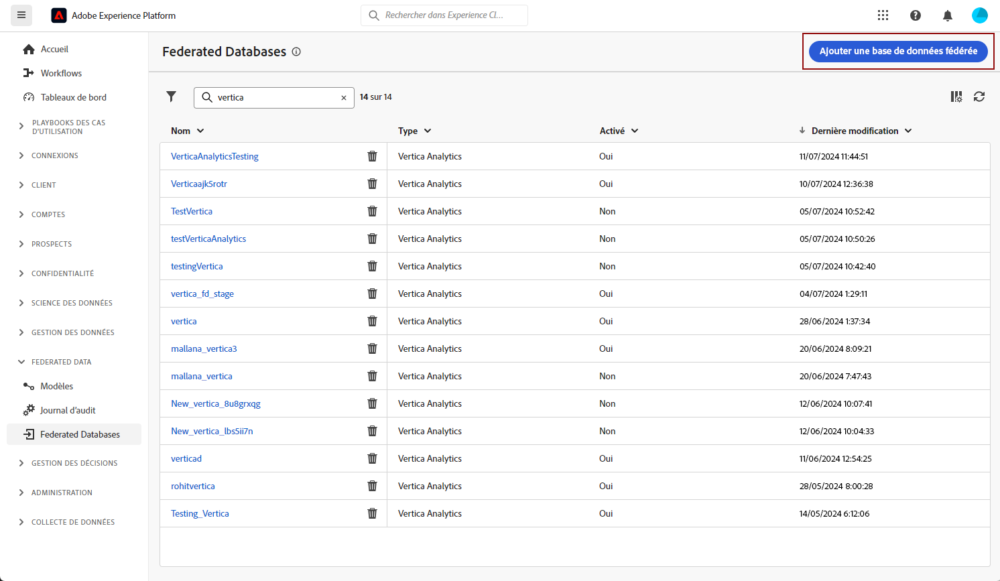
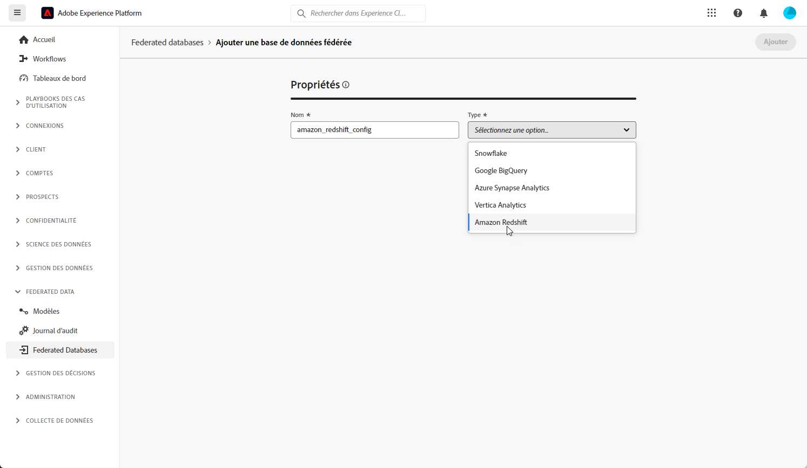
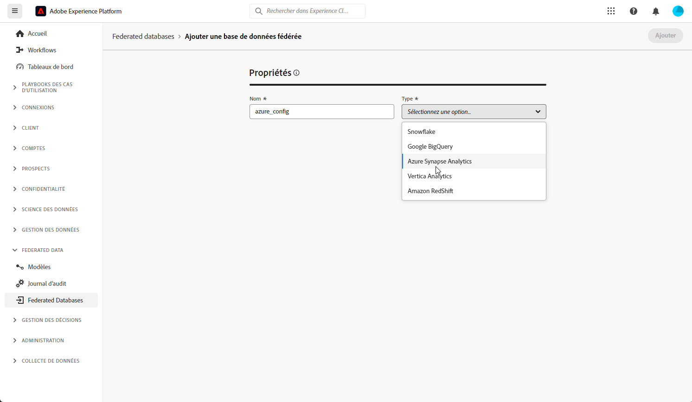
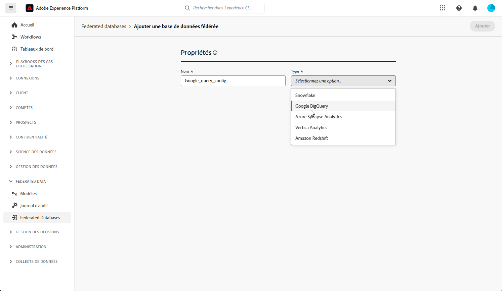
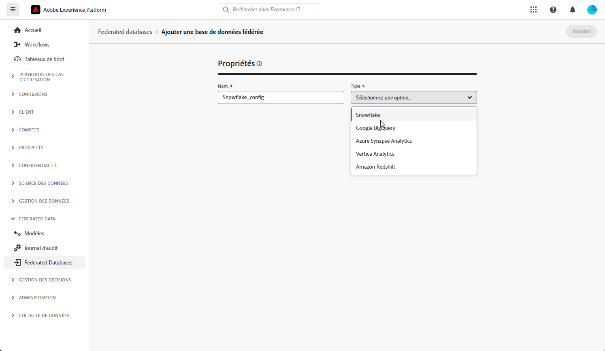
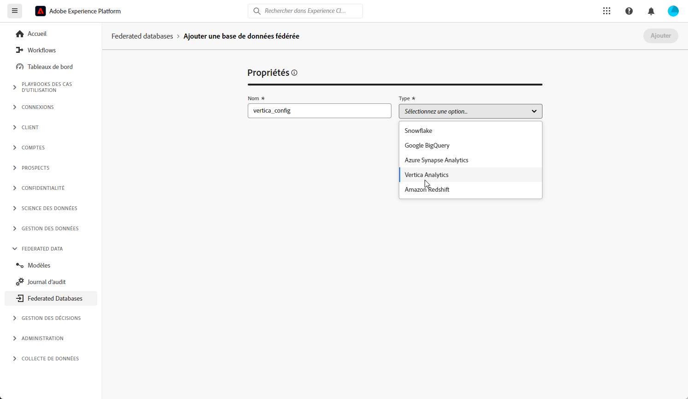

# Commencer avec les bases de données fédérées {#federated-db}

>[!CONTEXTUALHELP]
>id="dc_connection_federated_database_menu"
>title="Bases de données fédérées"
>abstract="Les connexions existantes à des bases de données fédérées sont répertoriées dans cet écran. Pour créer une connexion, cliquez sur le bouton **[!UICONTROL Ajouter une base de données fédérée]**."

>[!CONTEXTUALHELP]
>id="dc_connection_federated_database_properties"
>title="Propriétés de la base de données fédérée"
>abstract="Saisissez le nom de la nouvelle base de données fédérée et sélectionnez son type."

>[!CONTEXTUALHELP]
>id="dc_connection_federated_database_details"
>title="Détails de la base de données fédérée"
>abstract="Renseignez les paramètres de connexion à la nouvelle base de données fédérée. Utilisez le bouton **[!UICONTROL Tester la connexion]** pour valider votre configuration."

La composition d’audiences fédérées Experience Platform permet au client de créer et d’enrichir des audiences à partir d’entrepôts de données tiers et d’importer les audiences dans Adobe Experience Platform.

Découvrez comment créer, configurer, tester et enregistrer la connexion à votre base de données externe dans cette page.

## Bases de données prises en charge {#supported-db}

Avec Federated Audience Composition, vous pouvez vous connecter aux bases de données suivantes. Le paramétrage de chaque base de données est présenté ci-dessous.

* [Amazon Redshift](#amazon-redshift)
* [Azure synapse](#azure-synapse-redshift)
* [Google BigQuery](#google-big-query)
* [Snowflake](#snowflake)
* [Vertica Analytics](#vertica-analytics)

## Amazon Redshift {#amazon-redshift}

Utilisez des bases de données fédérées pour traiter les informations stockées dans une base de données externe. Suivez les étapes ci-dessous pour configurer l’accès à Amazon Redshift.

1. Dans le menu **[!UICONTROL Federated data]**, sélectionnez **[!UICONTROL Federated database]**.

1. Cliquez sur **[!UICONTROL Ajouter une base de données fédérée]**.

   

1. Saisissez un **[!UICONTROL nom]** dans votre base de données Federate.

1. Dans la liste déroulante **[!UICONTROL Type]**, sélectionnez Amazon Redshift.

   

1. Configurez les paramètres d’authentification Amazon Redshift :

   * **[!UICONTROL Serveur]** : ajoutez le nom du DNS.

   * **[!UICONTROL Compte]** : ajoutez le nom d’utilisateur.

   * **[!UICONTROL Mot de passe]** : ajoutez le mot de passe du compte.

   * **[!UICONTROL Base de données]** : nom de la base de données s’il n’est pas spécifié dans le DSN. Il peut rester vide s’il est spécifié dans le DSN

   * **[!UICONTROL Schéma de travail]** : nom du schéma de base de données à utiliser pour les tables de travail. [En savoir plus](https://docs.aws.amazon.com/redshift/latest/dg/r_Schemas_and_tables.html)

     >[!NOTE]
     >
     >Vous pouvez utiliser n’importe quel schéma de la base de données, y compris les schémas utilisés pour le traitement temporaire des données, à condition que vous disposiez de l’autorisation requise pour vous connecter à ce schéma.

1. Sélectionnez l&#39;option **[!UICONTROL Tester la connexion]** pour vérifier votre configuration.

1. Cliquez sur le bouton **[!UICONTROL Déployer les fonctions]** pour créer les fonctions.

1. Une fois la configuration terminée, cliquez sur **[!UICONTROL Ajouter]** pour créer votre base de données Federate.

## Azure synapse Redshift {#azure-synapse-redshift}

Utilisez des bases de données fédérées pour traiter les informations stockées dans une base de données externe. Suivez les étapes ci-dessous pour configurer l’accès à Azure Synapse Redshift.

1. Dans le menu **[!UICONTROL Federated data]**, sélectionnez **[!UICONTROL Federated database]**.

1. Cliquez sur **[!UICONTROL Ajouter une base de données fédérée]**.

   

1. Saisissez un **[!UICONTROL nom]** dans votre base de données Federate.

1. Dans la liste déroulante **[!UICONTROL Type]**, sélectionnez Azure synapse Redshift.

   

1. Configurez les paramètres d’authentification de l’Azure synapse Redshift :

   * **[!UICONTROL Serveur]** : saisissez l’URL du serveur d’Azure synapse.

   * **[!UICONTROL Compte]** : saisissez le nom d’utilisateur.

   * **[!UICONTROL Mot de passe]** : saisissez le mot de passe du compte.

   * **[!UICONTROL Base de données]** (facultatif) : Entrez le nom de votre base de données s’il n’est pas spécifié dans le DSN.

   * **[!UICONTROL Options]** : le connecteur prend en charge les options présentées dans le tableau ci-dessous.

1. Sélectionnez l&#39;option **[!UICONTROL Tester la connexion]** pour vérifier votre configuration.

1. Cliquez sur le bouton **[!UICONTROL Déployer les fonctions]** pour créer les fonctions.

1. Une fois la configuration terminée, cliquez sur **[!UICONTROL Ajouter]** pour créer votre base de données Federate.

| Option | Description |
|---|---|
| Authentification | Type d’authentification pris en charge par le connecteur. Valeur actuelle prise en charge : ActiveDirectoryMSI. Pour plus d’informations, voir [SQL doc](https://learn.microsoft.com/en-us/sql/connect/odbc/using-azure-active-directory?view=sql-server-ver15#example-connection-strings) (Exemples de chaînes de connexion n°8) |

## Google BigQuery {#google-big-query}

Utilisez des bases de données fédérées pour traiter les informations stockées dans une base de données externe. Suivez les étapes ci-dessous pour configurer l’accès à Google Big Query.

1. Dans le menu **[!UICONTROL Federated data]**, sélectionnez **[!UICONTROL Federated database]**.

1. Cliquez sur **[!UICONTROL Ajouter une base de données fédérée]**.

   

1. Saisissez un **[!UICONTROL nom]** dans votre base de données Federate.

1. Dans la liste déroulante **[!UICONTROL Type]**, sélectionnez Google Big Query.

   

1. Configurez les paramètres d’authentification Google Big Query :

   * **[!UICONTROL Compte de service]** : saisissez l’adresse électronique de votre **[!UICONTROL compte de service]**. Pour plus d&#39;informations à ce propos, consultez la [documentation Google Cloud](https://cloud.google.com/iam/docs/creating-managing-service-accounts).

   * **[!UICONTROL Projet]** : saisissez le nom de votre **[!UICONTROL Projet]**. Pour plus d&#39;informations à ce propos, consultez la [documentation Google Cloud](https://cloud.google.com/resource-manager/docs/creating-managing-projects).

   * **[!UICONTROL Jeu de données]** : saisissez le nom de votre **[!UICONTROL jeu de données]**. Pour plus d&#39;informations à ce propos, consultez la [documentation Google Cloud](https://cloud.google.com/bigquery/docs/datasets-intro).

   * **[!UICONTROL Chemin d’accès au fichier clé]** : téléchargez votre fichier de clé sur le serveur. Seuls les fichiers .json sont acceptés.

   * **[!UICONTROL Options]** : le connecteur prend en charge les options présentées dans le tableau ci-dessous.

1. Sélectionnez l&#39;option **[!UICONTROL Tester la connexion]** pour vérifier votre configuration.

1. Cliquez sur le bouton **[!UICONTROL Déployer les fonctions]** pour créer les fonctions.

1. Une fois la configuration terminée, cliquez sur **[!UICONTROL Ajouter]** pour créer votre base de données Federate.

| Option | Description |
|---|---|
| ProxyType | Type de proxy utilisé pour se connecter à BigQuery par le biais des connecteurs ODBC et SDK.  HTTP (par défaut), http_no_tunnel, socks4 et socks5 sont actuellement pris en charge. |
| ProxyHost | Nom d’hôte ou adresse IP où le proxy peut être atteint. |
| ProxyPort | Numéro de port sur lequel le proxy s’exécute, par exemple 8080 |
| ProxyUid | Nom d’utilisateur utilisé pour le proxy authentifié |
| ProxyPwd | Mot de passe ProxyUid |
| bqpath | Notez que cela s’applique uniquement à l’outil de chargement en masse (SDK Cloud).   Pour éviter d’utiliser la variable PATH ou si le répertoire google-cloud-sdk doit être déplacé vers un autre emplacement, vous pouvez spécifier avec cette option le chemin exact du répertoire bin du sdk cloud sur le serveur. |
| GCloudConfigName | Notez que cela s’applique uniquement à partir de la version 7.3.4 et à l’outil de chargement en masse (SDK Cloud).  Le SDK Google Cloud utilise des configurations pour charger les données dans les tableaux BigQuery. La configuration nommée `accfda` stocke les paramètres pour le chargement des données. Cependant, cette option permet aux personnes de spécifier un nom différent pour la configuration. |
| GCloudDefaultConfigName | Notez que cela s’applique uniquement à partir de la version 7.3.4 et à l’outil de chargement en masse (SDK Cloud).  La configuration active du SDK Google Cloud ne peut pas être supprimée sans transférer au préalable la balise active vers une nouvelle configuration. Cette configuration temporaire est nécessaire pour recréer la configuration principale de chargement des données. Le nom par défaut de la configuration temporaire est `default`, et peut être modifié si nécessaire. |
| GCloudRecreateConfig | Notez que cela s’applique uniquement à partir de la version 7.3.4 et à l’outil de chargement en masse (SDK Cloud).  Lorsqu’il est défini sur `false`, le mécanisme de chargement en masse évite de tenter de recréer, de supprimer ou de modifier les configurations du SDK Google Cloud. Au lieu de cela, il procède au chargement des données à l’aide de la configuration existante sur la machine. Cette fonctionnalité est utile lorsque d’autres opérations dépendent des configurations du SDK Google Cloud.   Si la personne active cette option de moteur sans une configuration appropriée, le mécanisme de chargement en masse émet un message d’avertissement : `No active configuration found. Please either create it manually or remove the GCloudRecreateConfig option`. Pour éviter d’autres erreurs, le mécanisme de chargement en masse par défaut du tableau ODBC est rétabli. |

## Snowflake {#snowflake}

Utilisez des bases de données fédérées pour traiter les informations stockées dans une base de données externe. Suivez les étapes ci-dessous pour configurer l’accès à Snowflake.

1. Dans le menu **[!UICONTROL Federated data]**, sélectionnez **[!UICONTROL Federated database]**.

1. Cliquez sur **[!UICONTROL Ajouter une base de données fédérée]**.

   

1. Saisissez un **[!UICONTROL nom]** dans votre base de données Federate.

1. Dans la liste déroulante **[!UICONTROL Type]**, sélectionnez Snowflake.

   

1. Configurez les paramètres d’authentification du Snowflake :

   * **[!UICONTROL Serveur]** : saisissez le nom de votre serveur.

   * **[!UICONTROL User]** : saisissez votre nom d’utilisateur.

   * **[!UICONTROL Mot de passe]** : saisissez le mot de passe de votre compte.

   * **[!UICONTROL Base de données]** (facultatif) : Entrez le nom de votre base de données s’il n’est pas spécifié dans le DSN.

   * **[!UICONTROL Schéma de travail]** (facultatif) : saisissez le nom du schéma de base de données à utiliser pour les tables de travail.

     >[!NOTE]
     >
     >Vous pouvez utiliser n’importe quel schéma de la base de données, y compris les schémas utilisés pour le traitement temporaire des données, à condition que vous disposiez de l’autorisation requise pour vous connecter à ce schéma.

   * **[!UICONTROL Clé privée]** : cliquez sur le champ **[!UICONTROL Clé privée]** pour sélectionner vos fichiers .pem dans votre dossier de paramètres régionaux.

   * **[!UICONTROL Options]** : le connecteur prend en charge les options présentées dans le tableau ci-dessous.

1. Sélectionnez l&#39;option **[!UICONTROL Tester la connexion]** pour vérifier votre configuration.

1. Cliquez sur le bouton **[!UICONTROL Déployer les fonctions]** pour créer les fonctions.

1. Une fois la configuration terminée, cliquez sur **[!UICONTROL Ajouter]** pour créer votre base de données Federate.

Le connecteur prend en charge les options suivantes :

| Option | Description |
|---|---|
| workschema | Schéma de base de données à utiliser pour les tables de travail. |
| warehouse | Nom de l&#39;entrepôt par défaut à utiliser. Il remplace la valeur par défaut de l&#39;utilisateur. |
| TimeZoneName | Vide par défaut. C&#39;est le fuseau horaire système du serveur applicatif Campaign Classic qui est utilisé. Il est possible d&#39;utiliser cette option pour forcer le paramètre de session TIMEZONE.  Pour plus d&#39;informations à ce sujet, consultez [cette page](https://docs.snowflake.net/manuals/sql-reference/parameters.html#timezone). |
| WeekStart | Paramètre de session WEEK_START. Par défaut, cette valeur est définie sur 0.  Pour plus d&#39;informations à ce sujet, consultez [cette page](https://docs.snowflake.com/en/sql-reference/parameters.html#week-start). |
| UseCachedResult | Paramètre de session USE_CACHED_RESULTS. Par défaut, cette valeur est définie sur TRUE. Cette option peut être utilisée pour désactiver les résultats mis en cache du Snowflake.  Pour plus d’informations à ce sujet, consultez [cette page](https://docs.snowflake.net/manuals/user-guide/querying-persisted-results.html). |
| bulkThreads | Nombre de threads à utiliser pour le chargeur en masse de Snowflake ; plus de threads signifient de meilleures performances pour les chargements en masse plus volumineux. Par défaut, cette valeur est définie sur 1. Le nombre peut être ajusté en fonction du nombre de threads de la machine. |
| chunkSize | Détermine la taille de fichier du bloc de chargeur en masse. Par défaut, cette valeur est définie sur 128 Mo. Peut être modifiée pour des performances plus optimales, lorsqu’elle est utilisée avec bulkThreads. Plus de threads actifs simultanément signifie de meilleures performances.  Pour plus d’informations à ce propos, consultez la [documentation Snowflake](https://docs.snowflake.net/manuals/sql-reference/sql/put.html). |
| StageName | Nom de l’étape interne préconfigurée. Elle sera utilisée en chargement massif au lieu de créer une nouvelle étape temporaire. |

## Vertica Analytics {#vertica-analytics}

Utilisez des bases de données fédérées pour traiter les informations stockées dans une base de données externe. Suivez les étapes ci-dessous pour configurer l’accès à Vertica Analytics.

1. Dans le menu **[!UICONTROL Federated data]**, sélectionnez **[!UICONTROL Federated database]**.

1. Cliquez sur **[!UICONTROL Ajouter une base de données fédérée]**.

   

1. Saisissez un **[!UICONTROL nom]** dans votre base de données Federate.

1. Dans la liste déroulante **[!UICONTROL Type]**, sélectionnez Verticas analytics.

   

1. Configurez les paramètres d’authentification Vertica Analytics :

   * **[!UICONTROL Serveur]** : ajoutez l’URL du serveur [!DNL Vertica Analytics].

   * **[!UICONTROL Compte]** : ajoutez le nom d’utilisateur.

   * **[!UICONTROL Mot de passe]** : ajoutez le mot de passe du compte.

   * **[!UICONTROL Base de données]** (facultatif) : Entrez le nom de votre base de données s’il n’est pas spécifié dans le DSN.

   * **[!UICONTROL Schéma de travail]** (facultatif) : saisissez le nom du schéma de base de données à utiliser pour les tables de travail.

     >[!NOTE]
     >
     >Vous pouvez utiliser n’importe quel schéma de la base de données, y compris les schémas utilisés pour le traitement temporaire des données, à condition que vous disposiez de l’autorisation requise pour vous connecter à ce schéma.

   * **[!UICONTROL Options]** : le connecteur prend en charge les options présentées dans le tableau ci-dessous.

1. Sélectionnez l&#39;option **[!UICONTROL Tester la connexion]** pour vérifier votre configuration.

1. Cliquez sur le bouton **[!UICONTROL Déployer les fonctions]** pour créer les fonctions.

1. Une fois la configuration terminée, cliquez sur **[!UICONTROL Ajouter]** pour créer votre base de données Federate.

Le connecteur prend en charge les options suivantes :

| Option | Description |
|---|---|
| TimeZoneName | Vide par défaut. C&#39;est le fuseau horaire système du serveur applicatif Campaign Classic qui est utilisé. Il est possible d’utiliser cette option pour forcer le paramètre de session TIMEZONE. |
