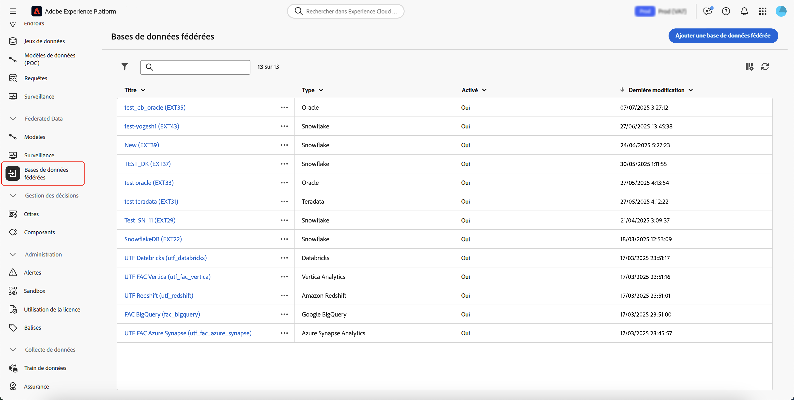
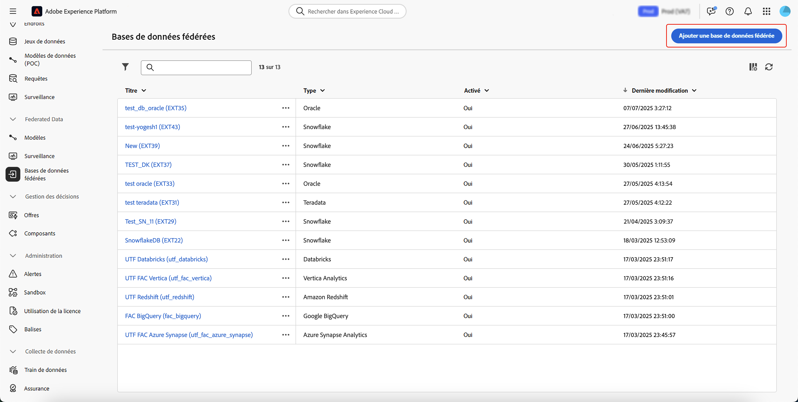
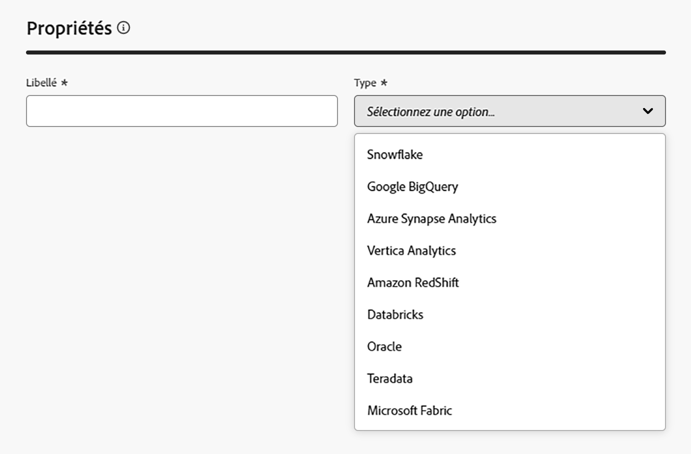

# Créer des connexions {#connections-fdb}

>[!AVAILABILITY]
>
>Pour accéder aux connexions, vous devez disposer de l’une des autorisations suivantes :
>
>**Gérer la base de données fédérée**
>-**Afficher la base de données fédérée**
>
>Pour plus d’informations sur les autorisations requises, lisez le [guide du contrôle d’accès](/help/governance-privacy-security/access-control.md).

La composition d’audiences fédérées Experience Platform permet de créer et d’enrichir des audiences à partir d’entrepôts de données tiers et d’importer les audiences dans Adobe Experience Platform.

## Bases de données prises en charge {#supported-databases}

Pour travailler avec votre base de données fédérée et Adobe Experience Platform, vous devez d’abord établir une connexion entre les deux sources. Avec la composition d’audiences fédérées, vous pouvez vous connecter aux bases de données suivantes.

- Amazon Redshift
- Azure Synapse Analytics
- Databricks
- Google BigQuery
- Microsoft Fabric
- Oracle
- Snowflake
- Teradata
- Vertica Analytics

## Créer une connexion {#create}

Pour créer une connexion, sélectionnez **[!UICONTROL Bases de données fédérées]** dans la section Données fédérées.

{zoomable="yes" width="70%" align="center"}

La section Bases de données fédérées s’affiche. Sélectionnez **[!UICONTROL Ajouter une base de données fédérée]** pour créer une connexion.

{zoomable="yes" width="70%" align="center"}

>[!NOTE]
>
>Pour demander une connectivité sécurisée à l’aide d’un lien privé ou d’un VPN, vous devez **obligatoirement** disposer d’une licence Privacy and Security Shield ou Healthcare Shield.

La fenêtre contextuelle Propriétés de connexion s’affiche. Vous pouvez nommer votre connexion ainsi que sélectionner le type de base de données à créer.

{zoomable="yes" width="70%" align="center"}

Après avoir sélectionné un type, la section **[!UICONTROL Détails]** s’affiche. Cette section diffère en fonction du type de base de données précédemment choisi.

>[!BEGINTABS]

>[!TAB Amazon Redshift]

>[!AVAILABILITY]
>
>Seuls Amazon Redshift AWS, Amazon Redshift Spectrum et Amazon Redshift sans serveur sont pris en charge.
>
>En outre, l’accès sécurisé à votre entrepôt de données externe Amazon Redshift par le biais d’un lien privé est pris en charge.

Après avoir sélectionné Amazon Redshift, vous pouvez ajouter les détails suivants :

| Champ | Description |
| ----- | ----------- |
| Serveur | Nom de la source de données. |
| Compte | Nom d’utilisateur ou d’utilisatrice du compte. |
| Mot de passe | Mot de passe du compte. |
| Base de données | Nom de la base de données. Si ce champ est spécifié dans le nom du serveur, vous pouvez le laisser vide. |
| Schéma de travail | Nom du schéma de base de données à utiliser pour les tables de travail. Vous trouverez plus d’informations sur cette fonctionnalité dans la [documentation Amazon Schemas](https://docs.aws.amazon.com/redshift/latest/dg/r_Schemas_and_tables.html){target="_blank"}.  **Remarque :** vous pouvez utiliser n’importe quel schéma de la base de données, y compris les schémas utilisés pour le traitement temporaire des données, à condition que vous disposiez des autorisation requises pour vous connecter à ce schéma. Cependant, vous **devez** utiliser des schémas de travail distincts lors de la connexion de plusieurs sandbox à la même base de données. |

>[!TAB Azure Synapse Analytics]

>[!NOTE]
>
>Si vous souhaitez créer une connexion sécurisée à l’aide d’Azure Synapse Analytics, contactez votre représentant ou représentante de l’assistance clientèle Adobe.

Après avoir sélectionné Azure Synapse Analytics, vous pouvez ajouter les détails suivants :

| Champ | Description |
| ----- | ----------- |
| Serveur | URL du serveur Azure Synapse. |
| Compte | ID d’application (**ID client**) de l’enregistrement de l’application Azure. |
| Mot de passe | Valeur du **Secret client** de l’application Azure. |
| Base de données | Nom de la base de données. Si ce champ est spécifié dans le nom du serveur, vous pouvez le laisser vide. |
| Options | Options supplémentaires pour la connexion. Pour Azure Synapse Analytics, vous pouvez spécifier le type d’authentification pris en charge par le connecteur. Actuellement, la composition d’audiences fédérées prend en charge `ActiveDirectoryMSI`. Pour plus d’informations sur les chaînes de connexion, consultez la section [Exemple de chaîne de connexion de la documentation Microsoft](https://learn.microsoft.com/fr-fr/sql/connect/odbc/using-azure-active-directory?view=sql-server-ver15#example-connection-strings){target="_blank"}. |

Vous pouvez également configurer en toute sécurité votre connexion Azure Synapse Analytics à l’aide de l’authentification du Principal de service. Vous devez utiliser l’authentification du Principal de service pour les intégrations de niveau production ainsi que pour les scénarios d’automatisation.

+++ Conditions préalables

Avant de configurer votre authentification du Principal de service, notez les conditions préalables suivantes :

- Un abonnement Azure avec accès à Microsoft Entra ID
- Un espace de travail et une base de données Azure Synapse
- Autorisation de créer l’enregistrement de l’application
- Autorisation de gérer les rôles de base de données Azure Synapse
- Autorisation de mettre à jour les configurations de Base de données fédérées

+++

Dans le portail Azure, vous devrez d’abord créer un enregistrement d’application. Sélectionnez **Enregistrer** après avoir attribué un nom unique à l’application. La page **Vue d’ensemble** s’affiche. Veillez à noter les valeurs **ID d’application (client)** et **ID de répertoire (locataire)**.

Dans l’application nouvellement enregistrée, sélectionnez **Certificats et secrets**. À partir de là, sélectionnez **Nouveau secret client** dans la section **Secrets client** pour créer un secret client. Après avoir fourni une description et une date d’expiration, sélectionnez **Ajouter** pour générer le secret client.

>[!IMPORTANT]
>
>Après avoir généré votre secret client, copiez et stockez en toute sécurité votre **valeur du secret client**. Cette valeur **ne sera plus** visible.

Maintenant que vous avez généré votre secret client, vous devez vous assurer que vous avez accordé l’identité **Principal de service** à la ressource.

Pour plus d’informations sur l’attribution d’identités aux ressources, consultez le guide [Identités gérées pour Azure Synapse Analytics](https://learn.microsoft.com/fr-fr/azure/synapse-analytics/synapse-service-identity).

Puisque vous avez terminé toutes vos configurations côté Azure, vous pouvez maintenant configurer vos configurations côté Composition d‘audience fédérée.

Dans votre connexion Azure Synapse, définissez les détails de configuration suivants :

| Champ | Description |
| ----- | ----------- |
| Serveur | URL du serveur Azure Synapse. |
| Compte | ID d’application (**ID client**) de l’enregistrement de l’application Azure. |
| Mot de passe | Valeur du **Secret client** de l’application Azure. |
| Base de données | Nom de la base de données. Si ce champ est spécifié dans le nom du serveur, vous pouvez le laisser vide. |
| Options | Options supplémentaires pour la connexion. Pour utiliser l’authentification du Principal de service, vous devez définir `Authentication="ActiveDirectoryServicePrincipal"`. |

>[!TAB Databricks]

>[!NOTE]
>
>L’accès sécurisé à votre entrepôt de données Databricks externe par le biais d’un lien privé est pris en charge. Cela inclut des connexions sécurisées aux bases de données Databricks hébergées sur Amazon Web Services (AWS) via un lien privé et aux bases de données Databricks hébergées sur Microsoft Azure via un VPN. Contactez votre représentant ou représentante Adobe pour obtenir de l’aide sur la configuration de l’accès sécurisé.

Après avoir sélectionné Databricks, vous pouvez choisir la méthode d’authentification à utiliser lors de la connexion à la composition d’audiences fédérées.

Si vous sélectionnez **Authentification par compte/mot de passe**, vous pouvez ajouter les informations de connexion suivantes :

| Champ | Description |
| ----- | ----------- |
| Serveur | Nom du serveur Databricks. |
| Mot de passe | Jeton d’accès du serveur Databricks. Pour plus d’informations sur cette valeur, consultez la [documentation de Databricks sur les jetons d’accès personnel](https://docs.databricks.com/aws/en/dev-tools/auth/pat){target="_blank"}. |

Si vous sélectionnez **Authentification par Principal de service**, vous pouvez ajouter les informations de connexion suivantes :

| Champ | Description |
| ----- | ----------- |
| Serveur | Nom du serveur Databricks. |
| Identifiant client | Identifiant client de votre serveur Databricks. Ce champ agit comme un nom d’utilisation pour votre projet. |
| Secret client | Secret client de votre serveur Databricks. Ce champ agit comme un mot de passe pour votre projet. |

Si vous sélectionnez **OAuth 2.0**, vous pouvez ajouter les informations suivantes :

| Champ | Description |
| ----- | ----------- |
| Serveur | Nom du serveur Databricks. |
| Identifiant client | Identifiant client de votre serveur Databricks. Ce champ est utilisé pour identifier l’application lors de l’authentification OAuth 2.0 et agit comme un nom d’utilisateur pour votre projet. |
| Secret client | Secret client de votre serveur Databricks. Ces informations d’identification confidentielles sont émises avec l’identifiant client et agissent comme un mot de passe pour votre projet. |
| Étendue d’accès | Informations préremplies qui répertorient les étendues pour lesquelles votre jeton OAuth est autorisé dans votre serveur Databricks. |

Après avoir saisi vos informations de connexion, vous pouvez ajouter les informations suivantes :

| Champ | Description |
| ----- | ----------- |
| Chemin HTTP | Chemin d’accès à votre cluster ou entrepôt de données. Pour plus d’informations sur le chemin d’accès, consultez la [documentation de Databricks sur les détails de connexion](https://docs.databricks.com/aws/en/integrations/compute-details){target="_blank"}. |
| Catalogue | Nom du catalogue Databricks. Pour plus d’informations sur les catalogues dans Databricks, consultez la [documentation de Databricks sur les catalogues](https://docs.databricks.com/aws/en/catalogs/){target="_blank"}. |
| Schéma de travail | Nom du schéma de base de données à utiliser pour les tables de travail.   **Note :** vous pouvez utiliser **n’importe quel** schéma de la base de données, y compris les schémas utilisés pour le traitement temporaire des données, à condition que vous disposiez des autorisation requises pour vous connecter à ce schéma. Cependant, vous **devez** utiliser des schémas de travail distincts lors de la connexion de plusieurs sandbox à la même base de données. |
| Options | Options supplémentaires pour la connexion. Les options disponibles sont répertoriées dans le tableau suivant. |

Pour Databricks, vous pouvez définir les options supplémentaires suivantes :

| Options | Description |
| ------- | ----------- |
| TimeZoneName | Nom du fuseau horaire à utiliser. Cette valeur représente le paramètre de session `TIMEZONE`. Pour plus d’informations sur les fuseaux horaires, consultez la [documentation de Databricks sur les fuseaux horaires](https://docs.databricks.com/aws/en/sql/language-manual/parameters/timezone#:~:text=The%20system%20default%20is%20UTC%20.){target="_blank"}. |

>[!TAB Google BigQuery]

>[!NOTE]
>
>Un accès sécurisé à votre entrepôt de données Google BigQuery externe via un VPN est pris en charge.

Après avoir sélectionné Google BigQuery, vous pouvez choisir la méthode d’authentification à utiliser lors de la connexion à la composition d’audiences fédérées.

Si vous sélectionnez **[!UICONTROL Authentification par compte/mot de passe]**, vous pouvez ajouter les informations de connexion suivantes :

| Champ | Description |
| ----- | ----------- |
| Compte de service | Adresse e-mail de votre compte de service. Pour plus d’informations, consultez la [documentation sur le compte de service Google Cloud](https://cloud.google.com/iam/docs/service-accounts-create){target="_blank"}. |

Si vous sélectionnez **[!UICONTROL OAuth 2.0]**, vous pouvez ajouter les informations de connexion suivantes :

>[!NOTE]
>
>Avant de vous connecter à Google BigQuery à l’aide d’OAuth 2.0, vous devez configurer votre URL de redirection dans votre projet Google Cloud. Ajoutez l’URL de redirection `https://fac-oauth.adobe.io/oauth` à votre projet Google Cloud sous la configuration de votre identifiant client OAuth 2.0.

| Champ | Description |
| ----- | ----------- |
| Identifiant client | Identifiant client de votre projet Google BigQuery. Ce champ agit comme un nom d’utilisation pour votre projet. |
| Secret client | Secret client de votre projet Google BigQuery. Ce champ agit comme un mot de passe pour votre projet. |
| Étendue d’accès | Informations préremplies qui répertorient les étendues pour lesquelles votre jeton OAuth est autorisé dans vos ressources Google Cloud. |

Sélectionnez **[!UICONTROL Se connecter]** pour terminer votre authentification.

Si vous sélectionnez **[!UICONTROL WIF]**, vous n’avez **pas** besoin de fournir d’identifiants de connexion. Cependant, vous **devez** ajouter la configuration de la bibliothèque cliente en tant que **[!UICONTROL chemin d’accès du fichier de clé]**. Pour plus d’informations sur la configuration de la bibliothèque cliente, consultez la [section Configuration de Google BigQuery (fédération des identités de charge de travail)](#wif-configuration).

Après avoir saisi vos informations de connexion, vous pouvez ajouter les détails suivants :

| Champ | Description |
| ----- | ----------- |
| Projet | ID de votre projet. Pour plus d’informations, consultez la [documentation sur le compte de service Google Cloud](https://cloud.google.com/resource-manager/docs/creating-managing-projects){target="_blank"}. |
| Jeu de données | Nom du jeu de données. Pour plus d’informations, consultez la [documentation sur le jeu de données Google Cloud](https://cloud.google.com/bigquery/docs/datasets-intro){target="_blank"}. |
| Emplacement du compartiment Google | Emplacement de votre compartiment Google. Vous ne devez ajouter ce champ que si vous utilisez l’activité **Modifier la dimension** dans votre composition. Pour plus d’informations, veuillez lire la documentation sur les [emplacements de compartiment cloud &#x200B;](https://docs.cloud.google.com/storage/docs/locations){target="_blank"}. |
| Chemin d’accès au fichier de clé | Fichier de clé pour le serveur. Seuls les fichiers `json` sont pris en charge. |
| Options | Options supplémentaires pour la connexion. Les options disponibles sont répertoriées dans le tableau suivant. |

Pour Google BigQuery, vous pouvez définir les options supplémentaires suivantes :

| Options | Description |
| ------- | ----------- |
| ProxyType | Type de proxy utilisé pour la connexion à BigQuery. Les valeurs acceptées comprennent `HTTP`, `http_no_tunnel`, `socks4` et `socks5`. |
| ProxyHost | Nom d’hôte ou adresse IP où le proxy peut être atteint. |
| ProxyUid | Numéro de port sur lequel le proxy s’exécute. |
| ProxyPwd | Mot de passe du proxy. |
| bgpath | **Remarque :** cela s’applique uniquement à l’**outil de chargement en masse** (SDK Cloud).   Chemin d’accès au répertoire de classe du SDK Cloud sur le serveur. Vous ne devez le définir que si vous avez déplacé le répertoire `google-cloud-sdk` vers un autre emplacement ou si vous souhaitez éviter d’utiliser la variable PATH. |
| GCloudConfigName | **Remarque :** cela s’applique uniquement à l’**outil de chargement en masse** (SDK Cloud) au-delà de la version 7.3.4.   Nom de la configuration qui stocke les paramètres pour le chargement des données. Par défaut, la valeur est `accfda`. |
| GCloudDefaultConfigName | **Remarque :** cela s’applique uniquement à l’**outil de chargement en masse** (SDK Cloud) au-delà de la version 7.3.4.   Le nom de la configuration temporaire est nécessaire pour recréer la configuration principale de chargement des données. Par défaut, la valeur est `default`. |
| GCloudRecreateConfig | **Remarque :** cela s’applique uniquement à l’**outil de chargement en masse** (SDK Cloud) au-delà de la version 7.3.4.   Valeur booléenne qui vous permet de décider si le mécanisme de chargement en masse doit recréer, supprimer ou modifier automatiquement les configurations de SDK Google Cloud. Si cette valeur est définie sur `false`, le mécanisme de chargement en masse charge les données à l’aide d’une configuration existante sur la machine. Si cette valeur est définie sur `true`, assurez-vous que votre configuration est correctement définie. Dans le cas contraire, l’erreur `No active configuration found. Please either create it manually or remove the GCloudRecreateConfig option` s’affiche et le mécanisme de chargement revient au mécanisme de chargement par défaut. |
| **restEndpoint** | Point d’entrée pour votre proxy Apigee. Vous ne devez l’utiliser que si vous utilisez le connecteur REST-API avec le proxy Apigee. Si vous utilisez le proxy Apigee, activez le paramètre **Utiliser le connecteur API REST**. Pour plus d’informations sur la configuration, consultez la section Prise en charge de la passerelle Google BigQuery Apigee [&#128279;](#apigee). |

>[!TAB Microsoft Fabric]

Après avoir sélectionné Microsoft Fabric, vous pouvez ajouter les détails suivants :

| Champ | Description |
| ----- | ----------- |
| Serveur | URL du serveur Microsoft Fabric. |
| ID de l’application | ID de l’application pour Microsoft Fabric. Pour plus d’informations sur l’ID de l’application, consultez la [documentation de Microsoft Fabric sur la configuration de l’application](https://learn.microsoft.com/fr-fr/fabric/workload-development-kit/create-entra-id-app){target="_blank"}. |
| Secret client | Secret client de l’application. Pour plus d’informations sur le secret client, consultez la [documentation de Microsoft Fabric sur la configuration de l’application](https://learn.microsoft.com/fr-fr/fabric/workload-development-kit/create-entra-id-app#step-8-generate-a-secret-for-your-application){target="_blank"}. |
| Options | Options supplémentaires pour la connexion. Les options disponibles sont répertoriées dans le tableau suivant. |

Pour Microsoft Fabric, vous pouvez définir les options supplémentaires suivantes :

| Option | Description |
| ------ | ----------- |
| Authentification | Type d’authentification utilisé par le connecteur. Les valeurs prises en charge comprennent : `ActiveDirectoryMSI`. Pour plus d’informations, consultez la [documentation de Microsoft sur la connectivité de l’entrepôt de données](https://learn.microsoft.com/fr-fr/fabric/data-warehouse/connectivity){target="_blank"}. |

>[!TAB Oracle]

>[!NOTE]
>
>La composition d’audiences fédérées prend en charge la configuration des connexions fédérées avec les bases de données Oracle de version 11g ou ultérieure et hébergées sur AWS, Azure, Exadata ou un cloud privé (à condition qu’elles soient accessibles par un réseau externe). Si vous avez d’autres questions relatives à la configuration de la base de données Oracle ou si vous devez créer une connexion sécurisée à Oracle, contactez votre représentant ou représentante d’assistance clientèle d’Adobe.

Après avoir sélectionné Oracle, vous pouvez ajouter les détails suivants :

| Champ | Description |
| ----- | ----------- |
| Serveur | URL du serveur Oracle. |
| Compte | Nom d’utilisateur ou d’utilisatrice du compte. |
| Mot de passe | Mot de passe du compte. |

>[!TAB Snowflake]

>[!NOTE]
>
>L’accès sécurisé à votre entrepôt de données Snowflake externe par le biais d’un lien privé est pris en charge. Notez que votre compte Snowflake doit être hébergé sur Amazon Web Services (AWS) ou Azure et être situé dans la même région que votre environnement de composition d’audiences fédérées. Veuillez contacter votre représentant ou représentante Adobe pour obtenir de l’aide sur la configuration de l’accès sécurisé à votre compte Snowflake.

Après avoir sélectionné Snowflake, vous pouvez choisir la méthode d’authentification à utiliser lors de la connexion à la composition d’audiences fédérées.

Si vous sélectionnez **[!UICONTROL Authentification par compte/mot de passe]**, vous pouvez ajouter les informations de connexion suivantes :

| Champ | Description |
| ----- | ----------- |
| Serveur | Nom du serveur. |
| Utilisateur ou utilisatrice | Nom d’utilisateur ou d’utilisatrice du compte. |
| Mot de passe | Mot de passe du compte. |

Vous pouvez également fournir une clé privée au lieu d’un mot de passe. Si vous ajoutez une clé privée, vous devez fournir les informations suivantes :

| Champ | Description |
| ----- | ----------- |
| Serveur | Nom du serveur. |
| Utilisateur ou utilisatrice | Nom d’utilisateur ou d’utilisatrice du compte. |
| Clé privée | La clé privée du compte. Seuls les fichiers `.pem` sont pris en charge. |
| Mot de passe | (Facultatif) Le mot de passe du compte. |

Si vous sélectionnez **[!UICONTROL OAuth 2.0]**, vous pouvez ajouter les informations de connexion suivantes :

>[!NOTE]
>
>Avant de vous connecter à Snowflake à l’aide d’OAuth 2.0, vous devez configurer votre URL de redirection dans votre objet d’intégration Snowflake OAuth. Ajoutez l’URL de redirection `https://fac-oauth.adobe.io/oauth` à votre configuration de l’intégration OAuth de Snowflake.

| Champ | Description |
| ----- | ----------- |
| Serveur | Nom du serveur. |
| Identifiant client | Identifiant client de votre projet Snowflake. Ce champ agit comme un nom d’utilisation pour votre projet. |
| Secret client | Secret client de votre projet Snowflake. Ce champ agit comme un mot de passe pour votre projet. |

Sélectionnez **[!UICONTROL Se connecter]** pour terminer votre authentification.

Après avoir saisi vos informations de connexion, vous pouvez ajouter les détails suivants :

| Champ | Description |
| ----- | ----------- |
| Base de données | Nom de la base de données. Si ce champ est spécifié dans le nom du serveur, vous pouvez le laisser vide. |
| Schéma de travail | Nom du schéma de base de données à utiliser pour les tables de travail.   **Note :** vous pouvez utiliser **n’importe quel** schéma de la base de données, y compris les schémas utilisés pour le traitement temporaire des données, à condition que vous disposiez des autorisation requises pour vous connecter à ce schéma. Cependant, vous **devez** utiliser des schémas de travail distincts lors de la connexion de plusieurs sandbox à la même base de données. |
| Clé privée | Clé privée de la connexion à la base de données. Vous pouvez charger un fichier `.pem` à partir de votre système local. |
| Options | Options supplémentaires pour la connexion. Les options disponibles sont répertoriées dans le tableau suivant. |

Pour Snowflake, vous pouvez définir les options supplémentaires suivantes :

| Options | Description |
| ------- | ----------- |
| workschema | Nom du schéma de base de données à utiliser pour les tables de travail. |
| TimeZoneName | Nom du fuseau horaire à utiliser. Cette valeur représente le paramètre de session `TIMEZONE`. Le fuseau horaire du système est utilisé par défaut. Pour plus d’informations sur les fuseaux horaires, consultez la [documentation de Snowflake sur les fuseaux horaires](https://docs.snowflake.com/fr/sql-reference/parameters#timezone){target="_blank"}. |
| WeekStart | Jour auquel vous voulez que la semaine commence. Cette valeur représente le paramètre de session `WEEK_START`. Pour plus d’informations sur le début de la semaine, consultez la [documentation de Snowflake sur le paramètre de début de semaine](https://docs.snowflake.com/fr/sql-reference/parameters#week-start){target="_blank"}. |
| UseCachedResult | Valeur booléenne qui détermine si les résultats mis en cache de Snowflake seront utilisés. Cette valeur représente le paramètre de session `USE_CACHED_RESULTS`. Par défaut, cette valeur est définie sur true. Pour plus d’informations sur ce paramètre, consultez la [documentation de Snowflake sur les résultats persistants](https://docs.snowflake.com/fr/user-guide/querying-persisted-results){target="_blank"}. |
| bulkThreads | Nombre de threads à utiliser pour le chargeur en masse de Snowflake. Plus il y a de threads ajoutés, meilleures seront les performances pour les chargements en masse plus volumineux. Par défaut, cette valeur est définie sur 1. |
| chunkSize | Taille de fichier du bloc de chaque chargeur en masse. Lors de l’utilisation avec d’autres threads, vous pouvez améliorer les performances de vos chargements en masse. Par défaut, cette valeur est définie sur 128 Mo. Pour plus d’informations sur les tailles des blocs, consultez la [documentation de Snowflake sur la préparation des fichiers de données](https://docs.snowflake.com/fr/user-guide/data-load-considerations-prepare){target="_blank"}. |
| StageName | Nom d’un environnement d’évaluation interne préconfiguré. Il peut être utilisé dans les chargements en masse au lieu de créer une nouvelle étape temporaire. |

>[!TAB Teradata]

>[!NOTE]
>
>Pour vous connecter à Teradata, vous **devez obligatoirement** remplir différentes conditions préalables, notamment l’installation de pilotes de base de données. Pour plus dʼinformations, contactez votre représentant ou représentante de l’Assistance clientèle Adobe.

Après avoir sélectionné Teradata, vous pouvez ajouter les détails suivants :

| Champ | Description |
| ----- | ----------- |
| Serveur | L’URL du serveur Teradata. |
| Compte | Le nom d’utilisateur ou d’utilisatrice utilisé par la base de données pour la session ODBC (Open Database Connectivity). |
| Mot de passe | Le mot de passe utilisé pour se connecter à la session ODBC. |
| Base de données | Nom de la base de données. |
| Options | Options supplémentaires pour la connexion. Pour Teradata, les deux options indiquées doivent **obligatoirement** être ajoutées. Les options disponibles sont répertoriées dans le tableau suivant. |

Pour Teradata, vous pouvez définir les options supplémentaires suivantes :

| Options | Description |
| ------- | ----------- |
| `workTableSchema` | Le nom du schéma des tables de travail. |
| `ODBCLib` | L’emplacement de la bibliothèque ODBC du système, que vous pouvez utiliser si vous utilisez Teradata conjointement avec une autre ODBC. |

>[!TAB Vertica Analytics]

Après avoir sélectionné Vertica Analytics, vous pouvez ajouter les détails suivants :

| Champ | Description |
| ----- | ----------- |
| Serveur | URL du serveur Vertica Analytics. |
| Compte | Nom d’utilisateur ou d’utilisatrice du compte. |
| Mot de passe | Mot de passe du compte. |
| Base de données | Nom de la base de données. Si ce champ est spécifié dans le nom du serveur, vous pouvez le laisser vide. |
| Schéma de travail | Nom du schéma de base de données à utiliser pour les tables de travail.   **Note :** vous pouvez utiliser **n’importe quel** schéma de la base de données, y compris les schémas utilisés pour le traitement temporaire des données, à condition que vous disposiez des autorisation requises pour vous connecter à ce schéma. Cependant, vous **devez** utiliser des schémas de travail distincts lors de la connexion de plusieurs sandbox à la même base de données. |
| Options | Options supplémentaires pour la connexion. Les options disponibles sont répertoriées dans le tableau suivant. |

Pour Vertica Analytics, vous pouvez définir les options supplémentaires suivantes :

| Options | Description |
| ------- | ----------- |
| TimeZoneName | Nom du fuseau horaire à utiliser. Cette valeur représente le paramètre de session `TIMEZONE`. Pour plus d’informations sur les fuseaux horaires, consultez la [documentation de Vertica Analytics sur les fuseaux horaires](https://docs.vertica.com/24.1.x/en/admin/configuring-db/config-procedure/using-time-zones-with/){target="_blank"}. |

>[!ENDTABS]

Après avoir ajouté les détails de la connexion, notez les paramètres supplémentaires suivants :

>[!NOTE]
>
>Pour utiliser la composition d’audiences fédérées pour une base de données, vous devez ajouter à la liste autorisée **toutes** les adresses IP associées à cette base de données.

| Paramètres | Détails |
| -------- | ------- |
| Activer la connexion | Bouton (bascule) booléen qui détermine si la connexion sera automatiquement activée. |
| Adresses IP du serveur | Fenêtre contextuelle qui affiche les adresses IP à placer sur la liste autorisée pour se connecter à la base de données. |
| Connexion de test | Permet de vérifier les détails de votre configuration. |

Vous pouvez maintenant sélectionner **[!UICONTROL Déployer les fonctions]**, puis **[!UICONTROL Ajouter]** pour finaliser la connexion entre la base de données fédérée et Experience Platform.

## Annexe {#appendix}

L’annexe suivante décrit comment configurer les connexions du côté du compte externe.

### Configuration de Google BigQuery (fédération d’identités de charge de travail) {#wif-configuration}

Avant de configurer la configuration de votre plateforme Google Cloud, vous devez disposer des valeurs suivantes :

- Identifiant de compte AWS
   - Contactez votre représentant ou représentante Adobe pour obtenir cette valeur.
- Le nom du rôle IAM AWS
   - Le nom du rôle AWS IAM respecte le format suivant : `arn:aws:iam::<ADOBE_AWS_ACCOUNT_ID>:role/fac-<CUSTOMER_IMS_ORG_ID>`

Dans la console de Google Cloud, créez un **pool d’identités de charge de travail** dans la section **IAM et administration**. Cela vous permet d’organiser et de gérer les identités externes.

Sélectionnez **Ajouter un fournisseur** pour créer un fournisseur d’identités. Cela configure une relation de confiance unidirectionnelle entre le fournisseur d’identités dans Google Cloud et le pool d’identités de charge de travail en indiquant les métadonnées pertinentes du fournisseur.

Lorsque vous créez un fournisseur, vous devez indiquer les informations suivantes :

| Champ | Description |
| ----- | ----------- |
| Nom | Le nom du fournisseur du pool d’identités de charge de travail. |
| Identifiant | L’identifiant du fournisseur est généré automatiquement. |
| Identifiant de compte AWS | L’identifiant de compte AWS fourni précédemment. |
| Fournisseur activé | Valeur booléenne qui détermine si le fournisseur est activé ou désactivé. |
| Mappage des attributs | Les mappages correspondant aux rôles. Ces informations sont déjà présentes. |

Après avoir créé le fournisseur, vous devez créer une politique IAM pour permettre aux identités du pool d’identités de charge de travail d’emprunter l’identité du compte de service. Sélectionnez **Accorder l’accès** pour ouvrir la boîte de dialogue Accorder l’accès au compte de service.

Dans la boîte de dialogue, sélectionnez **Accorder l’accès à l’aide de l’emprunt d’identité du compte de service**. Dans la section **Sélectionner les entités**, vous devez créer vos mappages d’attributs.

Sélectionnez **aws_role** et ajoutez `arn:aws:sts::AWSAccountID:assumed-role/AWSRoleName` comme valeur, en remplaçant `AWSAccountID` et `AWSRoleName` par les valeurs fournies précédemment.

Après avoir accordé l’accès au compte de service, téléchargez la configuration de la bibliothèque cliente.

Après avoir téléchargé la configuration de la bibliothèque cliente, vous pouvez maintenant configurer une connexion WIF avec la configuration d’audience fédérée.

### Prise en charge de la passerelle [!DNL Apigee] BigQuery Google {#apigee}

Vous pouvez utiliser [!DNL Apigee], la plateforme de gestion d’API native de Google Cloud, pour effectuer le proxy de vos appels API vers Google BigQuery.

Vous devrez d’abord créer un proxy dans l’interface utilisateur de [!DNL Apigee]. Dans Google Cloud, accédez à **Apigee** puis à **Développement de proxy**, **Serveurs proxy d’API** et **Créer** pour afficher le panneau **Créer un proxy**. Dans le panneau, vous pouvez renseigner les détails suivants :

| Détails | Description |
| ------- | ----------- |
| Modèle de proxy | Type de proxy à créer. Pour ce cas d’utilisation, vous devez sélectionner **Proxy inverse (les plus courants)**. |
| Nom du proxy | Nom de votre proxy. Cette valeur peut **uniquement** inclure des caractères alphanumériques, des tirets (`-`) ou des traits de soulignement (`_`). |
| Chemin de base | Fragment d’URI affichant l’adresse hôte de votre proxy API. Ce chemin d’accès de base est basé sur le nom du proxy et **doit** être unique. |
| Description | Description facultative du proxy API. |
| Cible | L’URL (qui inclut HTTP ou HTTPS) du service principal appelé par le proxy API. |

Pour la composition d’audiences fédérées, créez une règle de point d’entrée proxy pour **each** point d’entrée utilisé par le connecteur BigQuery Google, comme indiqué ci-dessous :

| Chemin de base | Point d’entrée cible | Description |
| --------- | --------------- | ----------- |
| `/bigquery` | `https://bigquery.googleapis.com/bigquery` | Point d’entrée principal pour Google BigQuery. Ce point d’entrée est utilisé pour obtenir des données telles que des requêtes et des tableaux de liste. |
| `/token` | `https://oauth2.googleapis.com/token` | Ce point d’entrée est utilisé pour l’authentification du compte de service. |
| `/storage` | `https://storage.googleapis.com/storage` | Ce point d’entrée de stockage est utilisé pour supprimer les fichiers de chargement en masse temporaires. |
| `/upload` | `https://storage.googleapis.com/upload` | Ce point d’entrée de stockage est utilisé pour le chargement en masse de fichiers. |
| `/v1/token` | `https://sts.googleapis.com/v1/token` | Ce point d’entrée est utilisé pour le flux WIF (Workload Identity Federation) afin d’obtenir le jeton. |
| `/v1/projects` | `https://iamcredentials.googleapis.com/v1/projects` | Ce point d’entrée est utilisé pour emprunter l’identité d’un compte de service dans le flux WIF (Workload Identity Federation). |

Une fois que vous avez créé votre proxy, vous pouvez l’utiliser pour vous connecter à la composition d’audiences fédérées. Une fois le proxy déployé, vous pouvez trouver l’URL complète de votre proxy sous **Noms d’hôte** lorsque vous sélectionnez **Environnements** suivi de **Groupes** dans la section **Admin**.
