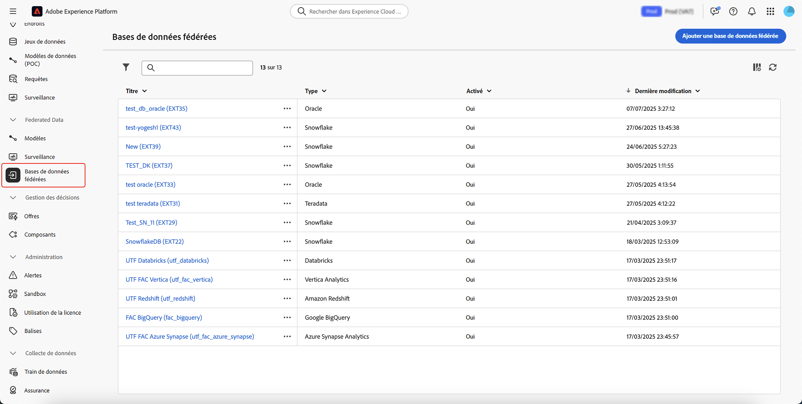

# Créer des connexions {#connections-fdb}

>[!AVAILABILITY]
>
>Pour accéder aux connexions, vous devez disposer de l’une des autorisations suivantes :
>
>-**Gestion de la base de données fédérées**
>>-**Affichage de la base de données fédérées**
>
>Pour plus d’informations sur les autorisations requises, lisez le [guide du contrôle d’accès](/help/governance-privacy-security/access-control.md).

La composition de l’audience fédérée d’Experience Platform vous permet de créer et d’enrichir des audiences à partir des entrepôts de données tiers et d’importer les audiences dans Adobe Experience Platform.

## Bases de données prises en charge {#supported-databases}

Pour utiliser votre base de données fédérée et Adobe Experience Platform, vous devez d’abord établir une connexion entre les deux sources. Avec la composition de l’audience fédérée, vous pouvez vous connecter aux bases de données suivantes.

* Amazon Redshift
* Azure Synapse Analytics
* Databricks
* Google BigQuery
* Microsoft Fabric
* Oracle
* Snowflake
* Vertica Analytics

## Créer une connexion {#create}

Pour créer une connexion, sélectionnez **[!UICONTROL Bases de données fédérées]** dans la section Données fédérées .

{zoomable="yes" width="70%" align="center"}

La section Bases de données fédérées s’affiche. Sélectionnez **[!UICONTROL Ajouter une base de données fédérée]** pour créer une connexion.

{zoomable="yes" width="70%" align="center"}

La fenêtre contextuelle des propriétés de la connexion s’affiche. Vous pouvez nommer votre connexion ainsi que sélectionner le type de base de données à créer.

{zoomable="yes" width="70%" align="center"}

Après avoir sélectionné un type, la section **[!UICONTROL Détails]** s’affiche. Cette section diffère en fonction du type de base de données précédemment choisi.

>[!BEGINTABS]

>[!TAB Amazon Redshift]

>[!AVAILABILITY]
>
>Seuls Amazon Redshift AWS, Amazon Redshift Spectrum et Amazon Redshift Serverless sont pris en charge.

Après avoir sélectionné Amazon Redshift, vous pouvez ajouter les détails suivants :

| Champ | Description |
| ----- | ----------- |
| Serveur | Nom de la source de données. |
| Compte | Nom d’utilisateur du compte. |
| Mot de passe | Mot de passe du compte. |
| Base de données | Nom de la base de données. Si ce champ est spécifié dans le nom du serveur, vous pouvez le laisser vide. |
| Schéma de travail | Nom du schéma de la base de données à utiliser pour les tables de travail. Vous trouverez plus d’informations sur cette fonctionnalité dans la documentation [Schémas Amazon](https://docs.aws.amazon.com/redshift/latest/dg/r_Schemas_and_tables.html){target="_blank"}.  **Remarque :** vous pouvez utiliser n’importe quel schéma de la base de données, y compris les schémas utilisés pour le traitement temporaire des données, à condition de disposer des autorisations requises pour vous connecter à ce schéma. Cependant, vous **devez** utiliser des schémas de travail distincts lors de la connexion de plusieurs sandbox à la même base de données. |

>[!TAB Azure Synapse Analytics]

Après avoir sélectionné Azure Synapse Analytics, vous pouvez ajouter les détails suivants :

| Champ | Description |
| ----- | ----------- |
| Serveur | URL du serveur Azure Synapse. |
| Compte | Nom d’utilisateur du compte Azure Synapse. |
| Mot de passe | Mot de passe du compte Azure Synapse. |
| Base de données | Nom de la base de données. Si ce champ est spécifié dans le nom du serveur, vous pouvez le laisser vide. |
| Options | Options supplémentaires pour la connexion. Pour Azure Synapse Analytics, vous pouvez spécifier le type d’authentification pris en charge par le connecteur. Actuellement, la composition de l’audience fédérée prend en charge `ActiveDirectoryMSI`. Pour plus d’informations sur les chaînes de connexion, consultez la section [exemple de chaîne de connexion) de la documentation Microsoft](https://learn.microsoft.com/fr-fr/sql/connect/odbc/using-azure-active-directory?view=sql-server-ver15#example-connection-strings){target="_blank"} . |

>[!TAB Briques de données]

>[!NOTE]
>
>L’accès sécurisé à votre entrepôt de données Databricks externe par le biais d’un lien privé est pris en charge. Cela inclut des connexions sécurisées aux bases de données Databricks hébergées sur Amazon Web Services (AWS) via un lien privé et aux bases de données Databricks hébergées sur Microsoft Azure via un VPN. Contactez votre représentant ou représentante Adobe pour obtenir de l’aide sur la configuration de l’accès sécurisé.

Après avoir sélectionné les briques de données, vous pouvez ajouter les détails suivants :

| Champ | Description |
| ----- | ----------- |
| Serveur | Nom du serveur Databricks. |
| Chemin HTTP | Chemin d’accès à votre cluster ou entrepôt de données. Pour plus d’informations sur le chemin d’accès, consultez la [documentation relative aux briques de données sur les détails de connexion](https://docs.databricks.com/aws/en/integrations/compute-details){target="_blank"}. |
| Mot de passe | Jeton d’accès du serveur Databricks. Pour plus d’informations sur cette valeur, consultez la documentation [Databricks) sur les jetons d’accès personnel](https://docs.databricks.com/aws/en/dev-tools/auth/pat){target="_blank"}. |
| Catalogue | Nom du catalogue de briques de données. Pour plus d’informations sur les catalogues dans les briques de données, consultez la [documentation de Databricks sur les catalogues](https://docs.databricks.com/aws/en/catalogs/){target="_blank"} |
| Schéma de travail | Nom du schéma de base de données à utiliser pour les tables de travail.   **Remarque :** vous pouvez utiliser n’importe quel schéma de la base de données **n’importe quel**, y compris les schémas utilisés pour le traitement temporaire des données, à condition de disposer des autorisations requises pour vous connecter à ce schéma. Cependant, vous **devez** utiliser des schémas de travail distincts lors de la connexion de plusieurs sandbox à la même base de données. |
| Options | Options supplémentaires pour la connexion. Les options disponibles sont répertoriées dans le tableau suivant. |

Pour les briques de données, vous pouvez définir les options supplémentaires suivantes :

| Options | Description |
| ------- | ----------- |
| NomFuseauHoraire | Nom du fuseau horaire à utiliser. Cette valeur représente le paramètre de session `TIMEZONE`. Pour plus d’informations sur les fuseaux horaires, veuillez lire la [Documentation Databricks sur les fuseaux horaires](https://docs.databricks.com/aws/en/sql/language-manual/parameters/timezone#:~:text=The%20system%20default%20is%20UTC%20.){target="_blank"}. |

>[!TAB Google BigQuery]

Après avoir sélectionné Google BigQuery, vous pouvez ajouter les détails suivants :

| Champ | Description |
| ----- | ----------- |
| Compte de service | Adresse e-mail de votre compte de service. Pour plus d’informations, consultez la documentation du compte de service cloud Google {target="_blank"}. |
| Projet | Identifiant de votre projet. Pour plus d’informations, veuillez lire la documentation du projet Google Cloud {target="_blank"}. |
| Jeu de données | Nom du jeu de données. Pour plus d’informations, veuillez lire la documentation du jeu de données cloud Google {target="_blank"}. |
| Chemin d&#39;accès au fichier de clé | Fichier de clé sur le serveur. Seuls les fichiers `json` sont pris en charge. |
| Options | Options supplémentaires pour la connexion. Les options disponibles sont répertoriées dans le tableau suivant. |

Pour Google BigQuery, vous pouvez définir les options supplémentaires suivantes :

| Options | Description |
| ------- | ----------- |
| ProxyType | Type de proxy utilisé pour la connexion à BigQuery. Les valeurs prises en charge sont `HTTP`, `http_no_tunnel`, `socks4` et `socks5`. |
| ProxyHost | Nom d’hôte ou adresse IP où le proxy peut être atteint. |
| ProxyUid | Numéro de port sur lequel le proxy s’exécute. |
| ProxyPwd | Mot de passe du proxy. |
| bgpath | **Remarque :** cela s’applique uniquement à l’outil **bulk-load** (Cloud SDK).    Chemin d’accès au répertoire bin de Cloud SDK sur le serveur. Vous ne devez le définir que si vous avez déplacé le répertoire `google-cloud-sdk` vers un autre emplacement ou si vous souhaitez éviter d’utiliser la variable PATH. |
| GCloudConfigName | **Remarque :** cela s’applique uniquement à l’outil **bulk-load** (Cloud SDK) ci-dessus (version 7.3.4).    Nom de la configuration qui stocke les paramètres pour charger les données. Par défaut, cette valeur est `accfda`. |
| GCloudDefaultConfigName | **Remarque :** cela s’applique uniquement à l’outil **bulk-load** (Cloud SDK) ci-dessus dans la version 7.3.4.    Nom de la configuration temporaire pour recréer la configuration principale pour le chargement des données. Par défaut, cette valeur est `default`. |
| GCloudRecreateConfig | **Remarque :** s’applique uniquement à l’outil **bulk-load** (Cloud SDK) ci-dessus (version 7.3.4).    Valeur booléenne qui vous permet de décider si le mécanisme de chargement en masse doit recréer, supprimer ou modifier automatiquement les configurations de Google Cloud SDK. Si cette valeur est définie sur `false`, le mécanisme de chargement en masse charge les données à l’aide d’une configuration existante sur la machine. Si cette valeur est définie sur `true`, assurez-vous que votre configuration est correctement configurée. Dans le cas contraire, l’erreur `No active configuration found. Please either create it manually or remove the GCloudRecreateConfig option` s’affiche et le mécanisme de chargement revient au mécanisme de chargement par défaut. |

>[!TAB Fabric Microsoft]

Après avoir sélectionné Microsoft Fabric, vous pouvez ajouter les détails suivants :

| Champ | Description |
| ----- | ----------- |
| Serveur | URL du serveur Microsoft Fabric. |
| ID de l’application | ID de l’application pour Microsoft Fabric. Pour plus d’informations sur l’ID d’application, veuillez lire la documentation de la structure Microsoft [sur la configuration de l’application](https://learn.microsoft.com/en-us/fabric/workload-development-kit/create-entra-id-app){target="_blank"}. |
| Secret client | Secret client pour l’application. Pour plus d’informations sur le secret client, consultez la documentation de la structure Microsoft [sur la configuration de l’application](https://learn.microsoft.com/en-us/fabric/workload-development-kit/create-entra-id-app#step-8-generate-a-secret-for-your-application){target="_blank"}. |
| Options | Options supplémentaires pour la connexion. Les options disponibles sont répertoriées dans le tableau suivant. |

Pour Microsoft Fabric, vous pouvez définir les options supplémentaires suivantes :

| Option | Description |
| ------ | ----------- |
| Authentification | Type d’authentification utilisé par le connecteur. Les valeurs prises en charge comprennent : `ActiveDirectoryMSI`. Pour plus d&#39;informations, veuillez lire la documentation de [Microsoft sur la connectivité de l&#39;entrepôt de données](https://learn.microsoft.com/en-us/fabric/data-warehouse/connectivity){target="_blank"}. |

>[!TAB Oracle]

>[!IMPORTANT]
>
>Actuellement, le connecteur de base de données Oracle peut **uniquement** être utilisé pour les cas d’utilisation de création et d’enrichissement d’audiences.
>
>De plus, avant de configurer votre base de données Oracle, contactez votre représentant de l’assistance clientèle Adobe.

Après avoir sélectionné Oracle, vous pouvez ajouter les détails suivants :

| Champ | Description |
| ----- | ----------- |
| Serveur | URL du serveur Oracle. |
| Compte | Nom d’utilisateur du compte. |
| Mot de passe | Mot de passe du compte. |

>[!TAB Snowflake]

>[!NOTE]
>
>L’accès sécurisé à votre entrepôt de données Snowflake externe par le biais d’un lien privé est pris en charge. Notez que votre compte Snowflake doit être hébergé sur Amazon Web Services (AWS) ou Azure et être situé dans la même région que votre environnement de composition d’audiences fédérées. Veuillez contacter votre représentant ou représentante Adobe pour obtenir de l’aide sur la configuration de l’accès sécurisé à votre compte Snowflake.

Après avoir sélectionné Snowflake, vous pouvez ajouter les détails suivants :

| Champ | Description |
| ----- | ----------- |
| Serveur | Nom du serveur. |
| Utilisateur | Nom d’utilisateur du compte. |
| Mot de passe | Mot de passe du compte. |
| Base de données | Nom de la base de données. Si ce champ est spécifié dans le nom du serveur, vous pouvez le laisser vide. |
| Schéma de travail | Nom du schéma de base de données à utiliser pour les tables de travail.   **Remarque :** vous pouvez utiliser n’importe quel schéma de la base de données **n’importe quel**, y compris les schémas utilisés pour le traitement temporaire des données, à condition de disposer des autorisations requises pour vous connecter à ce schéma. Cependant, vous **devez** utiliser des schémas de travail distincts lors de la connexion de plusieurs sandbox à la même base de données. |
| Clé privée | Clé privée de la connexion à la base de données. Vous pouvez charger un fichier `.pem` à partir de votre système local. |
| Options | Options supplémentaires pour la connexion. Les options disponibles sont répertoriées dans le tableau suivant. |

Pour Snowflake, vous pouvez définir les options supplémentaires suivantes :

| Options | Description |
| ------- | ----------- |
| workschema | Nom du schéma de base de données à utiliser pour les tables de travail. |
| NomFuseauHoraire | Nom du fuseau horaire à utiliser. Cette valeur représente le paramètre de session `TIMEZONE`. Par défaut, le fuseau horaire système est utilisé. Pour plus d’informations sur les fuseaux horaires, veuillez lire la documentation de [Snowflake sur les fuseaux horaires](https://docs.snowflake.com/en/sql-reference/parameters#timezone){target="_blank"}. |
| WeekStart | Le jour où vous voulez que la semaine commence. Cette valeur représente le paramètre de session `WEEK_START`. Pour plus d’informations sur le début de la semaine, consultez la documentation de [Snowflake sur le paramètre de début de semaine](https://docs.snowflake.com/en/sql-reference/parameters#week-start){target="_blank"} |
| UseCachedResult | Valeur booléenne qui détermine si les résultats mis en cache du Snowflake seront utilisés. Cette valeur représente le paramètre de session `USE_CACHED_RESULTS`. Par défaut, cette valeur est définie sur « true ». Pour plus d’informations sur ce paramètre, consultez la documentation de [Snowflake sur les résultats persistants](https://docs.snowflake.com/en/user-guide/querying-persisted-results){target="_blank"}. |
| bulkThreads | Nombre de threads à utiliser pour le chargeur en masse de Snowflake. Plus il y a de threads ajoutés, meilleures seront les performances pour les chargements en masse plus volumineux. Par défaut, cette valeur est définie sur 1. |
| chunkSize | Taille de fichier du bloc de chaque chargeur en masse. Lorsqu’il est utilisé avec d’autres threads, vous pouvez améliorer les performances de vos chargements en masse. Par défaut, cette valeur est définie sur 128 Mo. Pour plus d’informations sur la taille des blocs, consultez la documentation de [Snowflake sur la préparation des fichiers de données](https://docs.snowflake.com/en/user-guide/data-load-considerations-prepare){target="_blank"}. |
| StageName | Nom d’un environnement d’évaluation interne préconfiguré. Vous pouvez l’utiliser dans des chargements en bloc au lieu de créer une étape temporaire. |

>[!TAB Vertica Analytics]

Après avoir sélectionné Vertica Analytics, vous pouvez ajouter les détails suivants :

| Champ | Description |
| ----- | ----------- |
| Serveur | URL du serveur Vertica Analytics. |
| Compte | Nom d’utilisateur du compte. |
| Mot de passe | Mot de passe du compte. |
| Base de données | Nom de la base de données. Si ce champ est spécifié dans le nom du serveur, vous pouvez le laisser vide. |
| Schéma de travail | Nom du schéma de base de données à utiliser pour les tables de travail.   **Remarque :** vous pouvez utiliser n’importe quel schéma de la base de données **n’importe quel**, y compris les schémas utilisés pour le traitement temporaire des données, à condition de disposer des autorisations requises pour vous connecter à ce schéma. Cependant, vous **devez** utiliser des schémas de travail distincts lors de la connexion de plusieurs sandbox à la même base de données. |
| Options | Options supplémentaires pour la connexion. Les options disponibles sont répertoriées dans le tableau suivant. |

Pour Vertica Analytics, vous pouvez définir les options supplémentaires suivantes :

| Options | Description |
| ------- | ----------- |
| NomFuseauHoraire | Nom du fuseau horaire à utiliser. Cette valeur représente le paramètre de session `TIMEZONE`. Pour plus d’informations sur les fuseaux horaires, consultez la documentation de Vertica Analytics sur les fuseaux horaires {target="_blank"} |

>[!ENDTABS]

Après avoir ajouté les détails de la connexion, notez les paramètres supplémentaires suivants :

>[!NOTE]
>
>Pour utiliser la composition de l’audience fédérée pour une base de données donnée, vous devez mettre en liste autorisée **toutes** les adresses IP associées à cette base de données.

| Paramètres | Détails |
| -------- | ------- |
| Activer la connexion | Bouton bascule booléen qui détermine si la connexion sera automatiquement activée. |
| Adresses IP du serveur | Une fenêtre contextuelle qui affiche les adresses IP à placer sur la liste autorisée pour se connecter à la base de données. |
| Tester la connexion | Permet de vérifier les détails de votre configuration. |

Vous pouvez maintenant sélectionner **[!UICONTROL Déployer les fonctions]**, puis **[!UICONTROL Ajouter]** pour finaliser la connexion entre la base de données fédérée et Experience Platform.

