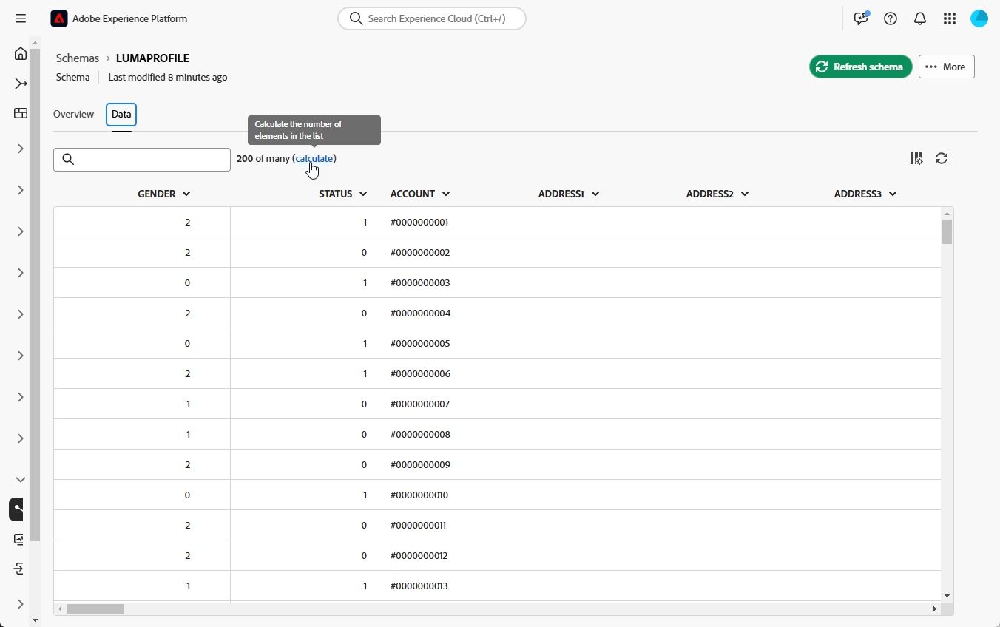
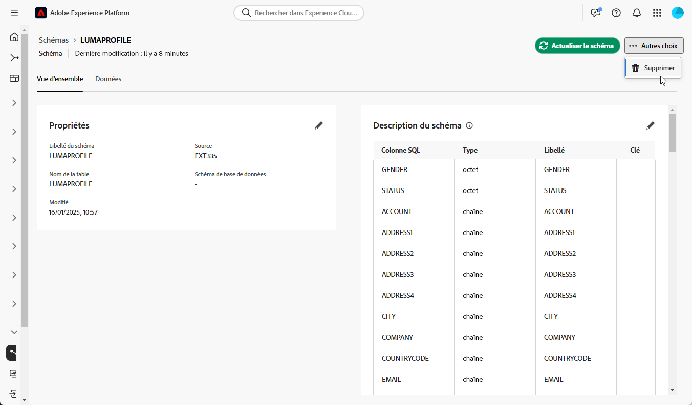

# Commencer avec les schémas {#schemas}

>[!CONTEXTUALHELP]
>id="dc_schema_create_select_tables"
>title="Sélectionner des tableaux"
>abstract="Sélectionnez les tableaux à ajouter au modèle de données."

>[!CONTEXTUALHELP]
>id="dc_schema_create_key"
>title="Clé"
>abstract="Sélectionnez une clé pour la réconciliation des données."

>[!CONTEXTUALHELP]
>id="dc_schema_create_schema_name"
>title="Nom du schéma"
>abstract="Saisissez le nom du schéma."

>[!CONTEXTUALHELP]
>id="dc_schema_edit_description"
>title="Description du schéma"
>abstract="La description du schéma répertorie les colonnes, les types et les libellés. Vous pouvez également vérifier la clé de réconciliation du schéma. Pour mettre à jour la définition du schéma, cliquez sur l’icône représentant un crayon."

>[!CONTEXTUALHELP]
>id="dc_schema_filter_sources"
>title="Sélectionner la base de données source à filtrer"
>abstract="Vous pouvez filtrer les schémas en fonction de leur source. Sélectionnez une ou plusieurs bases de données fédérées pour afficher leurs schémas."

## Qu’est-ce qu’un schéma ? {#schema-start}

Un schéma est une représentation d’un tableau de votre base de données. Il s’agit d’un objet de l’application qui définit la manière dont les données sont liées aux tableaux de base de données.

En créant un schéma, vous pouvez définir une représentation de votre tableau dans la composition d’audiences fédérées Experience Platform :

* Donnez-lui un nom et une description simples à retenir pour simplifier la compréhension.
* Déterminez la visibilité de chaque champ en fonction de son utilisation réelle.
* Sélectionnez sa clé primaire afin de lier les schémas entre eux selon les besoins dans le [modèle de données](../data-management/gs-models.md#data-model-start).

>[!CAUTION]
>
>Lors de la connexion de plusieurs sandbox à une même base de données, vous devez utiliser des schémas de travail distincts.
>

## Créer un schéma {#schema-create}

Pour créer des schémas dans la composition d’audiences fédérées, procédez comme suit :

1. Dans la section **[!UICONTROL DONNÉES FÉDÉRÉES]**, accédez au lien **[!UICONTROL Modèles]**. Accédez à l’onglet **[!UICONTROL Schéma]** et cliquez sur le bouton **[!UICONTROL Créer un schéma]**.

   {zoomable="yes"}

   Cette étape permet d’accéder à un nouvel écran avec une liste déroulante où se trouvent les bases de données connectées à votre environnement. En savoir plus sur la connexion de bases de données dans [cette section](../connections/connections.md#connections-fdb).

1. Sélectionnez votre base de données source dans la liste et cliquez sur l’onglet **[!UICONTROL Ajouter des tableaux]**.

   {zoomable="yes"}

   Vous aurez accès à la liste de tous les tableaux de la base de données.

1. En ajoutant les tableaux, pour lesquels vous souhaitez créer le schéma, vous avez accès à leurs champs comme ci-dessous :

   {zoomable="yes"}

   Pour chaque tableau, vous pouvez effectuer les actions suivantes :

   * Modifier le libellé du schéma
   * Ajouter une description
   * Renommer tous les champs et décider de leur visibilité
   * Sélectionner la clé primaire du schéma

   Par exemple, pour le tableau suivant importé :

   {zoomable="yes"}

   Le schéma peut être défini comme suit :

   {zoomable="yes"}

## Modifier un schéma {#schema-edit}

Pour modifier un schéma, procédez comme suit :

1. Cliquez sur le nom de votre schéma dans le dossier Schémas.

1. Cliquez sur le bouton **[!UICONTROL Modifier]**.

   {zoomable="yes"}

   Vous pouvez accéder aux mêmes options que lors de la [création d’un schéma](#schema-create).

   {zoomable="yes"}

## Prévisualiser les données dans un schéma {#schema-preview}

Pour prévisualiser les données du tableau représenté par votre schéma, accédez à l’onglet **[!UICONTROL Données]** comme ci-dessous.

Cliquez sur le lien **[!UICONTROL Calculer]** pour prévisualiser le nombre total d’enregistrements.

{zoomable="yes"}

Cliquez sur le bouton **[!UICONTROL Configurer les colonnes]** pour modifier l’affichage des données.

{zoomable="yes"}

## Supprimer un schéma {#schema-delete}

Pour supprimer un schéma, cliquez sur le bouton **[!UICONTROL Plus]**, puis sur **[!UICONTROL Supprimer]**.

{zoomable="yes"}
