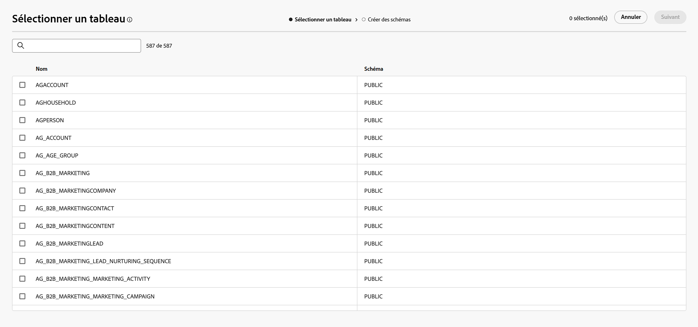
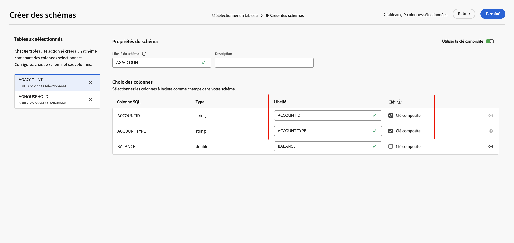
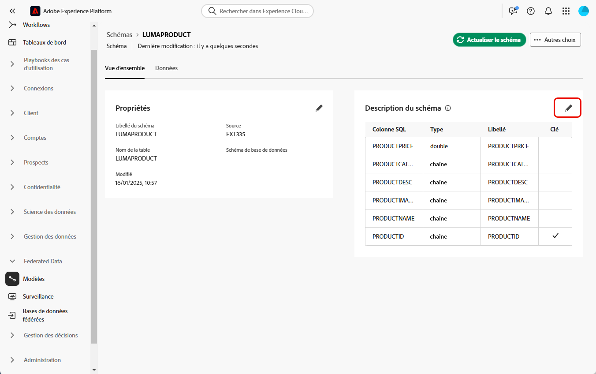
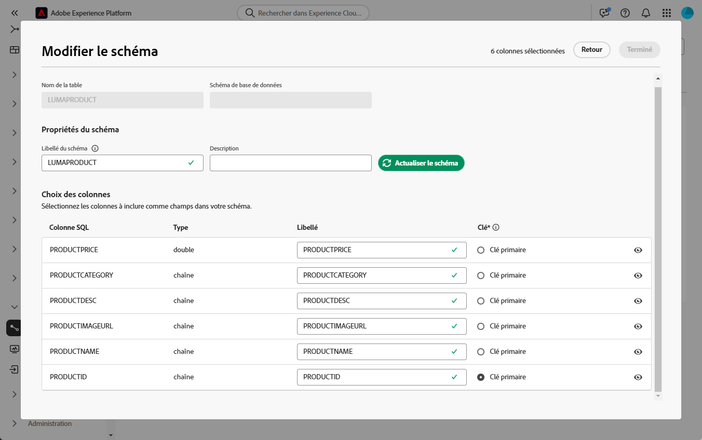

# Commencer avec les schémas {#schemas}

>[!AVAILABILITY]
>
>Pour accéder aux schémas, vous devez disposer de l’une des autorisations suivantes :
>
>-**Gestion du schéma fédéré**
>&#x200B;>-**Affichage du schéma fédéré**
>
>Pour plus d’informations sur les autorisations requises, lisez le [guide du contrôle d’accès](/help/governance-privacy-security/access-control.md).

>[!CONTEXTUALHELP]
>id="dc_schema_create_select_tables"
>title="Sélectionner des tableaux"
>abstract="Sélectionnez les tableaux à ajouter au modèle de données."

>[!CONTEXTUALHELP]
>id="dc_schema_create_key"
>title="Clé"
>abstract="Sélectionnez une clé pour la réconciliation des données."

>[!CONTEXTUALHELP]
>id="dc_schema_create_schema_name"
>title="Nom du schéma"
>abstract="Saisissez le nom du schéma."

>[!CONTEXTUALHELP]
>id="dc_schema_edit_description"
>title="Description du schéma"
>abstract="La description du schéma répertorie les colonnes, les types et les libellés. Vous pouvez également vérifier la clé de réconciliation du schéma. Pour mettre à jour la définition du schéma, cliquez sur l’icône représentant un crayon."

>[!CONTEXTUALHELP]
>id="dc_schema_filter_sources"
>title="Sélectionner la base de données source à filtrer"
>abstract="Vous pouvez filtrer les schémas en fonction de leur source. Sélectionnez une ou plusieurs bases de données fédérées pour afficher leurs schémas."

## Qu’est-ce qu’un schéma ? {#schema-start}

Un schéma est une représentation d’un tableau de votre base de données. Il s’agit d’un objet de l’application qui définit la manière dont les données sont liées aux tableaux de base de données.

En créant un schéma, vous pouvez définir une représentation de votre tableau dans la composition d’audiences fédérées Experience Platform :

* Donnez-lui un nom et une description simples à retenir pour simplifier la compréhension.
* Déterminez la visibilité de chaque champ en fonction de son utilisation réelle.
* Sélectionnez sa clé primaire afin de lier les schémas entre eux selon les besoins dans le [modèle de données](../data-management/gs-models.md#data-model-start).

>[!CAUTION]
>
>Lors de la connexion de plusieurs sandbox à une même base de données, vous devez utiliser des schémas de travail distincts.

## Créer un schéma {#schema-create}

Pour créer un schéma dans la composition d’audiences fédérées, sélectionnez **[!UICONTROL Modèles]** dans la section **[!UICONTROL Données fédérées]**. Dans l’onglet **[!UICONTROL Schéma]**, sélectionnez **[!UICONTROL Créer un schéma]**.

{zoomable="yes"}

La fenêtre contextuelle **[!UICONTROL Sélectionner la base de données fédérée]** s’affiche. Sur cette fenêtre contextuelle, vous pouvez sélectionner la [base de données source](/help/connections/home.md), suivie de **[!UICONTROL Suivant]**.

{zoomable="yes"}

La fenêtre contextuelle **Sélectionner un tableau** s’affiche. Dans cette fenêtre contextuelle, vous pouvez sélectionner les tables à utiliser pour créer le schéma.

{zoomable="yes"}

Chaque tableau sélectionné génère un schéma avec les colonnes choisies. Pour chaque table, vous pouvez modifier le libellé du schéma, ajouter une description, renommer le libellé du champ, définir la visibilité du libellé du champ et sélectionner la clé primaire du schéma.

{zoomable="yes"}

>[!NOTE]
>
>Si vous activez **[!UICONTROL Utiliser la clé composite]** mais sélectionnez une seule clé à utiliser, la clé sera traitée comme une clé primaire de schéma standard.

De plus, vous pouvez créer une clé composée de plusieurs colonnes de schéma. Activez **[!UICONTROL Utiliser la clé composite]** et marquez les clés à utiliser comme votre clé composite.

Une fois la configuration terminée, sélectionnez **[!UICONTROL Terminé]** pour terminer la création du schéma.

## Modifier un schéma {#schema-edit}

Pour modifier un schéma, sélectionnez le schéma précédemment créé sur la page **Schémas**.

La page des détails du schéma s’affiche. Sélectionnez l’icône  pour modifier le schéma.

{zoomable="yes"}

Dans la fenêtre **[!UICONTROL Modifier le schéma]**, vous pouvez accéder aux mêmes options que lors de la [création d’un schéma](#schema-create) et les configurer.

{zoomable="yes"}

## Prévisualiser les données dans un schéma {#schema-preview}

Pour prévisualiser les données du tableau représenté par votre schéma, accédez à l’onglet **[!UICONTROL Données]** comme ci-dessous.

Sélectionnez le lien **[!UICONTROL Calculer]** pour prévisualiser le nombre total d’enregistrements.

{zoomable="yes"}

Sélectionnez le bouton **[!UICONTROL Configurer les colonnes]** pour modifier l’affichage des données.

{zoomable="yes"}

## Actualiser un schéma {#schema-refresh}

Les tableaux d’une base de données fédérée peuvent être mis à jour, ajoutés ou supprimés. Dans de tels cas, vous devez actualiser le schéma dans Adobe Experience Platform pour vous aligner sur les dernières modifications. Pour ce faire, sélectionnez l’icône  en regard du nom du schéma suivi de **[!UICONTROL Actualiser le schéma]**.

Vous pouvez également mettre à jour la définition de schéma lors de sa modification.

{zoomable="yes"}

## Supprimer un schéma {#schema-delete}

Pour supprimer un schéma, sélectionnez l’icône , puis **[!UICONTROL Supprimer]**.

{zoomable="yes"}
