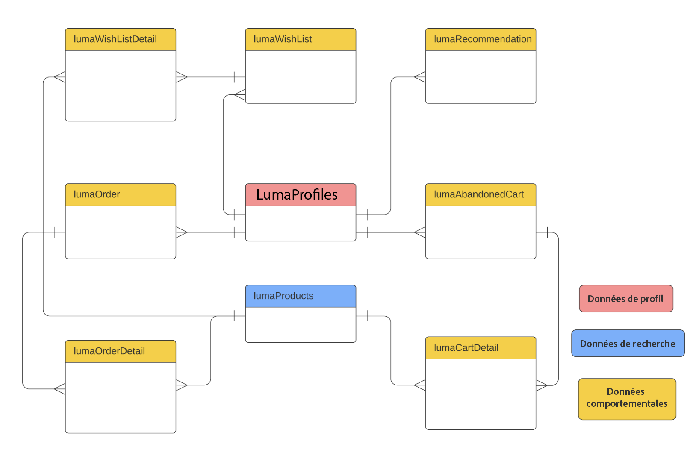
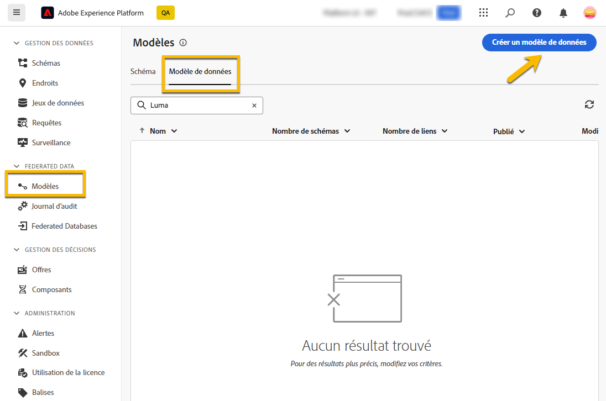
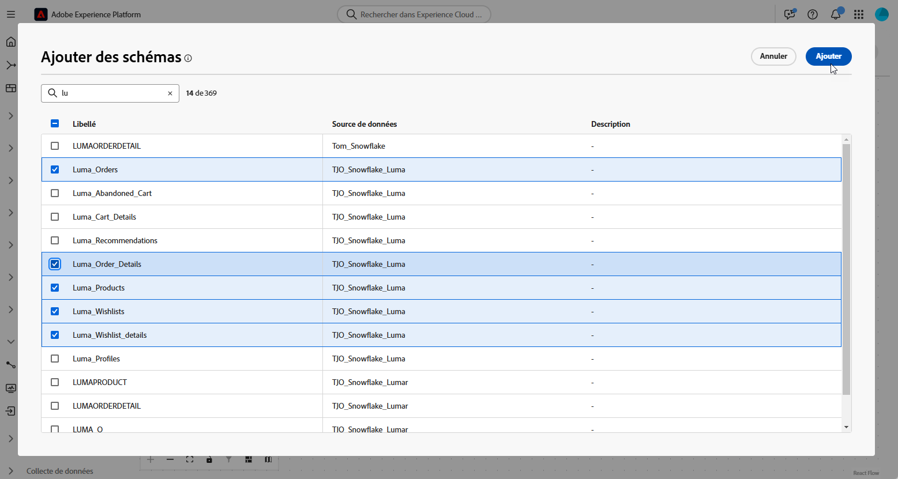
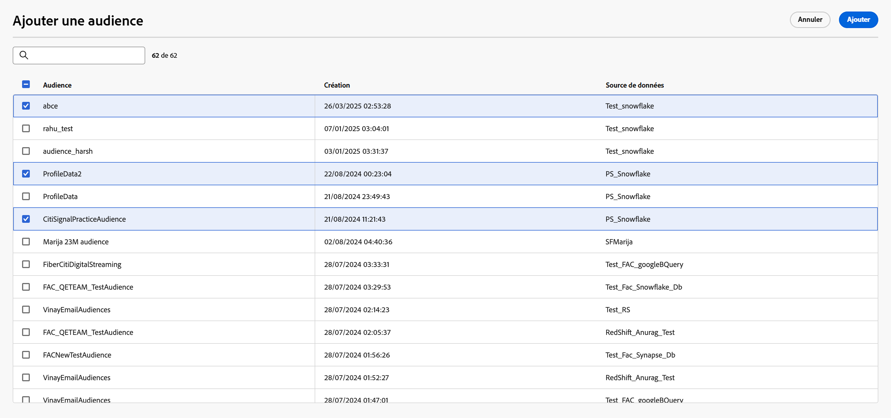
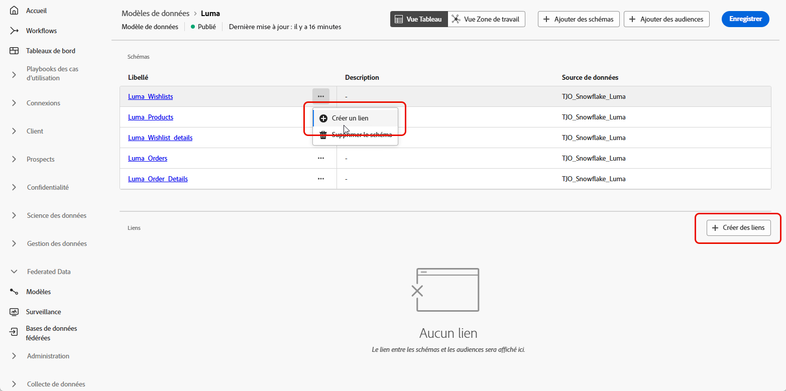
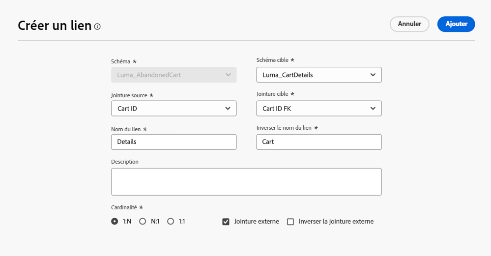
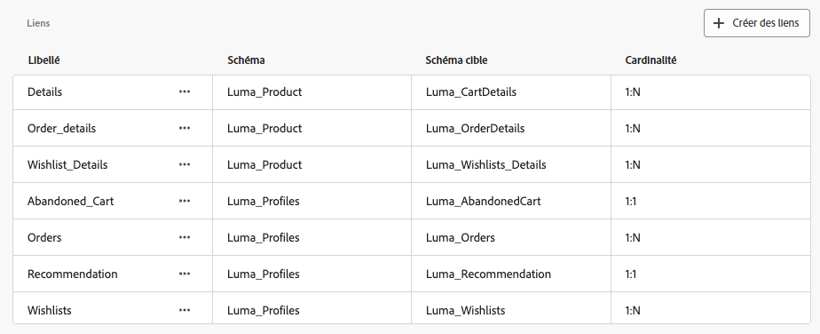
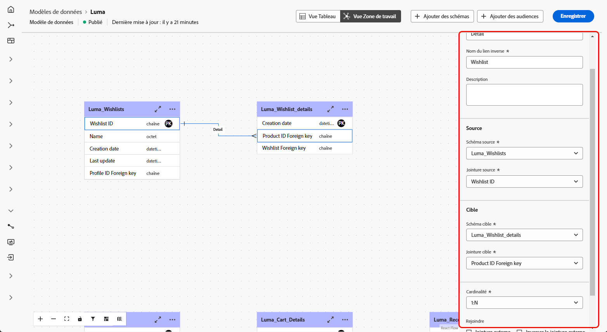
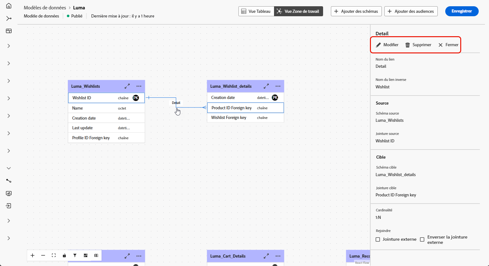

# Commencer avec les modèles de données {#data-model-beta}

>[!AVAILABILITY]
>
>Pour accéder aux modèles de données, vous devez disposer de l’une des autorisations suivantes :
>
>-**Gestion du modèle de données fédérées**
>>-**Affichage du modèle de données fédérées**
>
>Pour plus d’informations sur les autorisations requises, veuillez lire le [guide du contrôle d’accès](/help/governance-privacy-security/access-control.md).

## Qu’est-ce qu’un modèle de données ? {#data-model-start}

Un modèle de données désigne un ensemble de schémas et d’audiences, ainsi que les liens qui existent entre eux. Il est utilisé pour fédérer les audiences avec des données de base de données.

Dans la composition d’audiences fédérées, vous pouvez créer et gérer des modèles de données directement dans la vue Zone de travail. Cela inclut l’ajout de schémas et d’audiences, ainsi que la définition des liens entre eux en fonction de votre cas d’utilisation.

En savoir plus sur les [schémas](../customer/schemas.md#schema-start) et les [audiences](../start/audiences.md).

Voici un exemple de représentation d’un modèle de données : les tables avec leur nom et les liens qui les relient.

{zoomable="yes"}

## Créer un modèle de données {#data-model-create}

Pour créer un modèle de données, procédez comme suit :

1. Dans la section **[!UICONTROL Federated Data]**, accédez au menu **[!UICONTROL Modèles]**, puis à l’onglet **[!UICONTROL Modèle de données]**.

   Cliquez sur le bouton **[!UICONTROL Créer un modèle de données]**.

   {zoomable="yes"}

1. Définissez le nom de votre modèle de données, puis cliquez sur le bouton **[!UICONTROL Créer]**.

1. Dans le tableau de bord de votre modèle de données, cliquez sur **[!UICONTROL Ajouter des schémas]** pour choisir le schéma associé à votre modèle de données.

   {zoomable="yes"}

1. De plus, vous pouvez ajouter des audiences à votre modèle de données. Sélectionnez **[!UICONTROL Ajouter des audiences]** pour définir vos groupes cibles.

   {zoomable="yes"}

1. Établissez des connexions entre les tableaux de votre modèle de données pour garantir des relations de données précises. [En savoir plus](#data-model-links)

1. Une fois la configuration terminée, cliquez sur **[!UICONTROL Enregistrer]** pour appliquer les modifications.

## Créer des liens {#data-model-links}

>[!BEGINTABS]

>[!TAB Vue Tableau]

Pour créer des liens entre les tableaux de votre modèle de données à partir de l’onglet Vue Tableau, procédez comme suit :

1. Cliquez sur le menu **[!UICONTROL Créer un lien]** de l’une des tables ou sur le bouton **[!UICONTROL Créer des liens]**, puis sélectionnez les 2 tableaux suivants :

   {zoomable="yes"}

1. Renseignez le formulaire donné pour définir le lien.

   {zoomable="yes"}

   **Cardinalité**

   * **1-N** : à une occurrence du tableau source peuvent correspondre plusieurs occurrences du tableau cible, mais à une occurrence du tableau cible peut correspondre au plus une occurrence du tableau source.

   * **N-1** : à une occurrence du tableau cible peuvent correspondre plusieurs occurrences du tableau source, mais à une occurrence du tableau source peut correspondre au plus une occurrence du tableau cible.

   * **1-1** : à une occurrence du tableau source peut correspondre au plus une occurrence du tableau cible.

Tous les liens définis pour votre modèle de données seront répertoriés comme ci-dessous :

{zoomable="yes"}

>[!TAB Vue Zone de travail]

Pour créer des liens entre les tableaux de votre modèle de données à partir de l’onglet Vue Zone de travail, procédez comme suit :

1. Accédez à la vue Zone de travail de votre modèle de données et sélectionnez les deux tableaux à lier.

1. Cliquez sur le bouton  en regard de la jointure Source, puis faites glisser la flèche vers la jointure cible pour établir la connexion.

   {zoomable="yes"}

1. Remplissez le formulaire donné pour définir le lien et cliquez sur **[!UICONTROL Appliquer]** une fois configuré.

   {zoomable="yes"}

   **Cardinalité**

   * **1-N** : à une occurrence du tableau source peuvent correspondre plusieurs occurrences du tableau cible, mais à une occurrence du tableau cible peut correspondre au plus une occurrence du tableau source.

   * **N-1** : à une occurrence du tableau cible peuvent correspondre plusieurs occurrences du tableau source, mais à une occurrence du tableau source peut correspondre au plus une occurrence du tableau cible.

   * **1-1** : à une occurrence du tableau source peut correspondre au plus une occurrence du tableau cible.

1. Tous les liens définis dans votre modèle de données sont représentés par des flèches dans la vue Zone de travail. Cliquez sur une flèche entre deux tableaux pour afficher les détails, apporter des modifications ou supprimer le lien selon les besoins.

   {zoomable="yes"}

1. Utilisez la barre d’outils pour personnaliser et ajuster la zone de travail.

   

   * **[!UICONTROL Zoom avant]** : agrandissez la zone de travail pour afficher plus clairement les détails de votre modèle de données.
   * **[!UICONTROL Zoom arrière]** : réduisez la taille de la zone de travail pour obtenir une vue plus large de votre modèle de données.
   * **[!UICONTROL Ajuster la vue]** : ajustez le zoom pour qu’il s’adapte à l’ensemble des schémas et/ou audiences dans la zone visible.
   * **[!UICONTROL Activer/désactiver l’interactivité]** : activez ou désactivez l’interaction de la personne avec la zone de travail.
   * **[!UICONTROL Filtre]** : choisissez le schéma à afficher dans la zone de travail.
   * **[!UICONTROL Forcer la disposition automatique]** : organisez automatiquement les schémas et/ou les audiences pour une meilleure organisation.

>[!ENDTABS]

## Vidéo pratique {#data-model-video}

Découvrez comment créer un modèle de données dans cette vidéo :

>[!VIDEO](https://video.tv.adobe.com/v/3432020)
