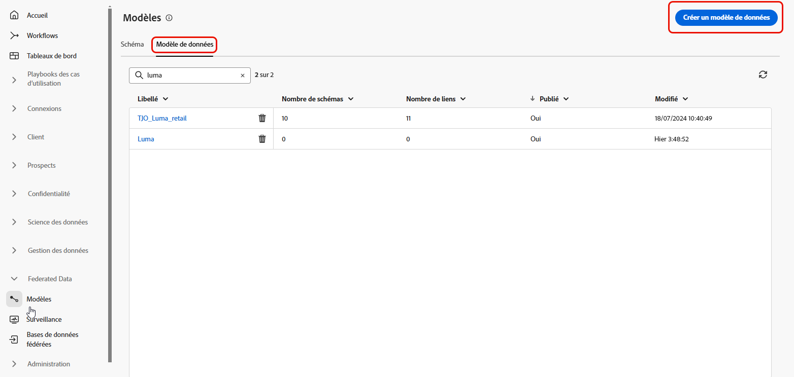

# Commencer avec les modèles de données {#data-model}

>[!CONTEXTUALHELP]
>id="dc_model_menu"
>title="Utiliser des modèles"
>abstract="Les schémas et les modèles de données sont répertoriés dans cet écran. Vous pouvez créer des schémas et des modèles de données à partir du bouton **Créer**."

>[!CONTEXTUALHELP]
>id="dc_datamodel_add_schema"
>title="Sélectionner des schémas"
>abstract="Sélectionnez les schémas du modèle de données."

>[!CONTEXTUALHELP]
>id="dc_datamodel_add_audience"
>title="Sélectionner une audience"
>abstract="Sélectionnez l’audience du modèle de données."

>[!CONTEXTUALHELP]
>id="dc_datamodel_properties"
>title="Propriétés du modèle de données"
>abstract="Saisissez le libellé du modèle de données."

## Qu’est-ce qu’un modèle de données ? {#data-model-start}

Un modèle de données est un ensemble de schémas, d’audiences et de liens entre eux.

En savoir plus sur les [schémas](../customer/schemas.md#schema-start).

En savoir plus sur [audiences](../start/audiences.md).

## Création d’un modèle de données {#data-model-create}

Dans la section **[!UICONTROL FEDERATED DATA]** , accédez au lien **[!UICONTROL Modèles]** . Vous y trouverez l’onglet **[!UICONTROL Modèle de données]** .

{zoomable="yes"}

En cliquant sur le bouton **[!UICONTROL Créer un modèle de données]** , vous aurez la possibilité de nommer votre modèle de données et de cliquer sur le bouton **[!UICONTROL Créer]** .

{zoomable="yes"}

Vous accédez à la fenêtre dans laquelle vous pouvez ajouter les schémas, les audiences et les liens de votre modèle de données.

{zoomable="yes"}

{zoomable="yes"}

### Créer des liens {#data-model-links}

La création de liens entre les tables de votre modèle de données peut se faire de 2 façons :

- Cliquez directement sur le menu **[!UICONTROL Créer un lien]** de l’une des tables
- Cliquez sur le bouton **[!UICONTROL Créer des liens]** et sélectionnez les 2 tables

{zoomable="yes"}

Renseignez le formulaire donné pour définir le lien :

{zoomable="yes"}

Tous les liens définis pour votre modèle de données seront répertoriés comme ci-dessous :

{zoomable="yes"}

## Création d’un modèle de données en vidéo {#data-model-video}

>[!VIDEO](https://video.tv.adobe.com/v/3432020)
