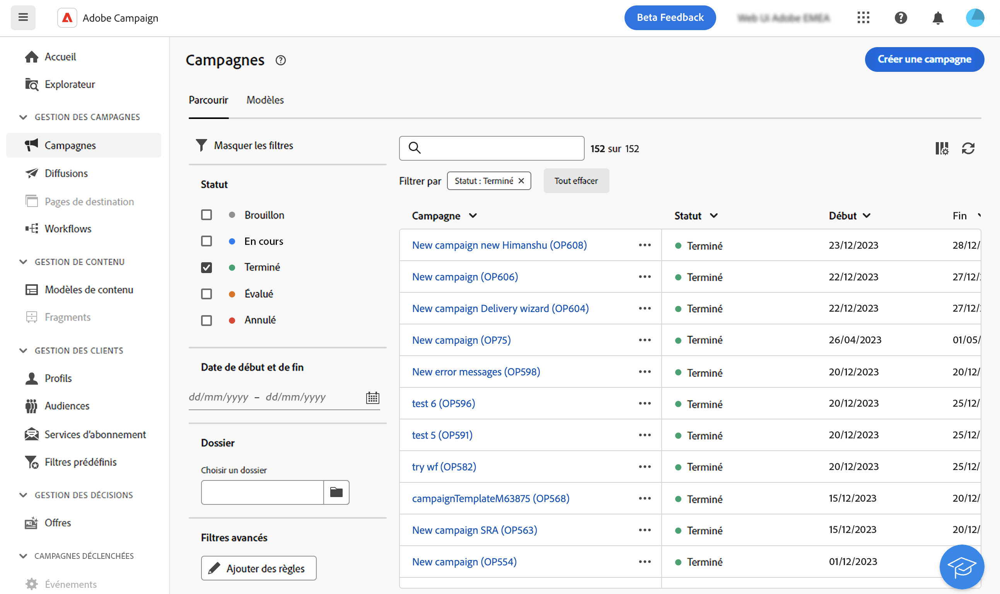

# Filtrer les listes {#filter-lists}

Vous pouvez filtrer la liste des objets, ce qui vous permet de filtrer les informations selon des critères contextuels spécifiques.

## Appliquer des filtres {#apply}

Pour appliquer des filtres à une liste, cliquez sur le bouton **[!UICONTROL Afficher les filtres]** situé dans le coin supérieur gauche de la liste, en regard de la barre de recherche.

Le volet Filtres s’ouvre, affichant les filtres disponibles pour la liste sélectionnée.

{zoomable="yes"}{width="70%" align="left" zoomable="yes"}

Pour filtrer une liste selon vos propres critères, créez un filtre personnalisé. Pour ce faire, accédez au bas du volet des filtres et cliquez sur le bouton **Ajouter des règles**. [Découvrez comment créer des filtres personnalisés](#custom)

Une fois appliqués à une liste, les filtres sont visibles dans la barre de recherche. Vous pouvez supprimer un filtre individuel à tout moment ou supprimer tous les filtres en cliquant sur le bouton **Tout effacer**.

## Créer des filtres personnalisés {#custom}

Les filtres personnalisés vous permettent d’affiner les listes en fonction de vos propres critères. Ils sont conçus à l’aide du créateur de modèles de requête. Pour créer un filtre personnalisé, procédez comme suit :

1. Ouvrez le volet des filtres et cliquez sur le bouton **Ajouter des règles** situé au bas du volet.

1. Le concepteur de requête s’ouvre. Définissez et combinez vos critères de filtre en fonction de vos besoins. Des informations détaillées sur l’utilisation du concepteur de requête sont disponibles dans [cette section](../query/query-modeler-overview.md).

1. Une fois votre filtre personnalisé configuré, cliquez sur **[!UICONTROL Confirmer]** pour l’appliquer à la liste.
