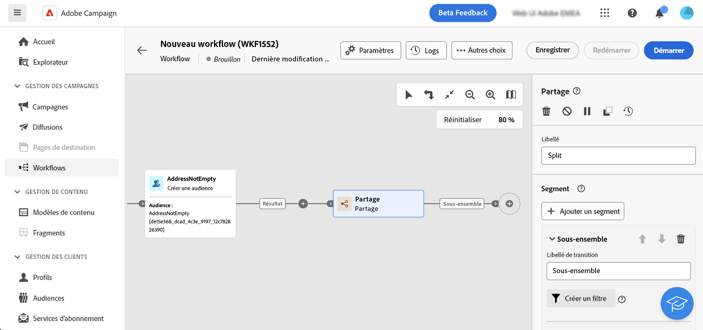

# Utiliser le concepteur de requête {#segment-builder}

>[!CONTEXTUALHELP]
>id="dc_orchestration_querymodeler_querymessage"
>title="Concepteur de requête"
>abstract="Définissez des critères de filtrage pour les destinataires ou tout autre schéma, également appelé dimension de ciblage, de la base de données."

Le modèle de requête simplifie le processus de filtrage de la base de données selon différents critères. De plus, le concepteur de requête peut gérer efficacement des requêtes très complexes et longues, offrant une flexibilité et une précision optimisées. En outre, il prend en charge les filtres prédéfinis dans les conditions, ce qui vous permet d’affiner facilement vos requêtes tout en utilisant des expressions et des opérateurs avancés pour des stratégies de segmentation et un ciblage d’audience complets.

## Accéder au concepteur de requête

Le concepteur de requête est disponible dans tout contexte où vous devez définir des règles pour filtrer les données.

| Utilisation | Exemple |
|  ---  |  ---  |
| **Définition des audiences**: définissez la population que vous souhaitez cibler dans vos compositions et créez facilement de nouvelles audiences adaptées à vos besoins. | {zoomable="yes"}{width="200" align="center" zoomable="yes"} |
| **Personnaliser les activités de workflow** : appliquez des règles à des activités de workflow, telles que **Partage** et **Réconciliation**, afin de respecter vos besoins spécifiques. [En savoir plus sur les activités de workflow](../compositions/activities/about-activities.md) | {zoomable="yes"}{width="200" align="center" zoomable="yes"} |
| **Filtres prédéfinis** : créez des filtres prédéfinis qui servent de raccourcis lors de diverses opérations de filtrage, que vous utilisiez des listes de données ou que vous créiez l’audience pour une diffusion. | {zoomable="yes"}{width="200" align="center" zoomable="yes"} |
| **Personnaliser les listes** : créez des règles personnalisées pour filtrer les données affichées dans les listes, telles que les personnes destinataires, les listes de diffusions, etc. | {zoomable="yes"}{width="200" align="center" zoomable="yes"} |

## Interface du concepteur de requête {#interface}

Le concepteur de requête fournit une zone de travail centrale où vous pouvez créer votre requête, et un volet droit fournissant des informations sur votre requête.

{zoomable="yes"}

### La zone de travail centrale {#canvas}

Le concepteur de requête fournit une zone de travail centrale où vous pouvez ajouter et combiner les différents composants qui construisent votre requête. [Découvrez comment créer une requête](build-query.md)

La barre d’outils située dans le coin supérieur droit de la zone de travail fournit des options permettant de manipuler facilement les composants de requête et de naviguer dans la zone de travail :

* **Mode de sélection multiple** : sélectionnez plusieurs composants de filtrage pour les copier et coller à l’emplacement de votre choix.
* **Faire pivoter** : retournez la zone de travail verticalement.
* **Ajuster à l’écran** : adaptez le niveau de zoom de la zone de travail à votre écran.
* **Zoom arrière**/**Zoom avant** : effectuez un zoom arrière ou avant dans la zone de travail.
* **Afficher la carte** : ouvre un instantané de la zone de travail indiquant où vous vous trouvez.

### Le volet Propriétés de la règle {#rule-properties}

Sur le côté droit, le volet **[!UICONTROL Propriétés de la règle]** fournit des informations sur votre requête. Il vous permet d’effectuer diverses opérations pour vérifier la requête et vous assurer qu’elle correspond à vos besoins. [Découvrez comment vérifier et valider votre requête](build-query.md#check-and-validate-your-query)
