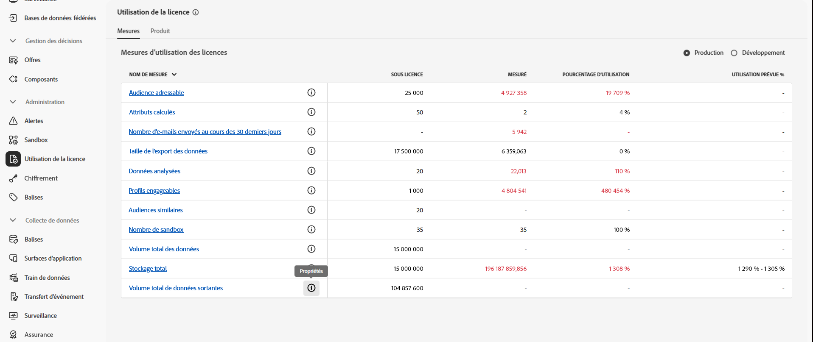
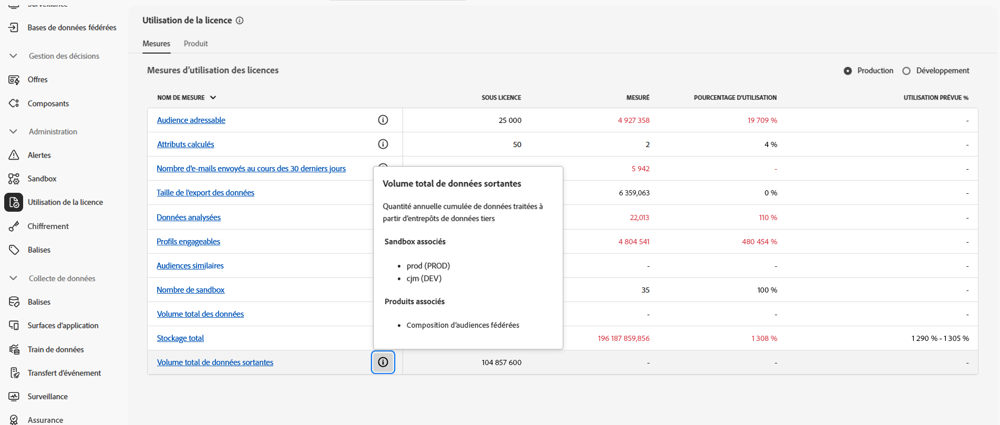

# Conditions préalables et mécanismes de sécurisation {#fac-access}

La composition d’audiences fédérées requiert les packages Adobe Real-Time Customer Data Platform et/ou Adobe Journey Optimizer **Prime** ou **Ultimate**. La seule condition préalable pour accéder à cette fonctionnalité est d’avoir acheté le module complémentaire Composition d’audiences fédérées.

>[!AVAILABILITY]
>
>Une fois que vous avez reçu l’e-mail de bienvenue d’Adobe, il peut s’écouler quelques heures de plus avant que l’interface ne soit mise à jour et que les fonctionnalités soient mises à votre disposition.

## Systèmes pris en charge {#supported-systems}

La composition d’audiences fédérées prend en charge les entrepôts cloud suivants :

* Amazon Redshift
* Azure Synapse
* Databricks
* Google BigQuery
* Snowflake
* Vertica Analytics
* Microsoft Fabric

Vous pouvez découvrir comment créer une connexion avec ces systèmes dans la [vue d’ensemble des connexions](../connections/home.md).

## Sandbox

Lors de l’achat de la composition d’audiences fédérées, vous avez droit à deux sandbox. Pour toute demande de sandbox supplémentaire, contactez votre représentant ou représentante Adobe.

Pour afficher la liste de vos sandbox actifs de composition d’audiences fédérées, procédez comme suit :

1. À partir de la composition d’audiences fédérées, accédez au menu **[!UICONTROL Utilisation des licences]** sous **[!UICONTROL Administration]**.

1. Sélectionnez l’icône  de **[!UICONTROL Volume total de sortie de données]** pour accéder aux propriétés de votre sandbox.

   

1. Les informations sur votre sandbox s’affichent dans la fenêtre contextuelle Propriétés.

   

## Autorisations {#permissions}

Pour accéder à la composition d’audiences fédérées, les personnes doivent être ajoutées au profil de produit spécifique au sandbox créé lors de l’achat et l’autorisation **[!UICONTROL Gérer Federated Data]** doit leur être attribuée. [En savoir plus](/help/governance-privacy-security/access-control.md)

## Listes autorisées des adresses IP {#ip}

Pour activer en toute sécurité l’accès de la Composition d’audiences fédérées à vos bases de données, vous devez obtenir les adresses IP des serveurs de Composition d’audiences fédérées qui y accéderont. Ces adresses IP s’affichent lors de l’ajout d’une base de données fédérées dans l’interface d’utilisation d’Adobe Experience Platform. [En savoir plus](../connections/home.md)

Ajoutez ces adresses IP à votre liste autorisée pour accorder l’accès à la Composition d’audiences fédérées.

## Politiques de fusion {#merge-policies}

Si votre sandbox utilise une politique de fusion **Priorité du jeu de données**, contactez l’assistance clientèle d’Adobe pour ajouter le jeu de données `Halos UPS` à votre politique de fusion.

Pour plus d’informations sur les politiques de fusion, consultez la [vue d’ensemble des politiques de fusion](https://experienceleague.adobe.com/fr/docs/experience-platform/profile/merge-policies/overview).

## Mécanismes de sécurisation et limitations {#fac-guardrails}

* Les droits, les limitations de produit et les mécanismes de sécurisation des performances répertoriés dans la [documentation Adobe Real-Time Customer Data Platform](https://experienceleague.adobe.com/fr/docs/experience-platform/profile/guardrails){target="_blank"} s’appliquent à la composition d’audiences fédérées.

* La composition d’audiences fédérées prend en charge l’export d’audiences volumineuses avec des tailles de fichier supérieures à 1 Go. Pour des performances optimales, la taille de fichier maximale recommandée est de 20 Go.
