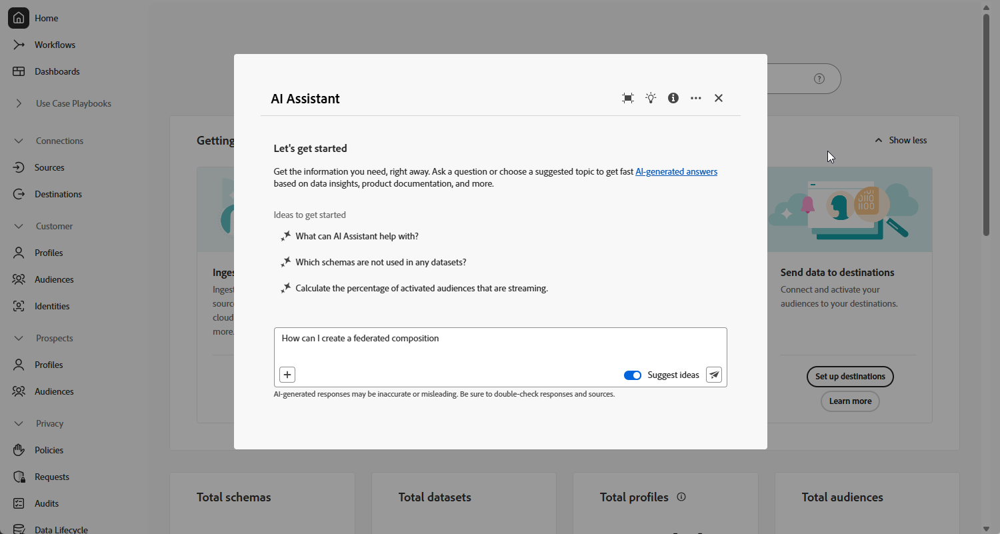

# Utiliser l’assistant IA {#ai-assistant}

L’Assistant IA est une fonctionnalité de l’interface d’utilisation conçue pour vous aider à parcourir et à comprendre les concepts d’Adobe. Il est disponible pour les cas d’utilisation liés à la connaissances des produits dans plusieurs produits Adobe Experience Cloud, notamment la composition d’audiences fédérées.

>[!CAUTION]
>
>Avant de pouvoir utiliser l’assistant IA, vous devez accepter les directives d’utilisation de l’IA générative d’Adobe Experience Cloud. Pour en savoir plus sur l’accord d’utilisation, consultez [cette page](https://experienceleague.adobe.com/fr/docs/experience-platform/ai-assistant/home){target="_blank"}.

Dans la composition d’audiences fédérées, vous pouvez accéder à la connaissance des produits pour découvrir les concepts d’Adobe liés à divers aspects du processus. L’Assistant IA prend en charge deux types de connaissances des produits : **Découverte ouverte** (explorez les concepts des produits en vous basant sur la documentation d’Experience League) et **Formation et dépannage ciblés** (posez des questions sur des fonctionnalités ou caractéristiques spécifiques).

Voici quelques exemples de ces questions :

* Qu’est-ce que la composition d’audiences fédérées ?
* Comment configurer un compte de base de données Snowflake Federated ?
* Comment créer une composition fédérée ?

Pour poser une question, procédez comme suit :

1. Accédez à l’Assistant IA en cliquant sur l’icône dans la barre supérieure.

   L’Assistant IA s’affiche dans la partie droite de l’écran. Vous pouvez cliquer sur  pour développer la fenêtre de l’Assistant IA.

   

1. Saisissez-la dans le champ en bas de l’écran et appuyez sur Entrée.

   

1. Vérifiez la réponse et utilisez le bouton **Afficher les sources** pour obtenir des liens directs vers la documentation du produit et pour en savoir plus.

   

1. Cliquez sur le pouce vers le haut ou sur le pouce vers le bas pour évaluer la réponse.

Pour découvrir comment utiliser l’assistant IA, consulter des exemples d’objectifs que vous pouvez réaliser avec l’assistant IA et découvrir comment il fonctionne, consultez la [Documentation d’Adobe Experience Platform](https://experienceleague.adobe.com/fr/docs/experience-platform/ai-assistant/home){target="_blank"}.
