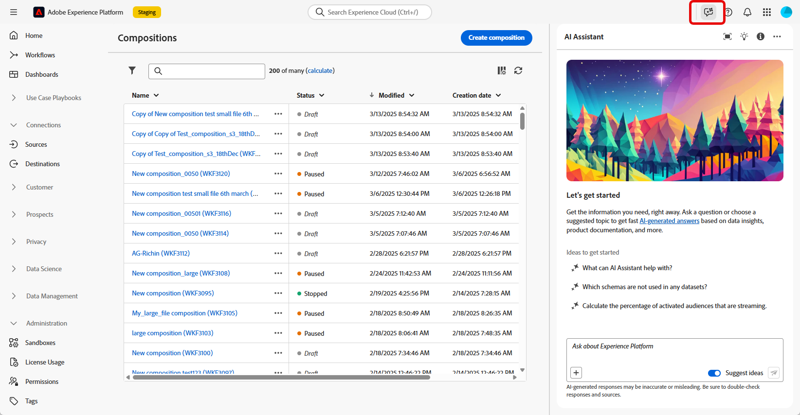

# Utiliser l’assistant IA {#ai-assistant}

L’assistant IA est une fonctionnalité de l’interface d’utilisation qui vous permet de parcourir et de comprendre les concepts Adobe et d’obtenir des informations opérationnelles sur votre environnement spécifique. Il est disponible dans plusieurs produits Adobe Experience Cloud, y compris la composition d’audiences fédérées.

Pour accéder à l’assistant IA, cliquez sur l’icône située dans la barre supérieure. L’assistant IA s’affiche dans la partie droite de l’écran.

>[!CAUTION]
>
>Avant de pouvoir utiliser l’assistant IA, vous devez accepter les directives d’utilisation de l’IA générative d’Adobe Experience Cloud. Pour en savoir plus sur l’accord d’utilisation, consultez [cette page](https://experienceleague.adobe.com/fr/docs/experience-platform/ai-assistant/home){target="_blank"}.

Dans la composition d’audiences fédérées, vous pouvez accéder à des questions sur la connaissance des produits concernant les concepts d’Adobe liés à divers aspects du processus. Voici quelques exemples de ces questions :

* Quels sont les paramètres de configuration requis pour établir une connexion fédérée entre Snowflake et Adobe Experience Platform ?
* Comment configurer une composition dans la composition d’audiences fédérées ?
* Comment utiliser un filtre prédéfini dans le concepteur de requête pour affiner ma sélection d’audiences ?

Pour poser une question, procédez comme suit :

1. Saisissez-la dans le champ en bas de l’écran et appuyez sur Entrée.

   

1. Vérifiez la réponse et utilisez le bouton **Afficher les sources** pour obtenir des liens directs vers la documentation du produit et pour en savoir plus.

   

1. Cliquez sur le pouce vers le haut ou sur le pouce vers le bas pour évaluer la réponse.

Pour découvrir comment utiliser l’assistant IA, consulter des exemples d’objectifs que vous pouvez réaliser avec l’assistant IA et découvrir comment il fonctionne, consultez la [Documentation d’Adobe Experience Platform](https://experienceleague.adobe.com/fr/docs/experience-platform/ai-assistant/home){target="_blank"}.
