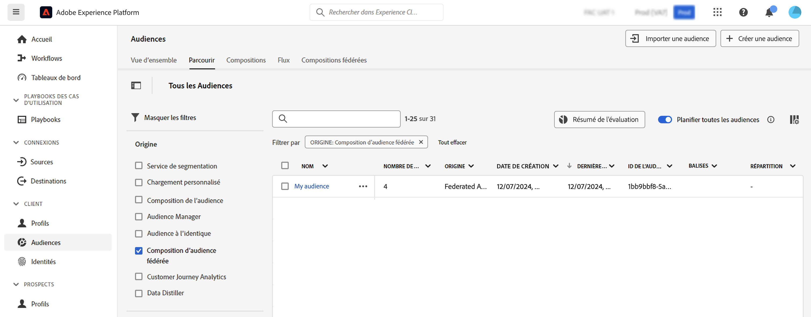

# Utiliser les audiences {#gs-audiences}

La composition d’audiences fédérées Experience Platform vous permet de [créer des compositions](../compositions/gs-compositions.md) qui permettent d’exploiter diverses activités dans une zone de travail visuelle pour créer des audiences et les stocker dans le portail d’audience Adobe Experience Platform.

Vous pouvez ensuite cibler ces audiences dans Journey Optimizer ou les activer vers n’importe quelle destination prise en charge par Adobe Experience Platform.

## Création d’audiences à l’aide de compositions{#creation}

Pour créer des audiences à l’aide de la composition d’audiences fédérées, vous devez créer une composition comprenant une activité **[!UICONTROL Enregistrer l’audience]**. Cette activité vous permet de sauvegarder l’audience dans le portail d’audience et de sélectionner des champs de vos bases de données externes à inclure dans l’audience. [Découvrir comment configurer une activité Enregistrer l’audience](../compositions/activities/save-audience.md)

Les audiences créées à l’aide de la composition d’audiences fédérées Adobe incluent tous les champs sélectionnés dans l’activité **[!UICONTROL Enregistrer l’audience]** et sont stockées dans le portail d’audience en regard de toutes les audiences Adobe Experience Platform.

Après l’exécution de la composition, l’audience obtenue est enregistrée dans Adobe Experience Platform en tant qu’audience externe. Elle est disponible dans la plateforme de données de la clientèle en temps réel d’Adobe et/ou Adobe Journey Optimizer.

Vous pouvez activer ces audiences pour n’importe quelle destination prise en charge par Adobe Experience Platform. Découvrir comment utiliser les destinations dans [Adobe Experience Platform](https://experienceleague.adobe.com/fr/docs/experience-platform/destinations/home){target="_blank"}

>[!NOTE]
>
>Les audiences créées à l’aide de la composition d’audiences fédérées Adobe ne peuvent pas être modifiées. Pour apporter des modifications à l’une de ces audiences, vous devez créer une audience à l’aide d’une composition.

## Accéder à votre audience dans Adobe Experience Platform {#access-audience}

Les audiences créées à l’aide de la composition d’audiences fédérées sont accessibles dans le portail d’audience, accessible à partir du menu **Audiences**.

L’onglet **[!UICONTROL Parcourir]** répertorie toutes les audiences existantes stockées dans Adobe Experience Platform. Vous pouvez identifier les audiences des compositions d’audiences fédérées dans la liste à l’aide de la colonne **[!UICONTROL Origine]** ou à l’aide des filtres disponibles dans le volet de gauche.

Pour plus d’informations sur l’utilisation des audiences dans Adobe Experience Platform, voir la [documentation du portail d’audience](https://experienceleague.adobe.com/fr/docs/experience-platform/segmentation/ui/audience-portal){target="_blank"}

<!-- add link to this donc once published: https://jira.corp.adobe.com/browse/PLAT-198674-->