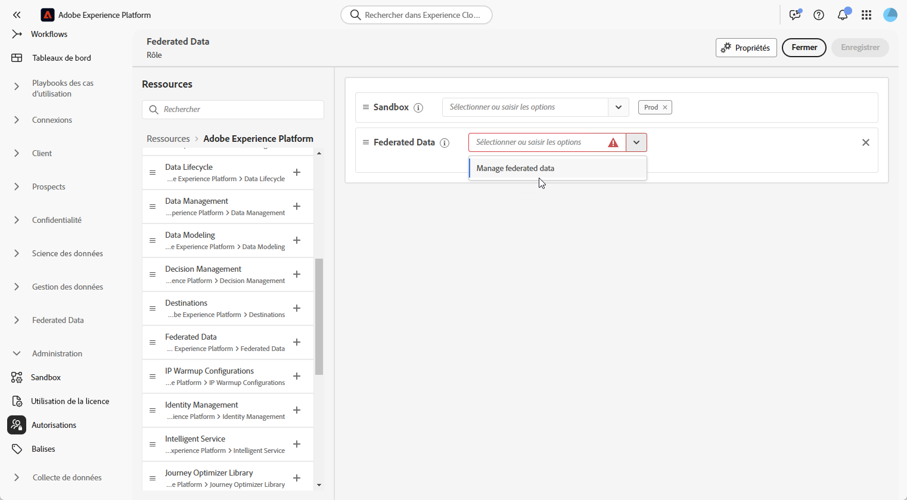

# Accéder à la composition d’audiences fédérées {#feature-access}

## Gérer l’accès aux sandbox {#access-sandboxes}

Lorsque vous achetez la composition d’audiences fédérées Adobe Experience Platform, un profil de produit est créé pour chaque sandbox actif à ce moment-là. Ce profil de produit est créé dans l’Admin Console sous la carte de produit **Adobe Experience Platform** et suit cette convention de nommage : `ACP_FAC - <<SandboxName>> - admin.`. Pour accéder à la composition d’audiences fédérées pour un sandbox spécifique, les personnes doivent être ajoutées au profil de produit créé pour ce sandbox.

Par exemple, si un nouveau sandbox nommé « fac-test » est activé, un profil de produit correspondant « ACP_FAC - fac-test - admin » est créé. Pour accéder à la composition d’audiences fédérées avec ce sandbox, les personnes doivent être ajoutées à ce profil de produit.

## Gérer l’accès à la composition d’audiences fédérées

Pour accéder à la **composition d’audiences fédérées**, vous devez d’abord vous assurer que l’autorisation **Gérer Federated Data** est affectée aux rôles appropriés. Ces rôles doivent ensuite être attribués aux utilisateurs et utilisatrices qui ont besoin d’accéder à la **composition d’audiences fédérées**.

Notez que seule l’équipe d’administration a la possibilité d’attribuer des autorisations.

1. Accédez au menu **[!UICONTROL Autorisations]**.

1. Dans le menu **[!UICONTROL Rôles]**, sélectionnez le **[!UICONTROL Rôle]** à mettre à jour.

   

1. Cliquez sur **[!UICONTROL Modifier]** pour modifier les autorisations du rôle.

   

1. Ajoutez la ressource **Federated Data**, puis sélectionnez **[!UICONTROL Gérer Federated Data]** dans le menu déroulant.

   

1. Une fois les modifications nécessaires effectuées, cliquez sur **[!UICONTROL Enregistrer]**.

Les autorisations des utilisateurs et utilisatrices déjà affectés à ce rôle seront automatiquement mises à jour et ils auront accès à la composition d’audiences fédérées.

Pour attribuer ce rôle à de nouvelles personnes, procédez comme suit :

1. Accédez à l’onglet **[!UICONTROL Utilisateurs et utilisatrices]** dans votre tableau de bord Rôle et cliquez sur **[!UICONTROL Ajouter des utilisateurs et des utilisatrices]**.

   

1. Saisissez le nom ou l’adresse e-mail de la personne ou effectuez votre sélection dans la liste disponible. Cliquez ensuite sur **[!UICONTROL Enregistrer]**.

La personne recevra un e-mail avec des instructions pour accéder à votre instance. Si le profil de l’utilisateur ou de l’utilisatrice n’a pas été créé auparavant, consultez [cette documentation](https://experienceleague.adobe.com/fr/docs/experience-platform/access-control/abac/permissions-ui/users).
