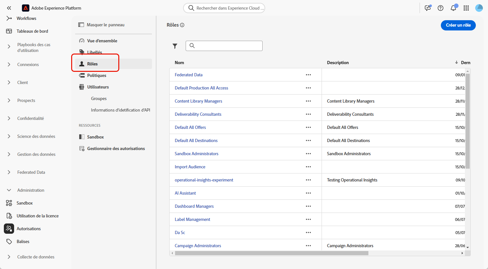
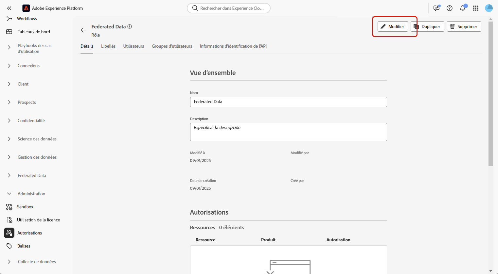
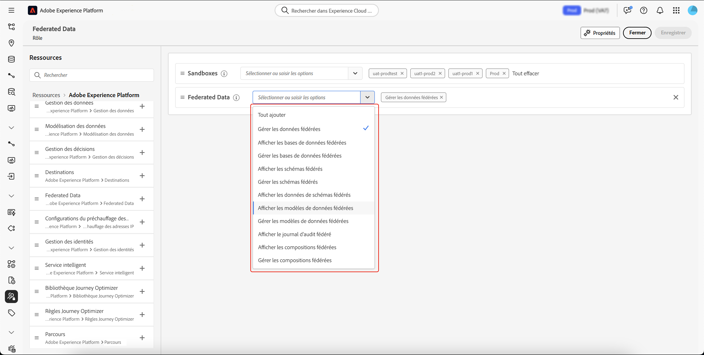
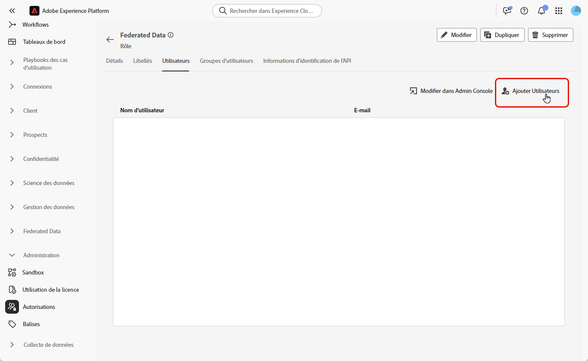

# Accéder à la composition d’audiences fédérées {#feature-access}

## Gérer l’accès aux sandbox {#access-sandboxes}

Lorsque vous achetez la composition d’audiences fédérées Adobe Experience Platform, un profil de produit est créé pour chaque sandbox actif à ce moment-là. Ce profil de produit est créé dans l’Admin Console sous la carte de produit **Adobe Experience Platform** et suit cette convention de nommage : `ACP_FAC - <<SandboxName>> - admin.`. Pour accéder à la composition d’audiences fédérées pour un sandbox spécifique, les personnes doivent être ajoutées au profil de produit créé pour ce sandbox.

Par exemple, si un nouveau sandbox nommé « fac-test » est activé, un profil de produit correspondant « ACP_FAC - fac-test - admin » est créé. Pour accéder à la composition d’audiences fédérées avec ce sandbox, les personnes doivent être ajoutées à ce profil de produit.

## Gérer l’accès à la composition d’audiences fédérées

Pour accéder à la **composition d’audiences fédérées**, vous devez d’abord vous assurer d’attribuer les autorisations requises pour accéder aux différents aspects de la composition d’audiences fédérées. Ces rôles doivent ensuite être attribués aux utilisateurs et utilisatrices qui ont besoin d’accéder à la **composition d’audiences fédérées**.

Notez que seule l’équipe d’administration a la possibilité d’attribuer des autorisations.

1. Accédez au menu **[!UICONTROL Autorisations]**.

1. Dans le menu **[!UICONTROL Rôles]**, sélectionnez le **[!UICONTROL Rôle]** à mettre à jour.

   

1. Sélectionnez **[!UICONTROL Modifier]** pour modifier les autorisations du rôle.

   

1. Ajoutez les autorisations requises pour la personne. Vous pouvez ajouter les autorisations suivantes pour accéder à la composition d’audiences fédérées :

   | Autorisation | Description |
   | ---------- | ----------- |
   | Gestion des données fédérées | Utilisez cette autorisation pour gérer tous les aspects de la composition d’audiences fédérées. Cette autorisation englobe les opérations suivantes : Gestion de la base de données fédérée, Gestion du schéma fédéré, Gestion du modèle de données fédérées et Gestion des compositions fédérées. |
   | Gestion de la base de données fédérées | Utilisez cette autorisation pour ajouter, afficher, mettre à jour et supprimer vos connexions aux bases de données fédérées. |
   | Affichage de la base de données fédérées | Utilisez cette autorisation pour afficher vos connexions aux bases de données fédérées. |
   | Gestion du schéma fédéré | Utilisez cette autorisation pour créer, afficher, mettre à jour, supprimer et actualiser des schémas. |
   | Affichage des données de schéma fédéré | Utilisez cette autorisation pour afficher l’onglet de données dans la section de schéma. |
   | Affichage du schéma fédéré | Utilisez cette autorisation pour afficher les tables de schéma. |
   | Gestion du modèle de données fédérées | Utilisez cette autorisation pour créer, afficher, mettre à jour et supprimer des modèles de données. |
   | Affichage du modèle de données fédérées | Utilisez cette autorisation pour afficher les modèles de données. |
   | Affichage du journal d’audit de fédération | Utilisez cette autorisation pour afficher le journal d’audit de la composition d’audiences fédérées. |
   | Gestion des compositions fédérées | Utilisez cette autorisation pour créer, afficher, mettre à jour et supprimer des compositions fédérées. |
   | Affichage des compositions fédérées | Utilisez cette autorisation pour afficher les compositions fédérées. |

   

1. Une fois les modifications nécessaires effectuées, cliquez sur **[!UICONTROL Enregistrer]**.

Les autorisations des utilisateurs et utilisatrices déjà affectés à ce rôle seront automatiquement mises à jour et ils auront accès à la composition d’audiences fédérées.

Pour attribuer ce rôle à de nouvelles personnes, procédez comme suit :

1. Accédez à l’onglet **[!UICONTROL Utilisateurs et utilisatrices]** dans votre tableau de bord Rôle et cliquez sur **[!UICONTROL Ajouter des utilisateurs et des utilisatrices]**.

   

1. Saisissez le nom ou l’adresse e-mail de la personne ou effectuez votre sélection dans la liste disponible. Cliquez ensuite sur **[!UICONTROL Enregistrer]**.

<!-- Alternatively, you can assign one of the pre-existing roles to the users, depending on what permissions they need. For more information on assigning pre-existing roles to a user, please read the [guide on managing users for a product profile](https://experienceleague.adobe.com/en/docs/experience-platform/access-control/ui/users).

| Role name | Permissions |
| --------- | ----------- |
| FAC Data Managers | <ul><li>Manage Federated Compositions</li><li>View Federated Databases</li><li>View Federated Schemas</li><li>View Federated Schema Data</li><li>View Federated Data Models</li></ul> |
| FAC Composition Managers | <ul><li>Manage Federated Compositions</li></ul> |
| FAC Administrators | <ul><li>Manage Federated Data</li></ul> | -->

La personne recevra un e-mail avec des instructions pour accéder à votre instance. Si le profil de l’utilisateur ou de l’utilisatrice n’a pas été créé auparavant, consultez [cette documentation](https://experienceleague.adobe.com/fr/docs/experience-platform/access-control/abac/permissions-ui/users).
