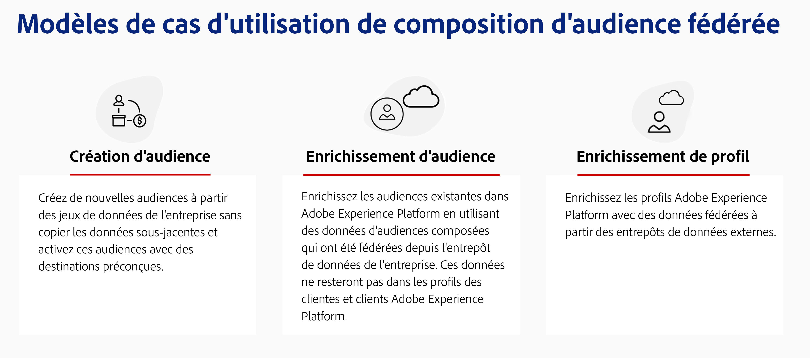
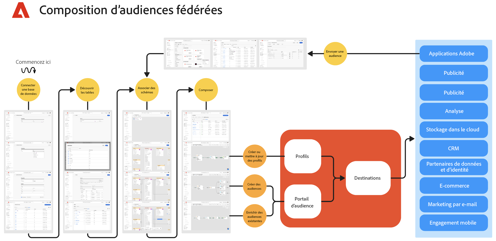

# Commencer avec la composition d’audiences fédérées {#gs-fac}

La composition d’audiences fédérées est une fonctionnalité de module complémentaire d’[Adobe Real-Time Customer Data Platform](https://experienceleague.adobe.com/fr/docs/experience-platform/segmentation/home){target="_blank"} et d’[Adobe Journey Optimizer](https://experienceleague.adobe.com/fr/docs/journey-optimizer/using/ajo-home){target="_blank"} qui vous permet de créer et d’enrichir des audiences à partir de vos entrepôts de données tiers et d’importer les audiences dans Adobe Experience Platform. La composition d’audiences fédérées offre une solution simple et puissante pour connecter votre entrepôt de données d’entreprise directement dans Adobe Real-Time Customer Data Platform et/ou Adobe Journey Optimizer et exécuter des requêtes sur les tables de votre entrepôt de données.

La composition d’audiences fédérées Adobe permet aux personnes utilisant des applications Adobe Experience Platform d’accéder aux données de leur clientèle stockées dans leurs entrepôts de données et plateformes de stockage dans le cloud, telles qu’Amazon Redshift, Azure Synapse Analytics, etc. Les données de la clientèle peuvent se trouver dans plusieurs entrepôts de données et sont désormais accessibles instantanément, sans réplication. Les plateformes prises en charge sont répertoriées sur [cette page](../connections/federated-db.md#supported-db).

## Fonctionnalités {#rn-capabilities}

La composition d’audiences fédérées étend la valeur de Real-Time CDP et Journey Optimizer avec une approche globale du traitement et de l’activation des audiences :

* Développez l’accès aux jeux de données critiques basés sur l’entrepôt pour créer des audiences à forte valeur ajoutée : utilisez les entrepôts de données existants comme système d’enregistrement principal, tout en exploitant les applications les plus performantes pour offrir de superbes expériences à la clientèle.

* Prise en charge complète des cas d’utilisation d’engagement : la composition d’audiences fédérées, couplée à Real-Time CDP ou Journey Optimizer, prend en charge des expériences personnalisées initiées par la marque avec des audiences fédérées et offre des expériences en temps réel déclenchées par des événements sur le moment, ainsi que des attributs de personne pour répondre aux exigences des cas d’utilisation au sein des équipes.

* Minimiser le déplacement et la duplication des données : créez des audiences à partir de jeux de données qui vivent dans un entrepôt de données d’entreprise sans copier de données sous-jacentes pour gérer les profils et audiences marketing exploitables.

* Utiliser un seul système pour les workflows pilotés par l’expérience : traitez les audiences ingérées et fédérées dans Adobe Experience Platform et coordonnez les expériences sortantes sur tous les canaux.

## Cas d’utilisation {#rn-uc}

Dans une interface d’utilisation conviviale pour le marketing, créez des règles de segmentation qui recherchent dans votre entrepôt de données une liste de personnes qualifiées pour un segment spécifique nécessaire aux campagnes marketing, accédez aux audiences existantes de l’entrepôt pour activation ou enrichissez les audiences Adobe Experience Platform avec des points de données supplémentaires qui existent dans l’entrepôt.

Dans cette version, deux cas pratiques sont disponibles :

1. Création d’audiences : créez des audiences à partir de jeux de données d’entreprise sans copier de données sous-jacentes et activez ces audiences avec des destinations prédéfinies.

1. Enrichissement de l’audience : enrichissez les audiences existantes dans Adobe Experience Platform en utilisant les données d’audience composée qui ont été fédérées à partir de l’entrepôt de données d’entreprise. Ces données ne seront pas conservées dans les profils client Adobe Experience Platform.

{zoomable="yes"}{width="75%" align="center"}

## Principales étapes {#gs-steps}

La composition d’audiences fédérées Adobe vous permet de créer et de mettre à jour des audiences Adobe Experience Platform directement à partir de votre base de données, sans processus d’ingestion.

<!--{zoomable="yes"}{width="85%" align="center"}-->

Principales étapes :

1. **Intégration de données** : rassemblez des données provenant de diverses sources et fusionnez-les en un jeu de données unifié. Découvrez comment connecter les applications Adobe Experience Platform et votre entrepôt de données d’entreprise ainsi que les bases de données prises en charge, puis apprenez à les configurer en consultant [cette section](../connections/federated-db.md).

1. **Modélisation des données** : concevez et créez des modèles et des schémas de données qui définissent la structure, les relations et les contraintes des données. Pour en savoir plus sur les schémas, consultez [cette page](../customer/schemas.md). Découvrez comment créer des liens pour votre modèle de données sur [cette page](../data-management/gs-models.md).

1. **Transformation des données** : appliquez des techniques de manipulation de données pour modifier le format, la structure ou les valeurs des éléments de données afin de les rendre compatibles ou adaptés à des analyses ou applications spécifiques.

1. **Utilisation des données** : créez, orchestrez et construisez des audiences. Découvrez comment composer des audiences sur [cette page](../compositions/gs-compositions.md). Vous pouvez également mettre à jour ou réutiliser des audiences existantes via le portail et les destinations Adobe Experience Platform Audience. En savoir plus sur [cette page](../connections/destinations.md)

>[!NOTE]
>
>Après l’exécution de la composition, l’audience obtenue est enregistrée dans Adobe Experience Platform en tant qu’audience externe. Elle est disponible dans la plateforme de données de la clientèle en temps réel d’Adobe et/ou Adobe Journey Optimizer. Elle est rendue accessible dans le menu **Audiences**. [En savoir plus](https://experienceleague.adobe.com/fr/docs/experience-platform/segmentation/ui/audience-portal){target="_blank"}

## En savoir plus {#learn}

<!-- Workflow + Workflow activities-->

Découvrez comment accéder à la composition, aux mécanismes de sécurisation et aux limitations des audiences fédérées sur [cette page](access-prerequisites.md).

Reportez-vous à la section Questions fréquentes sur [cette page](faq.md).

>[!CONTEXTUALHELP]
>id="dc_workflow_settings_execution"
>title="Paramètres d’exécution"
>abstract="Dans cette section, vous pouvez définir les paramètres relatifs à l’exécution du workflow, comme le nombre de jours pendant lesquels l’historique de la composition est conservé."

>[!CONTEXTUALHELP]
>id="dc_orchestration_query_enrichment_noneditable"
>title="Activité non modifiable"
>abstract="Lorsqu’une activité **Requête** ou **Enrichissement** est paramétrée avec des données supplémentaires dans la console, les données d’enrichissement sont prises en compte et transmises à la transition sortante, mais elles ne peuvent pas être modifiées."

<!-- Create a link -->

>[!CONTEXTUALHELP]
>id="dc_federated_database_create_link"
>title="Créer un lien"
>abstract="Définissez les paramètres du lien."

<!-- incremental query IDs -->

>[!CONTEXTUALHELP]
>id="dc_orchestration_incrementalquery"
>title="Requête incrémentale"
>abstract="L’activité **Requête incrémentale** vous permet d’interroger la base de données à l’aide du concepteur de requête. A chaque nouvelle exécution de cette activité, les résultats des exécutions précédentes sont exclus. Cela vous permet de ne cibler que les nouveaux éléments."

>[!CONTEXTUALHELP]
>id="dc_orchestration_incrementalquery_history"
>title="Historique des requêtes incrémentales"
>abstract="Historique des requêtes incrémentales"

>[!CONTEXTUALHELP]
>id="dc_orchestration_incrementalquery_processeddata"
>title="Données traitées des requêtes incrémentales"
>abstract="Données traitées des requêtes incrémentales"

>[!CONTEXTUALHELP]
>id="dc_orchestration_incrementalmode_standard"
>title="Mode de requête incrémentale"
>abstract="La requête incrémentale permet d’exécuter la même requête plusieurs fois en excluant les résultats des exécutions précédentes pour chaque nouvelle exécution."

>[!CONTEXTUALHELP]
>id="dc_orchestration_incrementalmode_custom"
>title="Mode de requête incrémentale"
>abstract="La requête incrémentale permet d’exécuter plusieurs fois la même requête en ne prenant en compte que les résultats pour lesquels le champ de date contient une date postérieure ou égale à la date de dernière exécution de l’activité de requête incrémentale."

>[!CONTEXTUALHELP]
>id="dc_orchestration_build_audience_dimension"
>title="Sélectionner la dimension de ciblage"
>abstract="La dimension de ciblage permet de définir la population ciblée par l’opération : personnes destinataires, personnes bénéficiaires d’un contrat, opérateurs et opératrices, personnes abonnées, etc. Par défaut, pour les e-mails et les SMS, la cible est sélectionnée à partir du tableau intégré Personnes destinataires. Pour les notifications push, la dimension cible par défaut est Applications des personnes abonnées."

<!-- save profile IDs-->

>[!CONTEXTUALHELP]
>id="dc_orchestration_saveprofile"
>title="Enregistrer le profil"
>abstract="Enregistrer le profil"

>[!CONTEXTUALHELP]
>id="dc_orchestration_saveprofile_selectaepschema"
>title="Enregistrer le profil Sélectionner le schéma AEP"
>abstract="Enregistrer le profil Sélectionner le schéma AEP"

>[!CONTEXTUALHELP]
>id="dc_orchestration_saveprofile_aepschemalist"
>title="Enregistrer le profil Liste de schémas AEP"
>abstract="Enregistrer le profil Liste de schémas AEP"

>[!CONTEXTUALHELP]
>id="dc_orchestration_saveprofile_selectaepattribute"
>title="Enregistrer le profil Attribut de schéma AEP"
>abstract="Enregistrer le profil Attribut de schéma AEP"

>[!CONTEXTUALHELP]
>id="dc_orchestration_saveprofile_selectprimaryfield"
>title="Enregistrer le profil Sélectionner le champ d’identité principal"
>abstract="Enregistrer le profil Sélectionner le champ d’identité principal"
